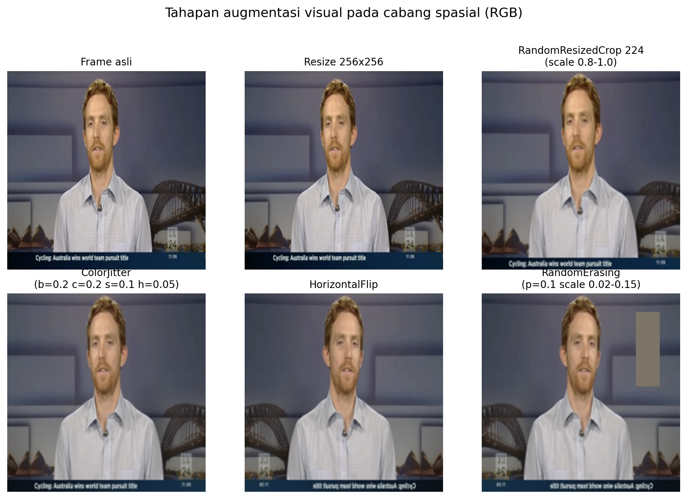

# Revisi BAB I–III Berdasarkan Hasil Tinjauan Pra Ujian Akhir

**Tanggal:** 2026-05-18
**Sumber feedback:** Pembanding 1 (nilai 70), Pembanding 2 (nilai 78)
**Sumber teks lama:** `documents/Metode Peningkatan ... _v2.md` (commit d90dbcc) — saat ini hanya ada di git history
**Sumber referensi:** `thesis_reference/INDEX.md` dan Daftar Pustaka v2 (entri (Korshunov & Marcel, 2019) hingga (Robbins & Monro, 1951))
**Format sitasi yang dipakai:** (Penulis, Tahun) konsisten dengan `documents/BAB_III_Tahapan_Pelaksanaan_v3.md`, bukan gaya IEEE bernomor.

---

## A. Perbandingan dua rencana revisi

`plan/lecturer-review-fixes-2026-04-19.md` dan `documentation/thesis_improvements_2026-04-25.md` pada dasarnya menangani **isu yang sama**, tetapi berbeda dalam tingkat keputusan editorial:

| Aspek | `lecturer-review-fixes` (19 Apr) | `thesis_improvements` (25 Apr) | Catatan |
|---|---|---|---|
| Rumusan masalah usulan | RM 1 = penurunan domain spasial; RM 2 = integrasi FFT; RM 3 = kontribusi tiap fitur | RM 1 = mendeteksi manipulasi yang artefak spasialnya halus; RM 2 = keterbatasan generalisasi; RM 3 = penambahan FFT untuk *robustness* | Versi 25 Apr **lebih sesuai** dengan permintaan P2 (paragraf turunan di latar belakang) dan lebih dekat dengan kerangka eksperimen ablation yang sudah ada. **Pakai versi 25 Apr.** |
| Manfaat poin 4 (kecepatan) | Diganti jadi "model sebagai dasar pengembangan forensik lanjut" | **Dihapus total** | 25 Apr lebih bersih — sejalan dengan rumusan masalah baru. |
| Manfaat poin 5 (alat andal) | Tidak dibahas eksplisit | Dilunakkan jadi "referensi metodologis" + manfaat dialamatkan ke pihak penerima | 25 Apr lebih lengkap. |
| Sitasi Celeb-DF | Belum ditentukan format | Eksplisit pakai `[35]` (Li et al. 2020) | **Masalah:** `[35]` tidak ada di Daftar Pustaka v2 (terakhir `[32]`). Wajib tambah entri baru. |
| Konsistensi BAB I ↔ BAB III ("1 arsitektur vs 3 arsitektur") | Tidak disebut | Reframe: 1 hybrid + 2 baseline untuk ablation | 25 Apr menyelesaikan kontradiksi yang dilaporkan P2. |
| BAB II — sub-bab dipangkas | Tidak ada | Eksplisit: 2.7 ringkas, 2.8 dipertimbangkan dipangkas, 2.17.1 (SGD) dipangkas, 2.5.4 ringkas | 25 Apr menanggapi catatan P2 ("cukup tuliskan yang akan diteliti"). |
| Subbab "Analisis Sistem" BAB III | Disebut | Disebut + lebih konkret (tools, hardware, orkestrasi) | Setara. |
| Augmentasi visual | Sama | Sama | Setara. |

**Kesimpulan:** Tidak ada perbedaan strategis. `thesis_improvements_2026-04-25.md` adalah **versi yang harus dipakai** — lebih lengkap, lebih sinkron dengan dua reviewer sekaligus, dan menyelesaikan kontradiksi struktur. `lecturer-review-fixes` cukup disimpan sebagai histori awal.

Satu hal yang **dua-duanya lupa eksplisit**: keduanya menyebut nomor sitasi seperti `[35]` atau `[ref]` tanpa memverifikasi bahwa nomor tersebut sudah ada di daftar pustaka v2 yang final. Lihat bagian **F** di bawah untuk verifikasi.

---

## B. BAB I — Rewrite per paragraf

> Format: **Lama** (kalimat persis dari `thesis_v2.md` baris 537–601) → **Baru** (usulan revisi) → *Catatan*.

> **PENTING — penomoran paragraf bergeser.** Karena B.1 menggabungkan paragraf 1+2 lama menjadi satu, semua nomor paragraf sesudahnya turun satu. Untuk menghindari kebingungan saat menyunting linear (atas → bawah), gunakan **peta urutan final** di bawah ini dan acu **kalimat penutup ("titik") tiap paragraf**, bukan nomornya.

#### Peta urutan final Latar Belakang (linear, atas → bawah)

| Urutan baru | Sumber | Isi singkat | Diakhiri kalimat ("titik" anchor) |
|---|---|---|---|
| **¶1** | B.1 (gabung P1+P2 lama) | GAN/deepfake → porn → geopolitik | "…menjadikan deteksi otomatis *deepfake* bukan sekadar tantangan riset, melainkan kebutuhan forensik digital yang mendesak." |
| **¶2** | B.2 (P3 lama) | MesoNet/ResNet/XceptionNet baseline | "…mengindikasikan ketergantungan model terhadap artefak visual khas dataset pelatihan." |
| **¶3** | **P4 lama — TIDAK diubah** | kelemahan spasial / GAN fingerprints | "…yang tidak terlihat jelas dalam *spatial domain* [8]." |
| **¶4** | B.3 (P5 lama) | pendekatan frekuensi FFT/DCT | "…melainkan pada distribusi spektralnya." |
| **¶5** | P6 lama + perbaikan C.6 (baris 547) | Durall et al. + Alam et al. | "…memperkuat pentingnya integrasi dua domain analisis untuk menciptakan detektor *deepfake* yang lebih *robust*." |
| **¶6 ← SISIPAN B.4** | B.4 (paragraf BARU) | urgensi generalisasi cross-dataset | "…dan menjadi fokus utama penelitian ini." |
| **¶7** | B.5 paragraf 7 (reframe P7 lama) | SpecXNet/FSBI/FDM — potensi | "…sebagai mekanisme spesifik untuk meningkatkan robustness lintas dataset." |
| **¶8** | B.5 paragraf 8 (reframe P8 lama) | gap spesifik + skenario FFPP↔CDF | "…yang lazim terjadi pada detektor spasial murni." |

> Catatan: **P4 lama** (kelemahan spasial / GAN fingerprints) tidak punya bagian B sendiri — sengaja **dipertahankan apa adanya** sebagai ¶3. Jangan kaget paragraf itu "lewat" tanpa instruksi rewrite.

### B.1 Latar Belakang — Paragraf 1+2 digabung (menjawab P2-LB-1)

**Lama (paragraf 1, baris 537):**
> Perkembangan teknologi kecerdasan buatan, khususnya pada bidang *Generative Adversarial Networks* (GAN), telah menghasilkan kemampuan menciptakan citra dan video sintetis yang sangat realistis. Salah satu hasil penerapannya adalah teknologi yang dikenal dengan nama *deepfake*. Teknologi ini mampu memanipulasi video atau audio untuk menampilkan adegan atau ucapan seolah-olah berasal dari orang yang sebenarnya. Meskipun tujuan awal dikembangkannya teknologi ini adalah untuk hiburan, atau penelitian, penyalahgunaan *deepfake* telah menimbulkan ancaman serius, seperti penyebaran informasi palsu (*fake news*), pelanggaran privasi, hingga memicu kerugian di tingkat individu, sosial, hingga geopolitik [1].

**Lama (paragraf 2, baris 539):**
> Di tingkat individu, *Deepfake* memiliki potensi besar untuk merusak citra, dan reputasi seseorang, terutama melalui pembuatan konten palsu yang merusak, seperti kasus *deepfake porn*. Secara global, studi menunjukkan mayoritas video *deepfake* adalah pornografi yang menargetkan perempuan, menciptakan konsekuensi serius terhadap privasi dan persepsi masyarakat [2].

**Baru (satu paragraf 5–7 kalimat):**
> Perkembangan *Generative Adversarial Networks* (GAN) telah memungkinkan terciptanya citra dan video sintetis yang sulit dibedakan dari rekaman asli, dan teknologi inilah yang melahirkan istilah *deepfake*, yaitu konten visual atau audio yang dimanipulasi sedemikian rupa sehingga menampilkan adegan atau ucapan yang tidak pernah terjadi. Meskipun awalnya dikembangkan untuk hiburan dan riset sintesis media, *deepfake* kini menjadi ancaman serius pada beberapa tingkatan. Pada tingkat geopolitik, teknologi ini dipakai sebagai instrumen disinformasi dan propaganda (Korshunov & Marcel, 2019). Pada tingkat individual, 96% video *deepfake* yang beredar global berbentuk pornografi non-konsensual yang sebagian besar menargetkan perempuan, menimbulkan kerugian reputasi, psikologis, dan hukum yang nyata (Andira & Susila, 2024). Skala dan kecepatan distribusi konten ini menjadikan deteksi otomatis *deepfake* bukan sekadar tantangan riset, melainkan kebutuhan forensik digital yang mendesak.

*Catatan referensi:* (Korshunov & Marcel, 2019) ✓, (Andira & Susila, 2024) ✓. Klaim 96% **wajib di-source ke (Andira & Susila, 2024)** (sudah konsisten). Jika klaim ingin diperkuat, tambahkan sitasi sekunder ke Sensity AI 2019 report (tidak wajib).

---

### B.2 Latar Belakang — Paragraf 3 (XceptionNet baseline) — perketat dan tambahkan klaim cross-dataset

**Lama (baris 541):** … "*XceptionNet* … menonjol karena efisiensinya dalam mengekstraksi fitur spasial tingkat tinggi menggunakan *depthwise separable convolution* (Chollet, 2017)."

**Baru (tambahkan satu kalimat penutup; sisanya tetap):**
> *MesoNet* dirancang untuk mendeteksi artefak lokal seperti batas *blending* dan perbedaan warna pada wajah hasil manipulasi, namun memiliki keterbatasan pada citra resolusi tinggi (Afchar et al., 2018). *ResNet-50* memperkenalkan *residual learning* untuk merepresentasikan fitur spasial yang lebih dalam, dan dilaporkan mencapai akurasi di atas 90% pada FaceForensics++ namun turun signifikan ketika diuji lintas dataset (Haq, 2021; He et al., 2015). *XceptionNet* (*Extreme Inception Net*) menjadi *baseline* domain spasial yang paling banyak dipakai karena *depthwise separable convolution* memberikan efisiensi komputasi tanpa mengorbankan akurasi, dan dilaporkan mencapai 99,26% AUC pada FaceForensics++ tanpa kompresi (Chollet, 2017; Rössler et al., 2019). **Namun, akurasi tinggi ini tidak konsisten pada pengujian lintas dataset, yang mengindikasikan ketergantungan model terhadap artefak visual khas dataset pelatihan.**

*Catatan referensi:* (Haq, 2021) ✓, (Afchar et al., 2018) ✓, (He et al., 2015) ✓, (Chollet, 2017) ✓, (Rössler et al., 2019) ✓. **Kalimat tambahan bold di atas menjawab P1 (kinerja XceptionNet) sekaligus P2-LB-2 (urgensi cross-dataset).**

---

### B.3 Latar Belakang — Paragraf 5 (sejumlah penelitian) — perpanjang dengan 3 sitasi (P2-LB-3)

**Lama (baris 545):**
> Untuk mengatasi keterbatasan tersebut, sejumlah penelitian telah mengusulkan pendekatan berbasis *frequency*, seperti *Frequency Domain Analysis (FDA)*, dengan metode *Fast Fourier Transform* (FFT), *Discrete Cosine Transform* (DCT), atau *Wavelet Transform*. Pendekatan ini berupaya mengekstraksi pola artefak frekuensi yang muncul akibat proses *upsampling*, *interpolation*, dan *compression* pada citra hasil sintesis (Durall et al., 2020).

**Baru (5–6 kalimat, 4 sitasi):**
> Untuk mengatasi keterbatasan tersebut, riset deteksi *deepfake* bergeser ke domain frekuensi. Pendekatan berbasis *Fast Fourier Transform* (FFT) memanfaatkan asimetri spektral pada citra GAN dan terbukti dapat membedakan citra sintetis dari citra natural meski manipulasi visualnya tidak terlihat di domain spasial (Durall et al., 2020). Pendekatan berbasis *Discrete Cosine Transform* (DCT) bekerja pada koefisien blok dan menyingkapkan anomali pada band frekuensi menengah yang konsisten antar-arsitektur GAN (Giudice et al., 2021). Sementara itu, pembelajaran adaptif pada representasi frekuensi seperti *Frequency-aware Clues* (Qian et al., 2020) dan *Frequency-Aware Deepfake Detection* berbasis spektrum (Tan et al., 2024) meningkatkan kemampuan generalisasi terhadap teknik sintesis baru dan citra terkompresi. Konvergensi ketiga pendekatan ini menunjukkan bahwa jejak generatif paling stabil bukan pada piksel, melainkan pada distribusi spektralnya.

*Catatan referensi:* (Durall et al., 2020) ✓, (Qian et al., 2020) ✓, (Tan et al., 2024) ✓, (Giudice et al., 2021) ✓. Semua sudah ada di daftar pustaka v2.

---

### B.4 Latar Belakang — Sisipkan paragraf baru: urgensi generalisasi cross-dataset (P2-LB-4 + P1)

**Titik sisipan (jadi ¶6 pada peta urutan final):**
- **Setelah** paragraf (¶5) yang berakhir: *"…memperkuat pentingnya integrasi dua domain analisis untuk menciptakan detektor* deepfake *yang lebih* robust*."* (paragraf Durall et al. + Alam et al.)
- **Sebelum** paragraf B.5 (¶7) yang dimulai: *"Studi awal hibridisasi domain spasial dan frekuensi telah menunjukkan **potensi** peningkatan generalisasi. SpecXNet…"*

**Teks paragraf baru:**

> Di luar laboratorium, detektor *deepfake* harus menghadapi distribusi data yang sangat berbeda dari data pelatihan: generator baru bermunculan setiap tahun, kompresi platform sosial bervariasi, dan teknik pasca-pemrosesan adversarial dipakai untuk menyamarkan jejak. Studi sistematis melaporkan penurunan AUC 10 hingga 20 poin ketika detektor berbasis CNN spasial dipindahkan dari satu dataset ke dataset lain (Rana et al., 2022; Rao & Uehara, 2025). Karena itu, kemampuan **generalisasi lintas dataset**, bukan akurasi *in-domain*, adalah metrik yang paling relevan untuk menilai kelayakan deteksi *deepfake* di dunia nyata, dan menjadi fokus utama penelitian ini.

*Catatan referensi:* (Rana et al., 2022) (systematic review, eksplisit melaporkan drop cross-dataset) ✓, (Rao & Uehara, 2025) (chronological review) ✓. **Klaim "10 hingga 20 poin AUC drop" perlu dicocokkan dengan angka di paper Rana atau Rao; jika tidak presisi, ganti jadi "penurunan AUC yang signifikan" tanpa angka.**

---

### B.5 Latar Belakang — Paragraf 7 & 8 (kontradiksi) — reframe (P2-LB-LB-4)

**Titik (jadi ¶7 dan ¶8, dua paragraf terakhir Latar Belakang):** kedua paragraf ini **menggantikan** dua paragraf lama terakhir, dan diletakkan **tepat setelah** paragraf sisipan B.4 (¶6) yang berakhir *"…dan menjadi fokus utama penelitian ini."* ¶8 adalah paragraf penutup Latar Belakang, langsung sebelum subbab **Rumusan Masalah**.

**Lama paragraf 7 (baris 549):**
> Beberapa penelitian menunjukkan bahwa gabungan antara dua domain ini, dapat meningkatkan kemampuan generalisasi model terhadap *deepfake* lawas maupun baru, sekaligus menekan *overfitting* terhadap dataset tertentu (Rana et al., 2022; Rao & Uehara, 2025; Kim et al., 2025). …

**Lama paragraf 8 (baris 551):**
> Berdasarkan uraian tersebut, terdapat *research gap* dalam penelitian deteksi *deepfake*, yaitu belum adanya pendekatan yang secara terpadu mengombinasikan analisis domain spasial dan domain frekuensi dalam satu arsitektur yang dioptimalkan untuk meningkatkan kemampuan generalisasi lintas *dataset*. …

**Baru paragraf 7 (reframe potensi, bukan absen):**
> Studi awal hibridisasi domain spasial dan frekuensi telah menunjukkan **potensi** peningkatan generalisasi. *SpecXNet* menggabungkan cabang spasial *XceptionNet* dengan cabang frekuensi untuk meningkatkan ketahanan deteksi terhadap berbagai manipulasi (Alam et al., 2025). *FSBI* memanfaatkan *self-blended image* yang ditingkatkan frekuensi untuk memperkuat generalisasi lintas dataset (Hasanaath et al., 2023). *Frequency-Domain Masking* mengintegrasikan informasi spasial dan frekuensi melalui mekanisme adaptif (Luo & Wang, 2025). Studi-studi ini berhasil membuktikan bahwa fusi dua domain bermanfaat, tetapi sebagian besar masih dioptimalkan untuk performa *in-domain* pada FaceForensics++, dan belum mengevaluasi secara sistematis fusi *late* dan *gating* sebagai mekanisme spesifik untuk meningkatkan robustness lintas dataset.

**Baru paragraf 8 (gap spesifik, bukan absen):**
> Penelitian ini mengisi celah tersebut dengan mengusulkan **arsitektur hybrid XceptionNet dan FFT dengan *late fusion* dan *Squeeze-and-Excitation gating*** yang dioptimalkan untuk generalisasi lintas dataset. Berbeda dari pekerjaan sebelumnya yang berfokus pada *in-domain accuracy*, penelitian ini secara eksplisit mengevaluasi skenario FFPP ke CDF dan CDF ke FFPP untuk mengukur seberapa besar fitur frekuensi mampu menahan *performance drop* yang lazim terjadi pada detektor spasial murni.

*Catatan referensi:* (Alam et al., 2025) SpecXNet ✓, (Hasanaath et al., 2023) FSBI ✓, (Luo & Wang, 2025) ✓. **Menghapus klaim "belum ada hybrid" yang kontradiktif.**

---

### B.6 Rumusan Masalah — Rewrite (P1-RM, P2-RM-1, P2-RM-2, P2-RM-3)

**Lama:**
1. Bagaimana mengembangkan metode deteksi *deepfake* yang lebih akurat, dan *robust* dengan menggabungkan arsitektur *XceptionNet* berbasis domain spasial, dan analisis frekuensi FFT untuk mendeteksi manipulasi **citra atau video sintetis**?
2. Bagaimana arsitektur *XceptionNet* dapat dimodifikasi dan diperluas melalui integrasi modul FDA untuk secara efektif mengekstrak dan menggabungkan fitur spasial *fine-grained* pada artefak *high-band frequency*?
3. Seberapa besar peningkatan kinerja, khususnya dalam hal *cross-dataset generalization capability* …

**Baru (3 pertanyaan berbentuk masalah, bukan solusi):**
1. Sejauh mana detektor *deepfake* berbasis domain spasial murni (*XceptionNet*) mengalami penurunan performa ketika diuji pada **video sintetis** dari dataset yang berbeda dengan data pelatihannya?
2. Sejauh mana penambahan analisis domain frekuensi (FFT) ke dalam arsitektur *XceptionNet* dapat memperkecil penurunan tersebut?
3. Seberapa besar kontribusi masing-masing komponen (fitur spasial vs fitur frekuensi) terhadap akurasi, presisi, *recall*, dan AUC pada pengujian *in-dataset* maupun *cross-dataset*?

*Catatan:* setiap RM mempunyai paragraf turunan di latar belakang baru: RM1 ↔ B.2 + B.4; RM2 ↔ B.5; RM3 ↔ B.5 (kalimat penutup tentang ablation).

---

### B.7 Tujuan — Rewrite (P1-TJ)

**Lama:** "Merancang dan mengimplementasi model *hybrid* … / Memperluas dan memodifikasi … / Menganalisis dan membandingkan kinerja …" — terkesan paraphrase RM.

**Baru (deliverable konkret, bukan paraphrase RM):**
1. Mengimplementasikan arsitektur hybrid *XceptionNet*–FFT dengan *late fusion* dan *SE gating* untuk deteksi *deepfake* tingkat *frame* video.
2. Melakukan *ablation study* (spasial-saja vs frekuensi-saja vs hybrid) untuk memisahkan kontribusi masing-masing domain.
3. Mengevaluasi generalisasi model pada skenario *in-dataset* (FFPP→FFPP, CDF→CDF) dan *cross-dataset* (FFPP→CDF, CDF→FFPP) menggunakan akurasi, presisi, *recall*, dan AUC.

---

### B.8 Manfaat — Hapus poin 4, lunakkan poin 5 (P2-MF-1, P2-MF-2)

**Lama poin 4:** "Manfaat Operasional: Menghasilkan model yang efisien dengan *XceptionNet*, dan **kecepatan serta ketepatan inferensi dari FFT**." → **HAPUS** (kontradiksi dengan Ruang Lingkup 4).

**Lama poin 5:** "Manfaat Praktis: Menyediakan **alat forensik digital yang lebih andal dan akurat**. Penegak hukum dan badan pengawas media dapat menggunakan model ini …"

**Baru (turunkan jadi 4 poin, dilunakkan):**
1. Manfaat Akademik: Memberikan kontribusi ilmiah berupa evaluasi sistematis terhadap kontribusi fitur frekuensi dalam arsitektur hybrid deteksi *deepfake*.
2. Manfaat Teknologi: Menyediakan rancangan arsitektur dan pipeline reproduktif yang dapat dijadikan acuan oleh peneliti lain yang mengembangkan detektor hibrida domain spasial–frekuensi.
3. Manfaat Sosial: Mendukung upaya mitigasi penyalahgunaan *deepfake* (misinformasi, *deepfake porn*, propaganda politik) dengan menyediakan dasar metodologis yang dapat dievaluasi oleh lembaga forensik digital.
4. Manfaat Praktis: Memberikan baseline cross-dataset yang dapat dipakai pengembang sistem verifikasi konten sebagai pembanding untuk arsitektur deteksi lain.

---

### B.9 Ruang Lingkup — Tambahkan kriteria dataset + sitasi link (P1-RL, P2-RL)

**Tambahkan ke Ruang Lingkup poin 1:**

> 1. Cakupan Data: Penelitian menggunakan **video** dari dua dataset publik yang kemudian diekstraksi menjadi **frame citra** untuk diproses model:
>    a. **FaceForensics++** (Rössler et al., 2019), repositori `https://github.com/ondyari/FaceForensics`, kompresi *high-quality* (c23), dengan empat metode manipulasi (*Deepfakes*, *Face2Face*, *FaceSwap*, *NeuralTextures*).
>    b. **Celeb-DF v2** (Li et al., 2020), repositori `https://github.com/yuezunli/celeb-deepfakeforensics`, kategori *celebrity face-swap*.
>    Pengambilan sampel dilakukan dengan rasio 50:50 antara kelas asli dan kelas manipulasi, dan pemisahan *train, val, test* dilakukan pada level video untuk menghindari kebocoran *frame*. Penelitian tidak mencakup deteksi manipulasi audio atau *text-based deepfake*.

**Titik:** ganti isi poin 1 "Cakupan Data" yang lama (*"Data diuji dan dilatih menggunakan dataset … FaceForensics++ dan Celeb-DF …"*) dengan teks di atas. Poin 2–4 (Cakupan Metode, Evaluasi, Sistem) tetap.

**Tabel total dataset (sisipkan setelah seluruh daftar Ruang Lingkup poin 1–4, sebelum paragraf penutup *"Dengan batasan ini…"*):**

> **Versi HTML siap-paste:** [`documents/table/tabel_1_1_komposisi_dataset.html`](../documents/table/tabel_1_1_komposisi_dataset.html) — caption "Tabel 1.1 Komposisi total *dataset* yang digunakan" (tabel pertama di BAB I).

| Dataset | Real videos | Fake videos | Total frame (~) | Sumber |
|---|---|---|---|---|
| FaceForensics++ (n=1000, c23) | 500 | 500 | ~50.000 | (Rössler et al., 2019) |
| Celeb-DF v2 (n=750) | 375 | 375 | ~37.500 | (Li et al., 2020) |

*Catatan referensi:* Li et al. 2020 "Celeb-DF: A Large-scale Challenging Dataset for DeepFake Forensics" CVPR sudah ada di Daftar Pustaka v2 sebagai entri Celeb-DF; gunakan format (Li et al., 2020).

---

## C. BAB II — Rewrite paragraf bermasalah (sentence-level)

### C.1 Subbab 2.3.4 — Pendekatan Hybrid: tambah sitasi pada "dua strategi utama" (P2-2.3.4)

**Permintaan penguji (Pembanding 2):** *"Pada bab 2.3.4 bagian penjelasan 2 strategi Utama ini mengacu pada referensi mana? tidak ditemukan sitasi pada penjelasannya."* — ini **murni keluhan sitasi yang hilang**, bukan permintaan menulis ulang. Sejalan dengan kesimpulan penguji (*"cukup tuliskan yang akan penelitian ini kerjakan saja … fokus"* dan *"anak subab 1 paragraf cukup dibuat dalam bentuk point a, b / 1, 2"*), struktur bernomor 1./2. yang sudah ada **dipertahankan**. Cukup **sisipkan sitasi**, jangan diubah jadi paragraf mengalir.

**Tindakan (minimal — pertahankan struktur, injeksi sitasi):**

1. Kalimat pembuka — tambahkan sitasi setelah "dua strategi utama":
   > **Lama:** "Secara arsitektural, terdapat dua strategi utama dalam mengintegrasikan domain spasial dan frekuensi:"
   > **Baru:** "Secara arsitektural, terdapat dua strategi utama dalam mengintegrasikan domain spasial dan frekuensi (Alam et al., 2025; Hasanaath et al., 2023; Qian et al., 2020):"

2. Poin **1. *Early Fusion*** — tambahkan sitasi di akhir paragraf:
   > … "memungkinkan model mempelajari interaksi antara fitur spasial dan frekuensi sejak lapisan konvolusi pertama, namun memerlukan arsitektur yang mampu menangani *input* multi-kanal secara efektif **(Qian et al., 2020)**."

3. Poin **2. *Late Fusion* / *Two-Branch*** — ganti sitasi `[13]` lama dengan attribution yang benar:
   > … "memungkinkan setiap *branch* untuk mengekstraksi fitur secara spesifik tanpa saling mengganggu **(Alam et al., 2025; Hasanaath et al., 2023)**."

Paragraf penutup ("Dalam penelitian ini, kedua strategi *fusion* diimplementasikan…") **tetap, tidak diubah**.

*Catatan referensi:* (Alam et al., 2025) SpecXNet ✓ (late fusion), (Hasanaath et al., 2023) FSBI ✓ (late fusion), (Qian et al., 2020) "Thinking in Frequency" ✓ (early-style). Sitasi `[13]` lama yang merujuk Stack Overflow sebaiknya **dihapus/diganti** dengan tiga sitasi di atas.

> *Catatan:* versi tulis-ulang menjadi satu paragraf mengalir (draf sebelumnya) **tidak dipakai** karena menambah cakupan dan menghapus struktur bernomor — bertentangan dengan arahan "fokus" dan "gunakan point" dari penguji.

---

### C.2 Subbab 2.9.4 — Depthwise Separable Convolution (P2-2.9.4)

Pastikan sitasi (Chollet, 2017) muncul tepat pada **definisi** *depthwise separable convolution* dan pada persamaan (2.5) atau (2.6):

> *Depthwise separable convolution* adalah dekomposisi konvolusi standar menjadi dua tahap berurutan, yaitu *depthwise convolution* yang mengoperasikan kernel terpisah pada tiap kanal *input*, dan *pointwise convolution* (1×1) yang menggabungkan kanal. Dekomposisi ini diformulasikan oleh Chollet (2017) sebagai dasar arsitektur *Xception*. Operasi ini secara signifikan menurunkan kompleksitas komputasi dari `K² × M × N` (standar) menjadi `K² × M + M × N` (DSC), seperti yang dijelaskan pada persamaan (2.5) hingga (2.9).

Sitasi (Chollet, 2017) sudah benar pada **definisi** ("Pendekatan ini diperkenalkan oleh Chollet [6]...").

**Verifikasi dokumen terupdate (.docx OneDrive, 25 Mei) — 2 temuan:**

1. **Penomoran persamaan:** di dokumen aktual, persamaan kompleksitas DSC ada di **(2.7)–(2.9)**, bukan (2.5)/(2.6) seperti tertulis di atas. Acuan nomor di poin C.2 ini dikoreksi menjadi (2.7) hingga (2.9):
   - `C_standard = K²×M×N` → (2.7)
   - `C_DSC = K²×M + M×N` → (2.8)
   - `C_DSC ≪ C_standard` → (2.9)

2. **Sitasi hilang di blok kompleksitas:** subbab "Kompleksitas Depthwise Separable Convolution" belum memuat (Chollet, 2017). Tambahkan pada kalimat pembuka blok tersebut:

   > *Perbedaan signifikan antara konvolusi biasa dan depthwise separable convolution terletak pada kompleksitas komputasi, sebagaimana diformulasikan oleh Chollet (2017) [6].*

   ( Subbab definisi sudah benar; perubahan ini hanya untuk blok persamaan (2.7)–(2.9).)

---

### C.3 Subbab 2.10.1 — XceptionNet (P2-2.10.1)

**Tindakan:** sisipkan gambar arsitektur XceptionNet (Entry flow, Middle flow × 8, Exit flow) dari Chollet (2017). Caption: "Gambar 2.X Arsitektur XceptionNet (Chollet, 2017)".

**Rewrite paragraf pembuka 2.10.1** (lebih faktual, bukan kutipan):

**Lama (baris 1193 lingkungan):** "Penelitian oleh *Rössler et al.* menunjukkan bahwa *XceptionNet* mencapai akurasi deteksi hingga 99,26% pada data mentah …"

**Baru (faktual, bukan "menurut"):**
> Pada *benchmark* FaceForensics++ tanpa kompresi, *XceptionNet* mencapai 99,26% AUC dan melampaui *ResNet-50* maupun *MesoNet*. Namun, akurasi turun ke 81,00% pada kompresi berat (c40), menunjukkan ketergantungan model pada artefak visual berfrekuensi tinggi yang rusak oleh kompresi (Rössler et al., 2019; Haq, 2021).

---

### C.4 Subbab 2.11.1 & 2.11.2 — Squeeze-and-Excitation (P2-2.11)

**Tambahkan referensi baru** ke daftar pustaka: **Hu, J., Shen, L., & Sun, G. (2018). Squeeze-and-Excitation Networks. CVPR.**

Sisipkan sitasi (Hu et al., 2018) pada definisi *channel attention*, rumus *squeeze* dan *excitation*, dan deskripsi blok SE.

> **STATUS per 28 Mei (.docx tersimpan):** ✅ Sitasi di paragraf "Konsep Channel Attention" & seluruh rumus SE Block sudah ditambah; nomor sitasi sudah konsisten **[36]** di semua tempat (BAB II & III). ❗ **SISA SATU:** entri Daftar Pustaka masih 5 penulis + venue CVPR 2018 (lihat temuan #1 di bawah) — belum diperbaiki.

**Verifikasi dokumen terupdate — 3 temuan:**

**1. Referensi sudah ada tetapi TIDAK akurat.** Entri Daftar Pustaka saat ini:
> "J. Hu, L. Shen, S. Albanie, G. Sun dan E. Wu, *Squeeze-and-Excitation Networks*, IEEE/CVF Conference on Computer Vision and Pattern Recognition, 2018."

Paper **CVPR 2018** SENet hanya memiliki **3 penulis**: Jie Hu, Li Shen, Gang Sun. Daftar 5 penulis (+ S. Albanie, E. Wu) adalah versi *extended* di **IEEE TPAMI 2020**, bukan CVPR 2018 — saat ini venue dan daftar penulis tercampur. Pilih salah satu bentuk yang konsisten:
   - **CVPR 2018 (sesuai rencana C.4):** J. Hu, L. Shen, G. Sun, "Squeeze-and-Excitation Networks," *IEEE/CVF CVPR*, 2018, hlm. 7132–7141. — **hapus S. Albanie dan E. Wu.**
   - **TPAMI 2020 (versi extended):** J. Hu, L. Shen, S. Albanie, G. Sun, E. Wu, "Squeeze-and-Excitation Networks," *IEEE TPAMI*, vol. 42, no. 8, hlm. 2011–2023, 2020. — ubah venue & tahun.

**2. Nomor sitasi tidak konsisten:** sumber yang sama (`HuJ18`) ter-render `[35]` di BAB II tetapi `[42]` di BAB III. Lakukan **Update All Fields (Ctrl+A → F9)** di Word; jika tetap berbeda, periksa apakah ada entri bibliografi duplikat untuk SENet.

**3. Penempatan sitasi — yang sudah ada vs perlu ditambah:**
   - ✅ Kalimat pembuka subbab 2.11 ("SE-Net yang diperkenalkan oleh Hu et al. [35]")
   - ✅ Paragraf "Relevansi SE Block untuk Fusi Multi-Domain" ([35])
   - ✅ BAB III "Squeeze-and-Excitation (SE) Gating" ([42])
   - ❌ **Paragraf "Konsep Channel Attention"** — tambahkan (Hu et al., 2018) di akhir kalimat definisi *channel attention*.
   - ❌ **Blok "Arsitektur SE Block" + rumus (2.10) squeeze, (2.11) excitation, (2.12) scale** — tambahkan (Hu et al., 2018) pada kalimat pengantar blok atau setelah deskripsi rumus (2.12).

---

### C.5 Subbab 2.20.1 — rename (P2-2.20.1)

`Mengapa Cross-GAN Sulit` → `Faktor Penyebab Kesulitan Generalisasi Cross-GAN`.

---

### C.6 Ubah pola "Menurut / X et al. menunjukkan" menjadi kalimat faktual (permintaan utama Anda)

Identifikasi terdapat **17+ kalimat** dengan pola `*X et al*. menunjukkan/menemukan/mengusulkan …`. Pola ini terbaca seperti rangkuman kutipan, bukan pembuktian. Rumus penggantinya:

> **Lama:** *X et al.* menunjukkan bahwa *Y* (Penulis, Tahun).
> **Baru:** *Y*, secara teknis disebabkan oleh *mekanisme M*, dengan bukti pada *dataset atau benchmark Z* (Penulis, Tahun).

Contoh konkret yang harus diubah:

| Lokasi (baris) | Lama | Baru |
|---|---|---|
| 547 | "*Durall et al*. menunjukkan bahwa sebagian besar *deepfake* generator gagal dalam mereplikasi spektrum frekuensi alami citra manusia …" | "Sebagian besar generator *deepfake* gagal mereplikasi distribusi spektral citra natural pada frekuensi tinggi. Pengukuran *azimuthal frequency profile* memperlihatkan kelebihan energi konsisten pada *frame* sintetis di lima arsitektur GAN yang diuji (Durall et al., 2020)." |
| 793 | "Penelitian *Durall et al.* menemukan bahwa jaringan GAN gagal mereproduksi distribusi spektral …" | "Jaringan GAN dengan operasi *upsampling* transposed-convolution secara sistematis menghasilkan distribusi spektral yang lebih landai (*spectral fall-off*) dibanding citra natural, sehingga rasio energi *high-band* terhadap *low-band* dapat dijadikan ciri pembeda (Durall et al., 2020)." |
| 837 | "*Durall et al*. menunjukkan bahwa operasi *up-convolution* sering menghasilkan pola spektral …" | "Operasi *up-convolution* dengan *stride* lebih dari 1 menghasilkan pola periodik di domain frekuensi karena *kernel overlap* yang tidak seragam. Fenomena ini dikenal sebagai *checkerboard artifact* (Durall et al., 2020; Odena et al., 2016)." |
| 1007 | "Menurut *Chadha et al*, istilah *deepfake* berasal dari …" | "Istilah *deepfake* terbentuk dari gabungan *deep learning* dan *fake*, merujuk pada konten visual atau audio yang dimodifikasi dengan jaringan saraf dalam hingga menyerupai rekaman asli (Chadha et al., 2021)." |
| 1193 | "Penelitian oleh *Rössler et al.* menunjukkan bahwa *XceptionNet* mencapai akurasi …" | "Pada FaceForensics++ *raw*, XceptionNet mencapai 99,26% AUC. Pada c40 nilai tersebut turun ke 81,00%, menunjukkan dependensi pada artefak *high-frequency* yang rusak oleh kompresi (Rössler et al., 2019; Haq, 2021)." |
| 1255 | "*Durall et al.* menunjukkan bahwa citra GAN menghasilkan pola energi frekuensi tinggi yang berlebihan …" | "Pengukuran energi spektral azimuth pada citra GAN menunjukkan kelebihan energi pada band frekuensi tinggi dibanding citra natural, beserta penguatan harmonik akibat *upsampling* yang tidak ideal (Durall et al., 2020)." |
| 1341 | "Studi oleh Durall et al. menunjukkan bahwa model GAN meninggalkan pola *high-frequency artifacts* …" | "Model GAN meninggalkan pola *high-frequency artifacts* yang konsisten lintas arsitektur, terutama akibat operasi *upsampling* dan ketidakseimbangan kernel konvolusi (Durall et al., 2020). Distribusi frekuensi yang berbeda secara signifikan dari citra asli menjadi dasar metode deteksi domain frekuensi (Zhang et al., 2019)." |
| 1347 | "Studi oleh Sabir et al. menunjukkan bahwa *deepfake* sering menampilkan pola-pola tidak stabil …" | "Manipulasi *frame-by-frame* tanpa konsistensi temporal menghasilkan *jittering* dan *flickering* yang dapat dideteksi dengan analisis spasial-frekuensi per-*frame* (Sabir et al., 2019)." (sitasi Sabir perlu diverifikasi keberadaannya pada daftar pustaka final) |
| 1443 | "Penelitian *Durall et al*. menunjukkan bahwa citra sintetis memiliki distribusi frekuensi global yang berbeda secara konsisten …" diperkuat *Qian et al.* … | "Distribusi frekuensi global citra sintetis berbeda secara konsisten dari citra natural (Durall et al., 2020). Generator *deepfake* gagal mereplikasi *natural image statistics* pada frekuensi tinggi karena bias *upsampling* (Qian et al., 2020)." |

**Pola umum:**
- Hapus subjek "*X et al*. menunjukkan atau menemukan", pindahkan klaim faktual menjadi kalimat utama.
- Tambahkan mekanisme teknis (mengapa fenomena itu terjadi) di antara klaim dan sitasi.
- Pertahankan sitasi (Penulis, Tahun) di akhir kalimat untuk attribution.

---

## D. BAB III — Rewrite/tambahan paragraf

### D.1 Subbab 3.2 — Tambahkan tabel total dataset (P2-BAB3-1)

Sisipkan **sebelum** Tabel 3.1 lama tabel berikut dengan caption "Tabel 3.1 Komposisi total *dataset* yang digunakan":

> **Versi HTML siap-paste:** [`documents/table/tabel_3_1_komposisi_total_dataset.html`](../documents/table/tabel_3_1_komposisi_total_dataset.html).
> **Catatan penomoran:** tabel ini disisipkan sebagai **Tabel 3.1**, sehingga tabel-tabel BAB III yang sudah ada bergeser satu nomor (lama `tabel_3_1_pembagian_dataset` → 3.2, dst.). Penomoran ulang file HTML lama belum dilakukan — putuskan apakah ingin di-renumber massal atau menempatkan tabel baru ini sebagai nomor lain.

| Dataset | Versi | Real videos | Fake videos | Total videos | Frame rate ekstraksi | Total frame (~) | Sumber |
|---|---|---|---|---|---|---|---|
| FaceForensics++ | c23 (HQ) | 500 | 500 (125 per metode × 4 metode) | 1.000 | 5 fps, max 50 *frame*/video | 50.000 | (Rössler et al., 2019) |
| Celeb-DF | v2 | 375 | 375 | 750 | 5 fps, max 50 *frame*/video | 37.500 | (Li et al., 2020) |

---

### D.2 Subbab 3.3.1 — Ekstraksi Frame (P1-BAB3 detail algoritma)

**Lokasi tepat (verifikasi .docx OneDrive, 25 Mei):** subbab 3.3.1 berisi paragraf pembuka + **daftar 6 langkah** (buka video → native FPS, hitung interval, ambil frame, simpan JPEG, infer label, multiprocessing + manifes CSV), lalu langsung ke subbab "Konversi Domain Frekuensi (FFT)".
- **Pseudocode** (oleh penulis ditambahkan sebagai gambar/codesnap): sisipkan **setelah daftar 6 langkah** ("...referensi untuk tahap selanjutnya.") dan **sebelum** heading "Konversi Domain Frekuensi (FFT)". Beri caption **"Gambar 3.X Pseudocode ekstraksi frame dari video"** dan rujuk di teks (mis. akhir langkah ke-6: "...algoritma selengkapnya ditunjukkan pada Gambar 3.X.").
- **Justifikasi** (paragraf di bawah): letakkan **tepat setelah gambar pseudocode**, masih dalam 3.3.1, sebelum subbab FFT.
- **Konsistensi rumus:** teks dokumen memakai `interval = max(FPS_asli/FPS_target, 1)`, sedangkan pseudocode di bawah memakai `round(...)`. Samakan menjadi `interval ← max(round(native_fps / target_fps), 1)` agar tidak kontradiksi.

**Pseudocode (untuk codesnap):**

```
input  : path_video, target_fps = 5, max_frame = 50
output : frame yang tersimpan sebagai .jpg

1. buka video dengan OpenCV → ambil native_fps
2. interval ← max(round(native_fps / target_fps), 1)
3. frame_idx ← 0, saved ← 0
4. selama saved < max_frame:
       baca frame ke-frame_idx
       jika gagal → break
       jika frame_idx mod interval == 0:
           tulis frame ke output_dir
           saved ← saved + 1
       frame_idx ← frame_idx + 1
5. tutup video
```

**Tambahkan justifikasi:**
> Pemilihan 5 fps dan maksimum 50 *frame*/video merupakan kompromi antara cakupan temporal dan ukuran *dataset*. Pada 30 fps native, 5 fps memberikan satu sampel setiap 200 ms, yang cukup untuk menangkap variasi ekspresi tanpa redundansi *frame*. Batas 50 *frame*/video membatasi total *frame* FFPP n=1000 ke ~50.000, ukuran yang dapat dilatih pada satu sesi Colab Pro tanpa mengorbankan keberagaman video.

---

### D.3 Subbab 3.4 — Reframe "3 arsitektur model" (P2-3.4)

**Lama:** "Penelitian merancang dan evaluasi 3 arsitektur model."

**Baru:**
> Penelitian ini mengusulkan **satu arsitektur utama**, yaitu *HybridTwoBranch* (subbab 3.4.3), sebagai kontribusi. Sebagai pembanding (*baseline*) dalam *ablation study*, dirancang juga dua model satu-domain: *XceptionNet* spasial-saja (subbab 3.4.1) dan *FreqCNN* frekuensi-saja (subbab 3.4.2). Tujuan *baseline* ini bukan kontribusi tersendiri, melainkan untuk memisahkan kontribusi masing-masing domain terhadap performa akhir model hybrid.

---

### D.4 Subbab 3.4.3 — Pindahkan Gambar 3.8 (P2-3.4.3)

Pindahkan Gambar 3.8 (diagram HybridTwoBranch) dari akhir 3.4.4 ke **awal** subbab 3.4.3, sebelum 3.4.3.1.

---

### D.5 Subbab 3.3.3 — Augmentasi visual (P2-augmentasi)

**Verifikasi dokumen + kode (.docx OneDrive 25 Mei vs `src/`):**

Subbab "Augmentasi Data" sudah memuat tiga bagian: "Augmentasi Domain Spasial", "Augmentasi Domain Frekuensi" (pers. 3.10 Gaussian noise, pers. 3.11–3.12 *spectral band masking*), dan "Konsistensi Augmentasi pada Mode Hybrid". Figur untuk domain frekuensi **sudah ada** di `documents/media_v2/`: `gambar_3_3_spectral_band_masking.png` (band masking) dan `gambar_3_5_fft_real_vs_fake.png` (FFT real vs fake). Yang **belum ada hanyalah figur untuk "Augmentasi Domain Spasial" (RGB)**.

**Koreksi penting (kode vs dokumen) — parameter band masking tidak cocok:**

| Parameter | Dokumen (pers. 3.11–3.12) | Kode (`deepfake_data.py:135`) |
|---|---|---|
| Probabilitas band masking | **15%** | **5%** (`random.random() < 0.05`) |
| Lebar pita | 2 s/d ⌊H/8⌋ | 1 s/d max(⌊H/16⌋, 2) |

→ Samakan: ubah dokumen menjadi **probabilitas 5%** dan **lebar 1 s/d ⌊H/16⌋**, atau ubah kode agar sesuai dokumen. (Augmentasi RGB lain — Resize 256, RandomResizedCrop 224 scale 0.8–1.0, ColorJitter b/c=0.2 s=0.1 h=0.05, HFlip 50%, Normalize ImageNet, RandomErasing p=0.1 scale 0.02–0.15 — **sudah cocok** dengan `transforms.py`.)

**Gambar yang dibuat** (script: `deepfake_hybrid/scripts/make_augmentation_figure.py` — menerapkan pipeline augmentasi *asli* dari kode, memakai frame **asli** `media_v2/media/ffpp_original.png`):

- **`documents/media_v2/gambar_3_x_augmentasi_rgb.png`** — grid 2×3: Frame asli → Resize 256 → RandomResizedCrop 224 → ColorJitter → HorizontalFlip → RandomErasing (Normalize diterapkan sebelum RandomErasing, sesuai kode). **Tempatkan di akhir bagian "Augmentasi Domain Spasial"** (setelah poin RandomErasing, sebelum kalimat "Pada tahap validasi dan pengujian..."). Caption disarankan: "Gambar 3.X Tahapan augmentasi visual pada cabang spasial (RGB)" — beri nomor sesuai urutan (mis. masuk sebagai Gambar 3.3, geser figur frekuensi setelahnya).

  

> **Catatan:** figur untuk cabang frekuensi (Gaussian noise + spectral band masking) **tidak perlu dibuat baru** — sudah tersedia `gambar_3_3_spectral_band_masking.png` dan `gambar_3_5_fft_real_vs_fake.png` di `media_v2/`.
>
> Untuk mengganti frame contoh dengan frame lain:
> ```bash
> python scripts/make_augmentation_figure.py --frame documents/media_v2/media/cdf_original.png
> ```

---

### D.6 Subbab BARU 3.8 — Analisis Sistem (P1-BAB3 sistem)

> **Status:** subbab "Analisis Sistem" **belum ada** di `.docx`. Versi di bawah adalah versi **lengkap** (menggantikan stub 5-poin sebelumnya). Daftar pustaka harus mencantumkan **semua** teknologi yang dipakai (lihat juga **Section G** untuk teknologi yang belum dibahas — terutama MTCNN).
>
> **PENEMPATAN PERSIS (.docx):** Sisipkan sebagai subbab **paling akhir BAB III**, yaitu **setelah** subbab 3.7 "Metode Evaluasi Model" selesai (setelah sub-subbab terakhir "Contoh Perhitungan Metrik") dan **sebelum** heading **"BAB IV HASIL DAN PEMBAHASAN"**. Beri heading "3.8 Analisis Sistem" (level subbab yang sama dengan 3.7).

Tambahkan subbab akhir BAB III:

> ### 3.8 Analisis Sistem
>
> Subbab ini menjabarkan kebutuhan perangkat keras dan perangkat lunak yang digunakan untuk mengimplementasikan dan menjalankan seluruh *pipeline* penelitian, dari *preprocessing* hingga evaluasi.
>
> #### 3.8.1 Kebutuhan Perangkat Keras
>
> | Komponen | Spesifikasi | Peran |
> |---|---|---|
> | GPU | NVIDIA berdukungan CUDA (Google Colab Pro: Tesla T4 15 GB / V100) | Pelatihan & inferensi; AMP/TF32 untuk Ampere ke atas |
> | RAM | ≥ 12 GB | Pemuatan *batch* citra + *cache* FFT |
> | Penyimpanan | ~ beberapa GB | *Frame* hasil ekstraksi, *cache* FFT (`.npy`), *checkpoint* |
> | CPU | — | *Fallback* untuk eksperimen kecil; ekstraksi *frame* paralel |
>
> #### 3.8.2 Kebutuhan Perangkat Lunak
>
> | Pustaka / Alat | Versi | Peran dalam penelitian | Justifikasi |
> |---|---|---|---|
> | Python | 3.9 | Bahasa implementasi | Ekosistem *deep learning* matang |
> | PyTorch (`torch`) | ≥ 2.0 | *Framework* utama: definisi model, *autograd*, *training loop*, AMP, AdamW, `BCEWithLogitsLoss`, *scheduler* | Dukungan GPU & fleksibilitas riset |
> | `torchvision` | — | Transformasi citra (augmentasi spasial), utilitas visi | Terintegrasi dengan PyTorch |
> | `timm` | — | Menyediakan **XceptionNet** *pretrained* ImageNet (`create_model("xception", pretrained=True)`) | Implementasi *backbone* teruji + bobot transfer |
> | `facenet-pytorch` | — | **MTCNN** untuk deteksi & *cropping* wajah saat ekstraksi *frame* | Detektor wajah ringan & akurat (lihat 3.3.2) |
> | OpenCV (`opencv-python`) | — | Baca video, ekstraksi *frame*, konversi warna (BGR→RGB, *grayscale*) | Standar I/O video & citra |
> | NumPy | — | Transformasi Fourier 2D (`np.fft.fft2`, `fftshift`), operasi numerik | Komputasi FFT & *array* |
> | scikit-learn | — | Pembagian *train/val/test* terstratifikasi (`train_test_split`), metrik (AUC) | Standar evaluasi & *split* reproducible |
> | pandas | — | Manifes CSV (`video_id`, `label`, `frames_dir`), tabel hasil | Pengelolaan data tabular |
> | Pillow (PIL) | — | Pemuatan & manipulasi citra untuk *pipeline* augmentasi | Backend transformasi `torchvision` |
> | PyYAML | — | Membaca konfigurasi `config.yaml` | Konfigurasi terpusat |
> | tqdm | — | *Progress bar* proses panjang | Pemantauan eksekusi |
> | matplotlib | — | Visualisasi hasil (kurva ROC, *learning curve*) pada BAB IV | Pembuatan grafik |
>
> #### 3.8.3 Orkestrasi Pipeline
>
> Seluruh tahap dijalankan melalui skrip terpadu `run_pipeline.py` yang memanggil secara berurutan: ekstraksi *frame* + *cropping* wajah (`extract_frames.py`), pembangunan *split* (`build_splits.py`), prakomputasi *cache* FFT (`compute_fft_cache.py`), pelatihan (`train.py`), dan evaluasi (`eval.py`). Konfigurasi terpusat pada `config.yaml`.
>
> #### 3.8.4 Keluaran Sistem
>
> *Checkpoint* terbaik (`best.pt`) dipilih berdasarkan AUC validasi tertinggi. Tabel hasil disimpan sebagai `Table1_in_dataset.csv`, `Table2_cross_dataset.csv`, dan `Table3_generalization_drop.csv` di direktori `outputs/tables/`.

---

## E. Verifikasi sitasi vs Daftar Pustaka v2

> Format sitasi yang digunakan pada hasil revisi adalah **(Penulis, Tahun)** mengikuti gaya pada `documents/BAB_III_Tahapan_Pelaksanaan_v3.md`. Tabel berikut memetakan nama penulis ke status keberadaan di Daftar Pustaka v2.

| Sitasi (Penulis, Tahun) | Status di Daftar Pustaka v2 |
|---|---|
| (Korshunov & Marcel, 2019) | ✓ ada |
| (Andira & Susila, 2024) | ✓ ada |
| (Haq, 2021) | ✓ ada |
| (Afchar et al., 2018) | ✓ ada |
| (He et al., 2015) | ✓ ada |
| (Chollet, 2017) | ✓ ada |
| (Durall et al., 2020) | ✓ ada |
| (Zhang et al., 2019) | ✓ ada |
| (Alam et al., 2025) | ✓ ada |
| (Rana et al., 2022) | ✓ ada |
| (Rao & Uehara, 2025) | ✓ ada |
| (Kim et al., 2025) | ✓ ada |
| (Qian et al., 2020) | ✓ ada |
| (Chadha et al., 2021) | ✓ ada |
| (Aduwala et al., 2021) | ✓ ada |
| (Odena et al., 2016) | ✓ ada |
| (Dai et al., 2021) | ✓ ada |
| (Hasanaath et al., 2023) | ✓ ada |
| (Rössler et al., 2019) | ✓ ada |
| (Luo & Wang, 2025) | ✓ ada |
| (Wikimedia Commons, 2018) | ✓ ada |
| (Tan et al., 2024) | ✓ ada |
| (Karras et al., 2018) | ✓ ada |
| (Mejri et al., 2021) | ✓ ada |
| (Giudice et al., 2021) | ✓ ada |
| (Nguyen et al., 2021) | ✓ ada |
| (Güera & Delp, 2018) | ✓ ada |
| (Gonzalez & Woods, 2018) | ✓ ada |
| (Oppenheim et al., 1989) | ✓ ada |
| (Stack Overflow, n.d.) | ✓ ada (sumber lemah, sebaiknya diganti Gonzalez & Woods atau Easton bila memungkinkan) |
| (Easton, 2010) | ✓ ada |
| (LeCun et al., 2015) | ✓ ada |
| (Haliassos et al., 2021) | ✓ ada |
| (Akinrogunde et al., 2025) | ✓ ada |
| (Li et al., 2020) Celeb-DF | ✓ ada |
| (Ma et al., 2025) | ✓ ada |
| (Sabir et al., 2019) | ✓ ada |
| **(Hu et al., 2018) SE-Net** | **Belum ada, WAJIB TAMBAH** ke Daftar Pustaka. |

**Catatan tentang (Li et al., 2020) Celeb-DF:**
> Y. Li, X. Yang, P. Sun, H. Qi, dan S. Lyu, "Celeb-DF: A Large-Scale Challenging Dataset for DeepFake Forensics," dalam *Proc. IEEE/CVF Conference on Computer Vision and Pattern Recognition (CVPR)*, 2020, hlm. 3207 hingga 3216. doi: 10.1109/CVPR42600.2020.00327.

**Catatan tentang (Hu et al., 2018) SE-Net:**
> J. Hu, L. Shen, dan G. Sun, "Squeeze-and-Excitation Networks," dalam *Proc. IEEE/CVF Conference on Computer Vision and Pattern Recognition (CVPR)*, 2018, hlm. 7132 hingga 7141. doi: 10.1109/CVPR.2018.00745.

---

## G. Teknologi yang Belum Dibahas / Belum Lengkap (Cek Kelengkapan Teknologi)

> Bagian ini membahas teknologi yang **dipakai di kode tetapi belum (atau salah) dijelaskan** di BAB III, sesuai permintaan agar setiap teknologi — termasuk sub-komponennya (pustaka A memakai B, C, D) — dijabarkan. Detail penuh: `analyze/BABIII_v4_Review_dan_Cek_Teknologi_2026-05-28_1400.md`.

### G.1 Deteksi Wajah dan Cropping (MTCNN) — GAP TERBESAR, WAJIB DITAMBAH

Pipeline memakai **MTCNN** (`facenet-pytorch`, `src/face_utils.py`) untuk mendeteksi & memotong wajah saat ekstraksi *frame*. Ini **langkah inti** — semua hasil BAB IV diproduksi dengan `face_crop=True` (*face crop* menaikkan AUC spatial FFPP **0,696 → 0,901**; `config.yaml: freq_base_channels: 64` = "for face crops"; `colab_run.ipynb: FACE_CROP=True`).

**Kondisi `.docx` saat ini (penting):**
- **BAB II** sudah punya pembahasan **konseptual** "Deteksi wajah dan cropping" (di subbab "Tahapan dan Alur Preprocessing", + Tabel 2.4) — tetapi **tanpa menyebut MTCNN/`facenet-pytorch`** dan **dengan klaim "Face Alignment" yang salah** (lihat G.2).
- **BAB III (metodologi)** — subbab 3.3.1 "Ekstraksi Frame dari Video" langsung melompat ke "Konversi Domain Frekuensi (FFT)". **Langkah cropping wajah TIDAK ada di metodologi.** Inilah yang wajib ditambah.

**PENEMPATAN PERSIS (.docx, BAB III):** Sisipkan subbab **baru 3.3.2 "Deteksi Wajah dan Cropping"** di antara dua heading berikut:
- **setelah** akhir subbab 3.3.1 "Ekstraksi Frame dari Video" — yaitu setelah paragraf "*Proses ekstraksi dilakukan secara paralel menggunakan multiprocessing pool ... manifes CSV ...*" dan setelah "Gambar 3.3 Pseudocode ekstraksi frame dari video";
- **sebelum** heading "**Konversi Domain Frekuensi (FFT)**".

Akibatnya: subbab FFT yang sekarang **bergeser** menjadi 3.3.3, dan seluruh sub-subbab di bawahnya (3.3.2.x → 3.3.3.x) ikut bergeser. (Catatan gambar: jika ditambahkan ilustrasi cropping, ia akan menggeser nomor Gambar 3.4/3.5 dst.)

Draf isi subbab 3.3.2:

> Setelah *frame* diekstraksi, setiap *frame* melewati deteksi wajah menggunakan **MTCNN** (*Multi-task Cascaded Convolutional Networks*) dari pustaka `facenet-pytorch`. MTCNN bekerja melalui tiga jaringan bertingkat (*cascade*): **P-Net** (*Proposal Network*) menghasilkan kandidat *bounding box* wajah secara cepat; **R-Net** (*Refine Network*) menyaring kandidat palsu; dan **O-Net** (*Output Network*) memfinalisasi posisi *bounding box* (dan *landmark*). Detektor dikonfigurasi dengan `min_face_size = 60` piksel dan ambang deteksi tiap tahap `[0,6; 0,7; 0,7]`. Apabila terdeteksi lebih dari satu wajah, dipilih wajah dengan area terbesar. *Bounding box* terpilih diperluas dengan margin 30% lalu *frame* dipotong, sehingga analisis terfokus pada region wajah dan meminimalkan *noise* latar yang tidak relevan. *Frame* hasil *crop* di-*resize* ke 224×224 sebelum tahap konversi domain frekuensi.

**Sitasi:** tambahkan **(Zhang et al., 2016)** — paper asli MTCNN — ke Daftar Pustaka:
> K. Zhang, Z. Zhang, Z. Li, dan Y. Qiao, "Joint Face Detection and Alignment Using Multitask Cascaded Convolutional Networks," *IEEE Signal Processing Letters*, vol. 23, no. 10, hlm. 1499–1503, 2016. doi: 10.1109/LSP.2016.2603342.

### G.2 KOREKSI: Klaim "Face Alignment" yang TIDAK ada di kode

**Kode tidak melakukan alignment** — `face_utils.py` hanya deteksi *bbox* + ekspansi margin + *crop* (tidak ada penyelarasan *landmark*). Tetapi `.docx` mengklaim langkah *Face Alignment* di **dua tempat di BAB II** (subbab "Tahapan dan Alur Preprocessing"):

1. **Sub-paragraf "Face Alignment"** — paragraf berbunyi "*Penyelarasan orientasi wajah berdasarkan landmark (posisi mata/hidung) agar rotasi dan kemiringan antar-frame lebih konsisten...*". → **Hapus seluruh sub-paragraf "Face Alignment" ini** (letaknya antara sub-paragraf "Deteksi wajah dan cropping" dan "Resize").
2. **Tabel 2.4 "Tahapan Preprocessing"** — **baris tahap 3** = "*Face alignment | Menyelaraskan orientasi wajah | Wajah ter-align*". → **Hapus baris ini** dan **nomori ulang** tahap 4–8 menjadi 3–7 (sehingga total 7 tahap, bukan 8).

Setelah penghapusan, urutan preprocessing menjadi: Ekstraksi frame → Deteksi wajah → Cropping → Resize 224×224 → Normalisasi pixel → FFT → Channel fusion. **Jangan** memunculkan kembali alignment di BAB III (G.1).

### G.3 Penjabaran sub-dependensi pustaka (yang sudah cukup vs perlu)

| Pustaka | Sub-komponen yang dipakai | Sudah dijelaskan? |
|---|---|---|
| `facenet-pytorch` | MTCNN (kaskade P-Net/R-Net/O-Net) | ❌ → lihat G.1 |
| `timm` | XceptionNet pretrained ImageNet | ✅ (3.4.1.2) |
| `torch` | AMP, AdamW, BCEWithLogitsLoss, cosine+warmup *scheduler*, *gradient accumulation/clipping* | ✅ (3.5) |
| OpenCV | baca video, `cvtColor` (BGR→RGB, *grayscale*) | ✅ (3.3.1, 3.3.2.1) |
| NumPy | `fft2`, `fftshift` | ✅ (3.3.2.2) |
| scikit-learn | `train_test_split(stratify)`, AUC | ✅ singkat (3.2.3, 3.7) |

➡️ Hanya **MTCNN (G.1)** yang merupakan gap substansial. Pustaka utilitas (Pillow, pandas, PyYAML, tqdm, matplotlib) cukup didaftar di **3.8 Analisis Sistem** (D.6).

### G.4 Konsistensi metodologi ↔ hasil

Karena seluruh tabel BAB IV memakai `face_crop=True`, metodologi (BAB III) **wajib** mencantumkan langkah *cropping* MTCNN. Tanpa itu, hasil tidak dapat direproduksi dari narasi.

---

## F. Ringkasan eksekusi

1. **Mulai dari BAB I.** Apply rewrite B.1 hingga B.9 di atas ke dokumen sumber (Google Docs atau `.docx`).
2. **Tambahkan entri** (Hu et al., 2018) untuk SE-Net ke Daftar Pustaka. Entri Celeb-DF (Li et al., 2020) sudah ada di Daftar Pustaka v2.
3. **BAB II:** apply C.1 hingga C.6. Untuk C.6 (penghilangan pola "X et al. menunjukkan"), gunakan tabel di C.6 sebagai *find-and-replace* checklist.
4. **BAB III:** apply D.1 hingga D.6, **dan Section G** (tambah subbab 3.3.2 Deteksi Wajah/Cropping MTCNN, hapus klaim Face Alignment, tambah sitasi Zhang et al., 2016).
5. **Setelah selesai**: re-render PDF dan cross-check checklist di `documentation/thesis_improvements_2026-04-25.md` baris 215 hingga 229.
6. **Catatan format sitasi**: seluruh hasil revisi memakai gaya (Penulis, Tahun) konsisten dengan `documents/BAB_III_Tahapan_Pelaksanaan_v3.md`, bukan gaya IEEE bernomor `[N]`.
7. **Catatan sumber**: dokumen sumber BAB I dan BAB II ada di Google Docs atau `.docx`, bukan di markdown. Markdown v2 terakhir di commit `d90dbcc`. Setelah revisi, pertimbangkan re-konversi ke markdown agar perubahan terlacak di git.

---

**Akhir dokumen.**
