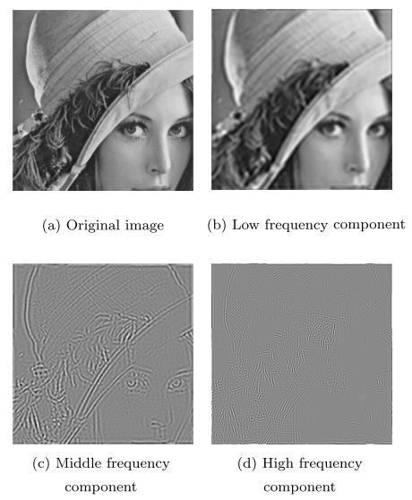
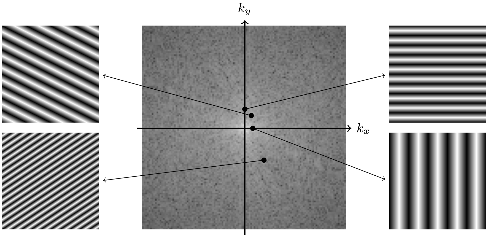

**METODE PENINGKATAN DETEKSI DEEPFAKE BERBASIS ARSITEKTUR HYBRID XCEPTIONNET DAN ANALISIS ARTEFAK DOMAIN FREKUENSI**

**SKRIPSI**

**Oleh:**

**NAOMI PRISELLA**

**NIM. 221111798**

**GIOVANNY HALIMKO**

**NIM. 221110058**

**SAMUEL ONASIS**

**NIM. 221110680**

{width="1.5748031496062993in" height="2.115376202974628in"}

**PROGRAM STUDI S-1 TEKNIK INFORMATIKA**

**FAKULTAS INFORMATIKA**

**UNIVERSITAS MIKROSKIL**

**MEDAN**

**2025**

**AN ENHANCED DEEPFAKE DETECTION METHOD BASED ON HYBRID XCEPTIONNET ARCHITECTURE AND FREQUENCY-DOMAIN ARTIFACT ANALYSIS**

**FINAL RESEARCH**

**By:**

**NAOMI PRISELLA**

**ID NUMBER. 221111798**

**GIOVANNY HALIMKO**

**ID NUMBER. 221110058**

**SAMUEL ONASIS**

**ID NUMBER. 221110680**

{width="1.5748031496062993in" height="2.115376202974628in"}

**MAJOR OF S-1 INFORMATICS ENGINEERING**

**FACULTY OF INFORMATICS**

**UNIVERSITAS MIKROSKIL**

**MEDAN**

**\**

**LEMBARAN PENGESAHAN**

**METODE PENINGKATAN DETEKSI DEEPFAKE BERBASIS ARSITEKTUR HYBRID XCEPTIONNET DAN ANALISIS ARTEFAK DOMAIN FREKUENSI**

**SKRIPSI**

Diajukan untuk Melengkapi Persyaratan Guna

Mendapatkan Gelar Sarjana

Program Studi S-1 Teknik Informatika

**Oleh:**

**NAOMI PRISELLA**

**NIM. 221111798**

**GIOVANNY HALIMKO**

**NIM. 221110058**

**SAMUEL ONASIS**

**NIM. 221110680**

Disetujui Oleh:

Dosen Pembimbing I, Dosen Pembimbing II,

\_\_\_\_\_\_\_\_\_\_\_\_\_\_\_\_\_\_\_\_\_\_\_\_\_ \_\_\_\_\_\_\_\_\_\_\_\_\_\_\_\_\_\_\_\_\_\_\_\_\_

Medan, ... ............... 20xx

Diketahui dan Disahkan Oleh:

Ketua Program Studi

S-1 Teknik Informatika,

**\_\_\_\_\_\_\_\_\_\_\_\_\_\_\_\_\_\_\_\_\_\_\_\_\_**

**HALAMAN PERNYATAAN**

Saya yang membuat pernyataan ini adalah mahasiswa Program Studi S-1 Teknik Informatika Universitas Mikroskil Medan dengan identitas mahasiswa sebagai berikut:

Nama : Samuel Onasis

NIM : 221110680

Saya telah melaksanakan penelitian dan penulisan Skripsi dengan judul dan tempat penelitian sebagai berikut:

+-------------------------------+---+------------------------------------------------------------------------------------------------------------------------------------------------+
| > Judul Skripsi               | : | Metode Peningkatan Deteksi Deepfake Berbasis Arsitektur Hybrid XceptionNet dan Analisis Artefak Domain Frekuensi                               |
+===============================+===+================================================================================================================================================+
| > Tempat Penelitian           | : | \...\...\...\...\...\...\...\...\...\...\...\...\...\...\...\...\...\...\...\...\...\...\...\...\...\...\...\...\...\...\...\...\...\...\..... |
+-------------------------------+---+------------------------------------------------------------------------------------------------------------------------------------------------+
| > Alamat Tempat Penelitian    | : | \...\...\...\...\...\...\...\...\...\...\...\...\...\...\...\...\...\...\...\...\...\...\...\...\...\...\...\...\...\...\...\...\...\...\..... |
+-------------------------------+---+------------------------------------------------------------------------------------------------------------------------------------------------+
| > No. Telp. Tempat Penelitian | : | \...\...\...\...\...\...\...\...\...\...\...\...\...\...\...\...\...\...\...\...\...\...\...\...\...\...\...\...\...\...\...\...\...\...\..... |
+-------------------------------+---+------------------------------------------------------------------------------------------------------------------------------------------------+

Sehubungan dengan Skripsi tersebut, dengan ini saya menyatakan dengan sebenar-benarnya bahwa penelitian dan penulisan Skripsi tersebut merupakan hasil karya saya sendiri (tidak menyuruh orang lain yang mengerjakannya) dan semua sumber, baik yang dikutip maupun dirujuk, telah saya nyatakan dengan benar. Bila di kemudian hari ternyata terbukti bahwa bukan saya yang mengerjakannya (membuatnya), maka saya bersedia dikenakan sanksi yang telah ditetapkan oleh Universitas Mikroskil Medan, yakni pencabutan ijazah yang telah saya terima dan ijazah tersebut dinyatakan tidak sah.

Selain itu, demi pengembangan ilmu pengetahuan, saya menyetujui untuk memberikan kepada Universitas Mikroskil Medan Hak Bebas Royalti Non-eksklusif (Non-exclusive Royalty Free Right) atas Skripsi saya beserta perangkat yang ada (jika diperlukan). Dengan hak ini, Universitas Mikroskil Medan berhak menyimpan, mengalihmedia/formatkan, mengelola dalam bentuk pangkalan data (database), merawat, dan mempublikasikan Skripsi saya, secara keseluruhan atau hanya sebagian atau hanya ringkasannya saja dalam bentuk format tercetak dan/atau elektronik, selama tetap mencantumkan nama saya sebagai penulis/pencipta dan sebagai pemilik hak cipta. Menyatakan juga bahwa saya akan mempertahankan hak eksklusif saya untuk menggunakan seluruh atau sebagian isi Skripsi saya guna pengembangan karya di masa depan, misalnya dalam bentuk artikel, buku, ataupun perangkat lunak/sistem informasi.

Demikian pernyataan ini saya perbuat dengan sungguh-sungguh, dalam keadaan sadar dan tanpa ada tekanan dari pihak manapun.

Medan, ... ............... 20xx

Saya yang membuat pernyataan,

Materai

Rp. 10.000,-

\_\_\_\_\_\_\_\_\_\_\_\_\_\_\_\_\_\_\_\_\_\_\_\_\_

**HALAMAN PERNYATAAN**

Saya yang membuat pernyataan ini adalah mahasiswa Program Studi S-1 Teknik Informatika Universitas Mikroskil Medan dengan identitas mahasiswa sebagai berikut:

Nama : Naomi Prisella

NIM : 221111798

Saya telah melaksanakan penelitian dan penulisan Skripsi dengan judul dan tempat penelitian sebagai berikut:

+-------------------------------+---+------------------------------------------------------------------------------------------------------------------------------------------------+
| > Judul Skripsi               | : | Metode Peningkatan Deteksi Deepfake Berbasis Arsitektur Hybrid XceptionNet dan Analisis Artefak Domain Frekuensi                               |
+===============================+===+================================================================================================================================================+
| > Tempat Penelitian           | : | \...\...\...\...\...\...\...\...\...\...\...\...\...\...\...\...\...\...\...\...\...\...\...\...\...\...\...\...\...\...\...\...\...\...\..... |
+-------------------------------+---+------------------------------------------------------------------------------------------------------------------------------------------------+
| > Alamat Tempat Penelitian    | : | \...\...\...\...\...\...\...\...\...\...\...\...\...\...\...\...\...\...\...\...\...\...\...\...\...\...\...\...\...\...\...\...\...\...\..... |
+-------------------------------+---+------------------------------------------------------------------------------------------------------------------------------------------------+
| > No. Telp. Tempat Penelitian | : | \...\...\...\...\...\...\...\...\...\...\...\...\...\...\...\...\...\...\...\...\...\...\...\...\...\...\...\...\...\...\...\...\...\...\..... |
+-------------------------------+---+------------------------------------------------------------------------------------------------------------------------------------------------+

Sehubungan dengan Skripsi tersebut, dengan ini saya menyatakan dengan sebenar-benarnya bahwa penelitian dan penulisan Skripsi tersebut merupakan hasil karya saya sendiri (tidak menyuruh orang lain yang mengerjakannya) dan semua sumber, baik yang dikutip maupun dirujuk, telah saya nyatakan dengan benar. Bila di kemudian hari ternyata terbukti bahwa bukan saya yang mengerjakannya (membuatnya), maka saya bersedia dikenakan sanksi yang telah ditetapkan oleh Universitas Mikroskil Medan, yakni pencabutan ijazah yang telah saya terima dan ijazah tersebut dinyatakan tidak sah.

Selain itu, demi pengembangan ilmu pengetahuan, saya menyetujui untuk memberikan kepada Universitas Mikroskil Medan Hak Bebas Royalti Non-eksklusif (Non-exclusive Royalty Free Right) atas Skripsi saya beserta perangkat yang ada (jika diperlukan). Dengan hak ini, Universitas Mikroskil Medan berhak menyimpan, mengalihmedia/formatkan, mengelola dalam bentuk pangkalan data (database), merawat, dan mempublikasikan Skripsi saya, secara keseluruhan atau hanya sebagian atau hanya ringkasannya saja dalam bentuk format tercetak dan/atau elektronik, selama tetap mencantumkan nama saya sebagai penulis/pencipta dan sebagai pemilik hak cipta. Menyatakan juga bahwa saya akan mempertahankan hak eksklusif saya untuk menggunakan seluruh atau sebagian isi Skripsi saya guna pengembangan karya di masa depan, misalnya dalam bentuk artikel, buku, ataupun perangkat lunak/sistem informasi.

Demikian pernyataan ini saya perbuat dengan sungguh-sungguh, dalam keadaan sadar dan tanpa ada tekanan dari pihak manapun.

Medan, ... ............... 20xx

Saya yang membuat pernyataan,

Materai

Rp. 10.000,-

\_\_\_\_\_\_\_\_\_\_\_\_\_\_\_\_\_\_\_\_\_\_\_\_\_

**HALAMAN PERNYATAAN**

Saya yang membuat pernyataan ini adalah mahasiswa Program Studi S-1 Teknik Informatika Universitas Mikroskil Medan dengan identitas mahasiswa sebagai berikut:

Nama : Giovanny Halimko

NIM : 221110058

Saya telah melaksanakan penelitian dan penulisan Skripsi dengan judul dan tempat penelitian sebagai berikut:

+-------------------------------+---+------------------------------------------------------------------------------------------------------------------------------------------------+
| > Judul Skripsi               | : | Metode Peningkatan Deteksi Deepfake Berbasis Arsitektur Hybrid XceptionNet dan Analisis Artefak Domain Frekuensi                               |
+===============================+===+================================================================================================================================================+
| > Tempat Penelitian           | : | \...\...\...\...\...\...\...\...\...\...\...\...\...\...\...\...\...\...\...\...\...\...\...\...\...\...\...\...\...\...\...\...\...\...\..... |
+-------------------------------+---+------------------------------------------------------------------------------------------------------------------------------------------------+
| > Alamat Tempat Penelitian    | : | \...\...\...\...\...\...\...\...\...\...\...\...\...\...\...\...\...\...\...\...\...\...\...\...\...\...\...\...\...\...\...\...\...\...\..... |
+-------------------------------+---+------------------------------------------------------------------------------------------------------------------------------------------------+
| > No. Telp. Tempat Penelitian | : | \...\...\...\...\...\...\...\...\...\...\...\...\...\...\...\...\...\...\...\...\...\...\...\...\...\...\...\...\...\...\...\...\...\...\..... |
+-------------------------------+---+------------------------------------------------------------------------------------------------------------------------------------------------+

Sehubungan dengan Skripsi tersebut, dengan ini saya menyatakan dengan sebenar-benarnya bahwa penelitian dan penulisan Skripsi tersebut merupakan hasil karya saya sendiri (tidak menyuruh orang lain yang mengerjakannya) dan semua sumber, baik yang dikutip maupun dirujuk, telah saya nyatakan dengan benar. Bila di kemudian hari ternyata terbukti bahwa bukan saya yang mengerjakannya (membuatnya), maka saya bersedia dikenakan sanksi yang telah ditetapkan oleh Universitas Mikroskil Medan, yakni pencabutan ijazah yang telah saya terima dan ijazah tersebut dinyatakan tidak sah.

Selain itu, demi pengembangan ilmu pengetahuan, saya menyetujui untuk memberikan kepada Universitas Mikroskil Medan Hak Bebas Royalti Non-eksklusif (Non-exclusive Royalty Free Right) atas Skripsi saya beserta perangkat yang ada (jika diperlukan). Dengan hak ini, Universitas Mikroskil Medan berhak menyimpan, mengalihmedia/formatkan, mengelola dalam bentuk pangkalan data (database), merawat, dan mempublikasikan Skripsi saya, secara keseluruhan atau hanya sebagian atau hanya ringkasannya saja dalam bentuk format tercetak dan/atau elektronik, selama tetap mencantumkan nama saya sebagai penulis/pencipta dan sebagai pemilik hak cipta. Menyatakan juga bahwa saya akan mempertahankan hak eksklusif saya untuk menggunakan seluruh atau sebagian isi Skripsi saya guna pengembangan karya di masa depan, misalnya dalam bentuk artikel, buku, ataupun perangkat lunak/sistem informasi.

Demikian pernyataan ini saya perbuat dengan sungguh-sungguh, dalam keadaan sadar dan tanpa ada tekanan dari pihak manapun.

Medan, ... ............... 20xx

Saya yang membuat pernyataan,

Materai

Rp. 10.000,-

\_\_\_\_\_\_\_\_\_\_\_\_\_\_\_\_\_\_\_\_\_\_\_\_\_

**METODE PENINGKATAN DETEKSI DEEPFAKE BERBASIS ARSITEKTUR HYBRID XCEPTIONNET DAN ANALISIS ARTEFAK DOMAIN FREKUENSI**

# Abstrak

*Abstrak minimal 100 kata dan maksimal 200 kata berbahasa Indonesia, dicetak miring dengan huruf Times New Roman 12 pt, serta dibuat dalam satu paragraf. Abstrak harus jelas, deskriptif, dan harus memberikan gambaran singkat masalah yang diteliti. Abstrak meliputi alasan pemilihan topik atau pentingnya topik penelitian, metodologi penelitian, dan ringkasan hasil. Abstrak harus diakhiri dengan komentar tentang pentingnya hasil atau kesimpulan singkat.*

**Kata kunci:** 3 s/d 5 kata kunci dicetak miring

**Abstract**

*A minimum 100 words and maximum 200 words of abstract in English, in italics with Times New Roman 12 pt, and within one paragraph. Abstract should be clear, descriptive, and provide a brief overview of the problem studied. Abstract include reasons for the selected topics or the importance of research topics, research methodology, and a summary of the results. Abstract should end with comments about the importance of the results or brief conclusion.*

**Keywords:** 3 to 5 keywords in italics

# KATA PENGANTAR

Puji syukur saya panjatkan ke hadirat Tuhan Yang Maha Esa atas segala rahmat, karunia, dan bimbingan-Nya sehingga saya dapat menyelesaikan tesis yang berjudul *"Metode Peningkatan Deteksi Deepfake Berbasis Arsitektur Hybrid XceptionNet dan Analisis Artefak Domain Frekuensi"*.

Skripsi ini dilakukan karena fenomena *deepfake* yang semakin berkembang, baik dari sisi kualitas maupun aksesibilitas. *Deepfake* bisa menyebarkan hoax, fitnah, menimbulkan pelanggaran privasi, dan merusak kepercayaan publik terhadap media. Oleh karena itu, diperlukan metode deteksi *deepfake* yang lebih *robust*, terutama terhadap generasi terbaru yang sangat menyerupai citra atau video asli.

Saya menyampaikan terima kasih yang sebesar-besarnya kepada:

1.  Bapak Gunawan S.Kom., M.T.I., selaku Dosen Pembimbing I.

2.  Bapak Heru Kurniawan S.Kom., M.Kom., selaku Dosen Pembimbing II.

3.  Bapak Hardy S.Kom., M.SC., PH.D., selaku Rektor Universitas Mikroskil Medan.

4.  Bapak Sunaryo Winardi S.Kom., M.T., selaku Dekan Fakultas Informatika Universitas Mikroskil Medan.

5.  Bapak Carles Juliandy S.Kom., M.Kom., selaku Ketua Program Studi S-1 Teknik Informatika Fakultas Informatika Universitas Mikroskil Medan.

6.  Orang tua dan keluarga

Medan, ... ............... 20xx

Penulis,

\_\_\_\_\_\_\_\_\_\_\_\_\_\_\_\_\_\_\_\_\_\_\_\_\_

# DAFTAR ISI

[Abstrak [2](#abstrak)](#abstrak)

[KATA PENGANTAR [3](#kata-pengantar)](#kata-pengantar)

[DAFTAR ISI [4](#daftar-isi)](#daftar-isi)

[DAFTAR GAMBAR [9](#daftar-gambar)](#daftar-gambar)

[DAFTAR TABEL [10](#daftar-tabel)](#daftar-tabel)

[DAFTAR LAMPIRAN [11](#daftar-lampiran)](#daftar-lampiran)

[1. BAB I PENDAHULUAN [1](#bab-i-pendahuluan)](#bab-i-pendahuluan)

[1.1 Latar Belakang [1](#latar-belakang)](#latar-belakang)

[1.2 Rumusan Masalah [3](#rumusan-masalah)](#rumusan-masalah)

[1.3 Tujuan [3](#tujuan)](#tujuan)

[1.4 Manfaat [3](#manfaat)](#manfaat)

[1.5 Ruang Lingkup [4](#ruang-lingkup)](#ruang-lingkup)

[2. BAB II KAJIAN LITERATUR [5](#bab-ii-kajian-literatur)](#bab-ii-kajian-literatur)

[2.1 Deepfake [5](#deepfake)](#deepfake)

[2.1.1 Ancaman Deepfake [5](#ancaman-deepfake)](#ancaman-deepfake)

[2.1.2 Tantangan dalam Deteksi Deepfake [6](#tantangan-dalam-deteksi-deepfake)](#tantangan-dalam-deteksi-deepfake)

[2.2 Generative Adversarial Networks (GAN) [6](#generative-adversarial-networks-gan)](#generative-adversarial-networks-gan)

[2.2.1 Peran GAN dalam Pembuatan Deepfake [7](#peran-gan-dalam-pembuatan-deepfake)](#peran-gan-dalam-pembuatan-deepfake)

[2.2.2 Upsampling dan Interpolasi dalam Proses Generatif Deepfake [8](#upsampling-dan-interpolasi-dalam-proses-generatif-deepfake)](#upsampling-dan-interpolasi-dalam-proses-generatif-deepfake)

[2.2.3 Artefak yang Dihasilkan Proses Generatif Deepfake [8](#artefak-yang-dihasilkan-proses-generatif-deepfake)](#artefak-yang-dihasilkan-proses-generatif-deepfake)

[2.3 Pendekatan Deteksi Deepfake [8](#pendekatan-deteksi-deepfake)](#pendekatan-deteksi-deepfake)

[2.3.1 Deteksi Berbasis Domain Spasial [8](#deteksi-berbasis-domain-spasial)](#deteksi-berbasis-domain-spasial)

[2.3.2 Deteksi Berbasis Domain Frekuensi [9](#deteksi-berbasis-domain-frekuensi)](#deteksi-berbasis-domain-frekuensi)

[2.3.3 Perbandingan Domain Spasial dengan Domain Frekuensi [10](#perbandingan-domain-spasial-dengan-domain-frekuensi)](#perbandingan-domain-spasial-dengan-domain-frekuensi)

[2.3.4 Pendekatan Hybrid Domain Spasial-Frekuensi [10](#pendekatan-hybrid-domain-spasial-frekuensi)](#pendekatan-hybrid-domain-spasial-frekuensi)

[2.4 Frequency Domain Analysis [11](#frequency-domain-analysis)](#frequency-domain-analysis)

[2.4.1 Konsep Domain Frekuensi [11](#konsep-domain-frekuensi)](#konsep-domain-frekuensi)

[2.4.2 Transformasi Fourier (FFT) [12](#transformasi-fourier-fft)](#transformasi-fourier-fft)

[2.4.3 Artefak Frekuensi pada Citra Deepfake [13](#artefak-frekuensi-pada-citra-deepfake)](#artefak-frekuensi-pada-citra-deepfake)

[2.4.4 Peran Frequency Domain Analysis dalam Deteksi Deepfake [14](#peran-frequency-domain-analysis-dalam-deteksi-deepfake)](#peran-frequency-domain-analysis-dalam-deteksi-deepfake)

[2.5 Spectral Distortions dalam Deteksi Deepfake [14](#spectral-distortions-dalam-deteksi-deepfake)](#spectral-distortions-dalam-deteksi-deepfake)

[2.5.1 Akar Kemunculan Spectral Distortions pada Model Generatif [15](#akar-kemunculan-spectral-distortions-pada-model-generatif)](#akar-kemunculan-spectral-distortions-pada-model-generatif)

[2.5.2 Jenis-Jenis Spectral Distortions pada Gambar dan Video Deepfake [15](#jenis-jenis-spectral-distortions-pada-gambar-dan-video-deepfake)](#jenis-jenis-spectral-distortions-pada-gambar-dan-video-deepfake)

[2.5.3 Relevansi Spectral Distortions untuk Deteksi Deepfake [16](#relevansi-spectral-distortions-untuk-deteksi-deepfake)](#relevansi-spectral-distortions-untuk-deteksi-deepfake)

[2.5.4 Pendekatan Modern yang Memanfaatkan Spectral Distortions [16](#pendekatan-modern-yang-memanfaatkan-spectral-distortions)](#pendekatan-modern-yang-memanfaatkan-spectral-distortions)

[2.5.5 Relevansi Spectral Distortions terhadap Penelitian Ini [17](#relevansi-spectral-distortions-terhadap-penelitian-ini)](#relevansi-spectral-distortions-terhadap-penelitian-ini)

[2.5.6 Spectral Dropoff](#spectral-dropoff)

[2.5.6.1 Spectral Dropoff pada Citra Alami](#spectral-dropoff-pada-citra-alami)

[2.5.6.2 Anomali Spectral Dropoff pada Deepfake](#anomali-spectral-dropoff-pada-deepfake)

[2.6 Periodic Noise dalam Domain Frekuensi](#periodic-noise-dalam-domain-frekuensi)

[2.6.1 Definisi dan Karakteristik Periodic Noise](#definisi-dan-karakteristik-periodic-noise)

[2.6.2 Sumber Periodic Noise pada Citra Deepfake](#sumber-periodic-noise-pada-citra-deepfake)

[2.6.3 Peran Periodic Noise dalam Deteksi Deepfake](#peran-periodic-noise-dalam-deteksi-deepfake)

[2.6.4 Contoh Pola Periodic Noise pada Spektrum Frekuensi](#contoh-pola-periodic-noise-pada-spektrum-frekuensi)

[2.7 Warping dalam Domain Frekuensi](#warping-dalam-domain-frekuensi)

[2.7.1 Low-Frequency Warping](#low-frequency-warping)

[2.7.2 High-Frequency Warping](#high-frequency-warping)

[2.8 Deep Learning](#deep-learning)

[2.8.1 Arsitektur Dasar Deep Learning](#arsitektur-dasar-deep-learning)

[2.8.2 Peran Deep Learning dalam Pembuatan Deepfake](#peran-deep-learning-dalam-pembuatan-deepfake)

[2.8.3 Peran Deep Learning dalam Deteksi *Deepfake*](#peran-deep-learning-dalam-deteksi-deepfake)

[2.9 Convolution Neural Network (CNN)](#convolution-neural-network-cnn)

[2.10 Depthwise Separable Convolution](#depthwise-separable-convolution)

[2.10.1 Depthwise Convolution](#depthwise-convolution)

[2.10.2 Pointwise Convolution](#pointwise-convolution)

[2.10.3 Kompleksitas Depthwise Separable Convolution](#kompleksitas-depthwise-separable-convolution)

[2.10.4 Relevansi Depthwise Separable Convolution pada Deteksi Deepfake](#relevansi-depthwise-separable-convolution-pada-deteksi-deepfake)

[2.10.5 Integrasi dengan FFT sebagai Channel Tambahan](#integrasi-dengan-fft-sebagai-channel-tambahan)

[2.11 XceptionNet](#xceptionnet)

[2.11.1 Arsitektur XceptionNet](#arsitektur-xceptionnet)

[2.11.2 Transfer Learning pada XceptionNet](#transfer-learning-pada-xceptionnet)

[2.11.3 Keunggulan XceptionNet dalam Deteksi Deepfake](#keunggulan-xceptionnet-dalam-deteksi-deepfake)

[2.12 FaceForensics](#faceforensics)

[2.12.1 Struktur dan Komposisi Dataset](#struktur-dan-komposisi-dataset)

[2.12.2 Karakteristik Artefak pada FaceForensics++](#karakteristik-artefak-pada-faceforensics)

[2.12.3 Alasan Pemilihan FaceForensics++ untuk Penelitian Ini](#alasan-pemilihan-faceforensics-untuk-penelitian-ini)

[2.12.4 Peran FaceForensics++ dalam Sistem Hybrid XceptionNet--FFT](#peran-faceforensics-dalam-sistem-hybrid-xceptionnetfft)

[2.13 Celeb-DF](#celeb-df)

[2.13.1 Komposisi dan Karakteristik Dataset](#komposisi-dan-karakteristik-dataset)

[2.13.2 Peran Celeb-DF dalam Evaluasi Cross-Dataset](#peran-celeb-df-dalam-evaluasi-cross-dataset)

[2.14 Analisis Citra](#analisis-citra)

[2.15 Analisis Video](#analisis-video)

[2.16 Preprocessing](#preprocessing)

[2.16.1 Tahapan dan Alur Preprocessing](#tahapan-dan-alur-preprocessing)

[2.16.2 Fast Fourier Transform (FFT)](#fast-fourier-transform-fft)

[2.17 Optimasi Model](#optimasi-model)

[2.17.1 Stochastic Gradient Descent dan Perkembangannya](#stochastic-gradient-descent-dan-perkembangannya)

[2.17.2 Adam (Adaptive Moment Estimation)](#adam-adaptive-moment-estimation)

[2.17.3 Keunggulan Adam untuk Deteksi Deepfake](#keunggulan-adam-untuk-deteksi-deepfake)

[2.17.4 Binary Cross-Entropy sebagai Fungsi Loss](#binary-cross-entropy-sebagai-fungsi-loss)

[2.18 Metrik Evaluasi Model](#metrik-evaluasi-model)

[2.18.1 Confusion Matrix](#confusion-matrix)

[2.18.2 Accuracy](#accuracy)

[2.18.3 Precision](#precision)

[2.18.4 Recall](#recall)

[2.18.5 F1-Score](#f1-score)

[2.18.6 AUC (Area Under the ROC Curve)](#auc-area-under-the-roc-curve)

[2.18.7 Perhitungan Metrik Evaluasi](#perhitungan-metrik-evaluasi)

[2.18.8 Relevansi Metrik Evaluasi terhadap Penelitian Deepfake](#relevansi-metrik-evaluasi-terhadap-penelitian-deepfake)

[2.19 Cross Dataset Generalization [44](#cross-dataset-generalization)](#cross-dataset-generalization)

[2.20 Cross-GAN pada Deteksi Deepfake [46](#cross-gan-pada-deteksi-deepfake)](#cross-gan-pada-deteksi-deepfake)

[2.20.1 Mengapa Cross-GAN Sulit [46](#mengapa-cross-gan-sulit)](#mengapa-cross-gan-sulit)

[2.20.2 Indikator Evaluasi Cross-GAN [47](#indikator-evaluasi-cross-gan)](#indikator-evaluasi-cross-gan)

[2.20.3 Pendekatan untuk Meningkatkan Generalisasi Cross-GAN [47](#pendekatan-untuk-meningkatkan-generalisasi-cross-gan)](#pendekatan-untuk-meningkatkan-generalisasi-cross-gan)

[2.20.4 Relevansi Cross-GAN terhadap Penelitian Ini [48](#relevansi-cross-gan-terhadap-penelitian-ini)](#relevansi-cross-gan-terhadap-penelitian-ini)

[2.21 Dasar Pemilihan Metode [48](#dasar-pemilihan-metode)](#dasar-pemilihan-metode)

[2.21.1 Pemilihan Transformasi FFT dalam Deteksi Deepfake [49](#pemilihan-transformasi-fft-dalam-deteksi-deepfake)](#pemilihan-transformasi-fft-dalam-deteksi-deepfake)

[2.21.2 Pemilihan Arsitektur XceptionNet dalam Domain Spasial [50](#pemilihan-arsitektur-xceptionnet-dalam-domain-spasial)](#pemilihan-arsitektur-xceptionnet-dalam-domain-spasial)

[2.21.3 Perbandingan Akurasi dan Ketahanan Metode FFT dan XceptionNet [51](#perbandingan-akurasi-dan-ketahanan-metode-fft-dan-xceptionnet)](#perbandingan-akurasi-dan-ketahanan-metode-fft-dan-xceptionnet)

[3. BAB III TAHAPAN PELAKSANAAN [53](#bab-iii-tahapan-pelaksanaan)](#bab-iii-tahapan-pelaksanaan)

[3.1 Kerangka Umum Penelitian](#kerangka-umum-penelitian)

[3.1.1 Justifikasi Pendekatan Hybrid](#justifikasi-pendekatan-hybrid)

[3.1.2 FFT sebagai Saluran Tambahan](#fft-sebagai-saluran-tambahan)

[3.1.3 Alur Sistem](#alur-sistem)

[3.2 Dataset dan Sumber Data](#dataset-dan-sumber-data)

[3.2.1 Dataset yang Digunakan [53](#dataset-yang-digunakan)](#dataset-yang-digunakan)

[3.2.2 Pembagian Dataset [54](#pembagian-dataset)](#pembagian-dataset)

[3.2.3 Struktur dan Karakteristik Dataset [54](#struktur-dan-karakteristik-dataset)](#struktur-dan-karakteristik-dataset)

[3.3 Tahapan Preprocessing Data [55](#tahapan-preprocessing-data)](#tahapan-preprocessing-data)

[3.3.1 Normalisasi, Resize dan Labelling Citra [55](#normalisasi-resize-dan-labelling-citra)](#normalisasi-resize-dan-labelling-citra)

[3.3.2 Konversi Domain Frekuensi (FFT) [55](#konversi-domain-frekuensi-fft)](#konversi-domain-frekuensi-fft)

[3.3.3 Integrasi FFT sebagai Channel Tambahan [56](#integrasi-fft-sebagai-channel-tambahan)](#integrasi-fft-sebagai-channel-tambahan)

[3.4 Arsitektur Model yang Diusulkan [56](#arsitektur-model-yang-diusulkan)](#arsitektur-model-yang-diusulkan)

[3.4.1 Arsitektur XceptionNet [56](#arsitektur-xceptionnet)](#arsitektur-xceptionnet)

[3.4.2 Channel Adapter Layer [57](#channel-adapter-layer)](#channel-adapter-layer)

[3.4.3 Arsitektur Lengkap Model [57](#arsitektur-lengkap-model)](#arsitektur-lengkap-model)

[3.5 Strategi Pelatihan Model [57](#strategi-pelatihan-model)](#strategi-pelatihan-model)

[3.5.1 Transfer Learning [57](#transfer-learning)](#transfer-learning)

[3.5.2 Parameter Pelatihan [58](#parameter-pelatihan)](#parameter-pelatihan)

[3.5.3 Early Stopping Kustom [58](#early-stopping-kustom)](#early-stopping-kustom)

[3.6 Metode Evaluasi Model [58](#metode-evaluasi-model)](#metode-evaluasi-model)

[4. BAB IV HASIL DAN PEMBAHASAN [60](#bab-iv-hasil-dan-pembahasan)](#bab-iv-hasil-dan-pembahasan)

[4.1 Hasil [60](#hasil)](#hasil)

[4.2 Pembahasan [60](#pembahasan)](#pembahasan)

[5. BAB V PENUTUP [61](#bab-v-penutup)](#bab-v-penutup)

[6. DAFTAR PUSTAKA [62](#daftar-pustaka)](#daftar-pustaka)

# DAFTAR GAMBAR

# DAFTAR TABEL

# DAFTAR LAMPIRAN

# BAB I PENDAHULUAN

## 1.1 Latar Belakang

Perkembangan teknologi kecerdasan buatan, khususnya pada bidang *Generative Adversarial Networks* (GAN), telah menghasilkan kemampuan menciptakan citra dan video sintetis yang sangat realistis. Salah satu hasil penerapannya adalah teknologi yang dikenal dengan nama *deepfake*. Teknologi ini mampu memanipulasi video atau audio untuk menampilkan adegan atau ucapan seolah-olah berasal dari orang yang sebenarnya. Meskipun tujuan awal dikembangkannya teknologi ini adalah untuk hiburan, atau penelitian, penyalahgunaan *deepfake* telah menimbulkan ancaman serius, seperti penyebaran informasi palsu (*fake news*), pelanggaran privasi, hingga memicu kerugian di tingkat individu, sosial, hingga geopolitik (P. & S., 2019).

Di tingkat individu, *Deepfake* memiliki potensi besar untuk merusak citra, dan reputasi seseorang, terutama melalui pembuatan konten palsu yang merusak, seperti kasus *deepfake porn*. Secara global, studi menunjukkan mayoritas video *deepfake* adalah pornografi yang menargetkan perempuan, menciptakan konsekuensi serius terhadap privasi dan persepsi masyarakat (Andira & Susila, 2024).

Berbagai metode telah dikembangkan untuk mendeteksi *deepfake*, salah satunya berbasis domain spasial yang menganalisis informasi visual langsung dari citra atau *frame* video. Beberapa arsitektur yang terbukti efektif di domain ini antara lain *MesoNet*, *ResNet*, dan *XceptionNet* (Haq, 2021) (Afchar, Nozick, & Yamagishi, 2018). *MesoNet* dirancang untuk mendeteksi artefak lokal seperti batas *blending* dan perbedaan warna pada wajah hasil manipulasi, namun memiliki keterbatasan pada citra resolusi tinggi (Afchar, Nozick, & Yamagishi, 2018). *ResNet* memperkenalkan *residual learning* untuk mempelajari representasi spasial yang lebih dalam, tetapi performanya menurun ketika dihadapkan pada lintas dataset (*cross-dataset*) (He, Zhang, Ren, & Sun, 2015). Sementara itu, *XceptionNet* atau *Extreme Inception Net*, menonjol karena efisiensinya dalam mengekstraksi fitur spasial tingkat tinggi menggunakan *depthwise separable convolution* (Chollet, 2017).

Namun, pendekatan berbasis spasial memiliki kelemahan yang fundamental, yaitu fokusnya yang hanya mendeteksi pada artefak visual yang tampak, bukan pada pola algoritmik yang dihasilkan selama proses generatif. Penyebab utama dari kegagalan generalisasi model *deepfake* biasanya terletak pada sifat fundamental artefak, yang bersifat algoritmik, bukan visual (Durall, Keuper, & Keuper, 2020). Artefak biasanya muncul dari kelemahan dalam operasi *upsampling*, yang digunakan oleh GAN untuk meningkatkan resolusi citra, yang cenderung menciptakan pola *noise* atau *spectral distortion* yang tidak alami, dan biasanya dikenal sebagai *GAN fingerprints*, yang tidak terlihat jelas dalam *spatial domain* (Zhang, Karaman, & Chang, 2019).

Untuk mengatasi keterbatasan tersebut, sejumlah penelitian telah mengusulkan pendekatan berbasis *frequency*, seperti *Frequency Domain Analysis (*FDA*)*, dengan metode *Fast Fourier Transform* (FFT), *Discrete Cosine Transform* (DCT), atau *Wavelet Transform*. Pendekatan ini berupaya mengekstraksi pola artefak frekuensi yang muncul akibat proses *upsampling*, *interpolation*, dan *compression* pada citra hasil sintesis (Durall, Keuper, & Keuper, 2020).

*Durall et al*. menunjukkan bahwa sebagian besar *deepfake* generator gagal dalam mereplikasi spektrum frekuensi alami citra manusia, dan FDA dapat mendeteksi perbedaan tersebut bahkan ketika manipulasi visual tampak realistis di domain spasial (Durall, Keuper, & Keuper, 2020). Studi terkini mulai mengombinasikan deteksi spasial dengan pendekatan frekuensi. *Alam el at*. menunjukkan bahwa penggabungan domain spasial dan domain frekuensi dapat meningkatkan kemampuan generalisasi dan ketahanan terhadap kompresi (Alam, Tanvir, & Woo, 2025). Temuan-temuan ini memperkuat pentingnya integrasi dua domain analisis untuk menciptakan detektor *deepfake* yang lebih *robust*.

Beberapa penelitian menunjukkan bahwa gabungan antara dua domain ini, dapat meningkatkan kemampuan generalisasi model terhadap *deepfake* lawas maupun baru, sekaligus menekan *overfitting* terhadap dataset tertentu (Rana, Nobi, Murali, & Sung, 2022; Rao & Uehara, 2025; Kim, et al., 2025). Dengan demikian, integrasi antara FFT dan *XceptionNet* memungkinkan sistem deteksi untuk memanfaatkan dua perspektif yaitu FFT yang menunjukkan perbedaan spektral yang tidak terlihat secara kasat mata, sedangkan *XceptionNet* mendeteksi inkonsistensi visual di domain spasial. Pendekatan gabungan ini terbukti meningkatkan akurasi dan kemampuan generalisasi *model* terhadap dataset baru (*cross-dataset testing*), yang menjadi tantangan utama dalam deteksi deepfake (Qian, Yin, Sheng, Chen, & Shao, 2020; Durall, Keuper, & Keuper, 2020).

Berdasarkan uraian tersebut, terdapat *research gap* dalam penelitian deteksi *deepfake*, yaitu belum adanya pendekatan yang secara terpadu mengombinasikan analisis domain spasial dan domain frekuensi dalam satu arsitektur yang dioptimalkan untuk meningkatkan kemampuan generalisasi lintas *dataset*. Sebagian besar studi terdahulu masih berfokus pada salah satu domain secara terpisah, sehingga performanya menurun ketika diuji pada data dari sumber berbeda. Oleh karena itu, penelitian ini berupaya mengisi kesenjangan tersebut dengan mengusulkan pendekatan *Hybrid XceptionNet--FFT*, yang mengintegrasikan kekuatan analisis spasial dan frekuensi untuk menghasilkan detektor *deepfake* yang lebih akurat, *robust*, dan adaptif terhadap berbagai variasi dataset.

## 1.2 Rumusan Masalah

Berdasarkan latar belakang masalah yang menggarisbawahi kegagalan detektor spasial murni dan potensi yang belum dimanfaatkan dari FDA, permasalahan utama dalam penelitian ini dapat dirumuskan sebagai berikut:

1.  Bagaimana mengembangkan metode deteksi *deepfake* yang lebih akurat, dan *robust* dengan menggabungkan arsitektur *XceptionNet* berbasis domain spasial, dan analisis frekuensi FFT untuk mendeteksi manipulasi citra atau video sintetis?

2.  Bagaimana arsitektur *XceptionNet* dapat dimodifikasi dan diperluas melalui integrasi modul FDA untuk secara efektif mengekstrak dan menggabungkan fitur spasial *fine-grained* pada artefak *high-band frequency*?

3.  Seberapa besar peningkatan kinerja, khususnya dalam hal *cross-dataset generalization capability*, yang dicapai oleh model *hybrid* yang diusulkan dibandingkan dengan model deteksi *state-of-the-art* berbasis spasial murni?

## 1.3 Tujuan

Tujuan yang hendak dicapai pada penelitian ini adalah:

1.  Merancang dan mengimplementasi model *hybrid* yang menggabungkan arsitektur *XceptionNet* dan modul ekstraksi fitur berbasis domain frekuensi, FDA dengan metode FFT untuk mendeteksi *deepfake*.

2.  Memperluas dan memodifikasi arsitektur *XceptionNet* dengan menambahkan modul *Frequency Domain Analysis* (FDA) untuk mengintegrasikan informasi spasial dan frekuensi, serta mengevaluasi pengaruh masing-masing fitur terhadap performa deteksi.

3.  Menganalisis dan membandingkan kinerja model *hybrid* yang diusulkan dengan model deteksi berbasis spasial murni dalam hal akurasi, presisi, dan kemampuan generalisasi lintas dataset.

## 1.4 Manfaat

Penelitian ini diharapkan memberikan kontribusi terhadap komunitas riset, serta diharapkan memberikan manfaat sebagai berikut:

1.  Manfaat Akademik: Memberikan kontribusi ilmiah dalam pengembangan metode deteksi *deepfake* berbasis gabungan domain spasial dan frekuensi.

2.  Manfaat Teknologi dan Industri: Menyediakan pendekatan yang dapat diadaptasi oleh lembaga forensik untuk mendeteksi konten manipulatif.

3.  Manfaat Sosial: Membantu mencegah penyebaran informasi palsu, perusakan citra, pelanggaran privasi akibat penyalahgunaan *deepfake*.

4.  Manfaat Operasional: Menghasilkan model yang efisien dengan *XceptionNet*, dan kecepatan serta ketepatan inferensi dari FFT.

5.  Manfaat Praktis: Menyediakan alat forensik digital yang lebih andal dan akurat. Penegak hukum dan badan pengawas media dapat menggunakan model ini untuk melakukan verifikasi keaslian konten video.

## 1.5 Ruang Lingkup

Ruang lingkup penelitian ini difokuskan pada pengembangan dan evaluasi model deteksi *deepfake* berbasis *hybrid* yang menggabungkan analisis domain spasial dan domain frekuensi. Penelitian ini hanya mencakup tahap perancangan, implementasi, dan evaluasi model deteksi menggunakan dataset publik, tanpa membahas aspek produksi video *deepfake* atau sistem penyebarannya.

Penelitian ini difokuskan pada:

1.  Cakupan Data: Data diuji dan dilatih menggunakan dataset yang berasal dari publik, seperti **FaceForensics++** dan **Celeb-DF**, yang berisi video wajah hasil manipulasi berbasis *face swapping*. Penelitian tidak mencakup deteksi manipulasi audio, atau *text-based deepfake*.

2.  Cakupan Metode: Analisis frekuensi dilakukan menggunakan metode FFT untuk mengekstraksi fitur spektral yang merepresentasikan artefak sintesis. Model spasial yang digunakan terbatas pada arsitektur *XceptionNet*.

3.  Cakupan Evaluasi: Evaluasi kinerja model dilakukan berdasarkan metrik *accuracy*, *precision*, *recall*, dan *AUC* (*Area Under Curve*), serta pengujian *cross-dataset generalization* untuk mengukur ketahanan model terhadap variasi sumber data.

4.  Cakupan Sistem: Implementasi dilakukan dalam lingkungan eksperimental, dengan keterbatasan komputasi dan waktu pelatihan tertentu. Penelitian tidak terfokus pada optimasi waktu inferensi secara mendalam.

Dengan batasan ini, penelitian diarahkan untuk menjaga fokus pada validasi efektivitas integrasi antara FDA ke dalam arsitektur *XceptionNet* untuk meningkatkan kemampuan generalisasi serta ketahanan, dan akurasi dalam mendeteksi *deepfake*.

# BAB II KAJIAN LITERATUR

## 2.1 Deepfake

Istilah *deepfake* berasal dari gabungan dua kata, yaitu *deep learning* dan *fake*. Istilah ini merujuk pada konten multimedia, baik berupa gambar, video maupun audio, yang telah dimodifikasi secara visual, atau auditori dengan menggunakan teknik *deep learning* hingga tampak sangat realistid dan menyerupai aslinya (Rana, Nobi, Murali, & Sung, 2022). Secara teknis, *deepfake* memanfaatkan model generatif seperti GAN atau arsitektur *encoder-decoder* untuk memodifikasi konten sintesis seperti *face swapping* atau *face reenactment*.

Secara umum, teknologi *deepfake* dikembangkan berdasarkan jaringan saraf tiruan (*neural network*). Dalam prosesnya, model dilatih untuk mempelajari pola, ekspresi, serta pergerakan wajah manusia, sehingga wajah seseorang pada suatu video dapat digantikan dengan wajah orang lain, sehingga menghasilkan video yang tampak realistis dan meyakinkan (Andira & Susila, 2024). Dengan kemampuan tersebut, *deepfake* menjadi salah satu penerapan *deep learning* yang paling menonjol dalam bidang sintesis media (Chadha, Kumar, Kashyap, & Gupta, 2021).

Tujuan utama dari pengembangan *deepfake* pada awalnya adalah untuk penelitian dan pengembangan teknologi sintesis media yang realistis, bukan untuk penipuan atau penyebaran informasi palsu. Teknologi ini dirancang untuk mengeksplorasi kemampuan dari *neural network* dalam melakukan rekonstruksi ekspresi wajah, pergerakan bibir, serta sinkronisasi audio-visual dalam konteks hiburan, industri film, *lip-sync translation*, dan *virutal reality* (Chadha, Kumar, Kashyap, & Gupta, 2021). Selain itu, *deepfake* juga dimanfaatkan dalam ranah ilmiah seperti pelatihan model *face recognition*, penciptaan data sintetik untuk meningkatkan generalisasi model, hingga simulasi terhadap perilaku manusia dalam bidang psikologi, dan forensik digital (Rana, Nobi, Murali, & Sung, 2022; Chadha, Kumar, Kashyap, & Gupta, 2021).

Dalam konteks penelitian ini, istilah *deepfake* merujuk secara khusus pada manipulasi wajah pada citra dan frame video yang dihasilkan menggunakan model generatif berbasis *deep learning*, seperti GAN. Fokus penelitian ditujukan pada pendeteksian artefak visual dan *spektral* pada gambar serta frame video, bukan pada manipulasi audio atau bentuk media sintetis lainnya.

### 2.1.1 Ancaman Deepfake

*Deepfake* membawa berbagai potensi penyalahgunaan yang serius, mulai dari penyebaran misinformasi, dan propaganda politik, hingga penipuan, dan perusakan reputasi individu melalui konten palsu (Rana, Nobi, Murali, & Sung, 2022). Salah satu bentuk penyalahgunaan yang paling meresahkan adalah *deepfake porn*, yakni video pornografi hasil rekayasa yang menampilkan wajah korban, seolah-olah korban terlibat dalam adegan tersebut. Studi global menunjukkan bahwa 96% dari seluruh video *deepfake* yang beredar di internet, berjenis pornografi, dan menargetkan perempuan (Andira & Susila, 2024). Kondisi ini jelas mengancam privasi, dan kehormatan korban, serta dapat menimbulkan trauma dan kerugian sosial.

Selain ancaman terhadap individu, *deepfake* juga berdampak luas pada aspek sosial, politik, dan keamanan digital. Dalam konteks sosial, *deepfake* dapat menurunkan tingkat kepercayaan publik terhadap media visual, dan memperburuk fenomena *information disorder* di masyarakat (Rana, Nobi, Murali, & Sung, 2022; Rao & Uehara, 2025). Pada bidang politik, teknologi ini dapat dimanfaatkan untuk menciptakan konten manipulatif yang dapat mengubah persepsi publik terhadap tokoh, atau peristiwa, dan berpotensi digunakan sebagai alat propaganda dan disinformasi terarah (P. & S., 2019; Rana, Nobi, Murali, & Sung, 2022).

### 2.1.2 Tantangan dalam Deteksi Deepfake

Seiring berkembangnya teknologi generatif seperti GAN, *deepfake* semakin sulit dibedakan dari konten asli. Kualitas manipulasi yang semakin sempurna membuat konten palsu nyaris tidak dapat dideteksi baik oleh pengamat manusia, maupun oleh sistem pendeteksi konvensional yang berbasis fitur spasial (Rana, Nobi, Murali, & Sung, 2022). Oleh karena itu, kemampuan untuk mendeteksi dan memverifikasi keaslian konten digital menjadi sangat krusial dalam menjaga integritas informasi serta melindungi keamanan dan kepercayaan publik di era media generatif.

Ancaman tersebut menunjukkan bahwa teknik deteksi konvensional yang hanya mengandalkan informasi spasial tidak lagi memadai untuk menghadapi kualitas *deepfake* modern. Banyak manipulasi visual kini dibuat sangat halus sehingga artefaknya tidak tampak jelas pada domain spasial. Oleh karena itu, diperlukan pendekatan pendeteksian yang lebih komprehensif dengan memanfaatkan informasi frekuensi untuk mengidentifikasi jejak matematis proses generatif, sehingga sistem deteksi menjadi lebih *robust* terhadap berbagai jenis teknik *deepfake* yang terus berkembang.

## 2.2 Generative Adversarial Networks (GAN)

*Generative Adversarial Networks* (GAN) adalah model *deep learning* yang diperkenalkan pada tahun 2014 yang terdiri dari dua jaringan saraf, generator dan diskriminator. Generator berfungsi untuk menghasilkan data palsu yang menyerupai data asli (misalnya, gambar wajah sintetis), sedangkan diskriminator berfungsi membedakan apakah *input* yang diberikan merupakan data asli atau hasil dari generator. Keduanya dilatih secara bersamaan, dimana generator berusaha untuk "menipu" diskriminator dengan menghasilkan output yang semakin realistis, sementara diskriminator berusaha semakin mahir dalam mendeteksi mana data yang palsu. Dalam proses pelatihan *adversarial* ini, generator secara bertahap belajar pola-pola dari data latih dan meningkatkan kualitas keluarannya hingga sedemikian rupa sehingga diskriminator tidak lagi mampu membedakan data sintetis dengan data asli. Pada saat generator dan diskriminator mencapai keseimbangan, *output* yang dihasilkan generator memiliki kemiripan statistik dan visual yang tinggi dengan data asli. Biasanya setelah proses *training* selesai, komponen diskriminator dapat diabaikan, dan generator digunakan sendiri untuk menghasilkan data baru yang realistis. Arsitektur ini yang membuat GAN sangat efektif dalam memodelkan distribusi data dan menciptakan sampel-sampel baru yang autentik (Rao & Uehara, 2025) (Aduwala, Arigala, Desai, Quan, & Eirinaki, 2021).

### 2.2.1 Peran GAN dalam Pembuatan Deepfake

Teknologi *deepfake* umumnya mengacu pada pembuatan media sintetis terutama *swap* wajah pada gambar atau video dengan tingkat kemiripan yang tinggi terhadap aslinya. GAN telah menjadi alat utama dalam banyak metode *deepfake* modern. Dalam konteks ini, GAN dimanfaatkan untuk menghasilkan wajah hasil pertukaran (*face swap*) atau wajah sintetis lainnya yang tampak *fotorealistic* dan sulit dibedakan dari wajah asli oleh mata manusia. Pada teknik *face swapping* berbasis GAN, model generator mempelajari ciri-ciri wajah target dan mencoba menggabungkan wajah sumber ke dalam wajah target sehingga sulit terdeteksi perbedaan, sementara diskriminator berperan mengidentifikasi bagian tidak asli pada hasil gabungan tersebut. Proses *adversarial* ini memastikan hasil *deepfake* memiliki detail visual yang konsisten (misalnya pencahayaan, pose, ekspresi) dan seminimal mungkin artefak yang mencurigakan (Rao & Uehara, 2025).

Metode *deepfake* umumnya menggunakan arsitektur *autoencoder* pada dua wajah (sumber dan target) untuk menukar wajah sumber dan target, lalu ditingkatkan dengan komponen *adversarial* dengan GAN agar hasilnya lebih halus dan nyata*.* Penerapan GAN dalam *deepfake* memungkinkan generator belajar memadukan wajah ke tubuh target secara rapi dan sulit terdeteksi, sementara diskriminator memastikan video atau gambar asli hasil manipulasi tampak alami. Pendekatan GAN ini digunakan dalam berbagai perangkat lunak *deepfake* modern untuk menghasilkan video swap wajah yang sulit dibedakan dari video asli (P. & S., 2019) (Rao & Uehara, 2025).

Pada proses manipulasi citra, GAN menggunakan operasi *upsampling* untuk meningkatkan resolusi dari citra berukuran kecil menjadi citra beresolusi tinggi. Proses ini sering kali dilakukan dengan metode interpolasi, yang secara matematis menyisipkan nilai nol dalam sinyal. Langkah ini menyebabkan replikasi spektrum frekuensi dari citra sumber ke area frekuensi tinggi yang baru, menghasilkan pola distorsi khas atau *spectral artifacts* (Durall, Keuper, & Keuper, 2020) (Zhang, Karaman, & Chang, 2019). Artefak ini tidak mudah dikenali secara visual di domain spasial, namun dapat diidentifikasi pada domain frekuensi menggunakan transformasi seperti FFT. Dengan demikian, artefak yang muncul akibat proses pembangkitan GAN menjadi dasar dari metode deteksi *deepfake* berbasis analisis frekuensi (Zhang, Karaman, & Chang, 2019).

### 2.2.2 Upsampling dan Interpolasi dalam Proses Generatif Deepfake

*Upsampling* merupakan proses meningkatkan resolusi citra atau *feature map* pada generator GAN dengan menambah jumlah *pixel* baru. Teknik umum yang digunakan meliputi *nearest-neighbor upsampling*, *bilinear interpolation*, dan *transposed convolution*, yang masing-masing memiliki karakteristik dan kelemahan tersendiri (Odena, Dumoulin, & Olah, 2016; Dai, Lu, & Shen, 2021). Pada arsitektur GAN, khususnya saat menggunakan *transposed convolution*, proses *upsampling* dapat menghasilkan pola artefak periodik seperti *checkerboard patterns* karena distribusi kernel yang tidak merata (Odena, Dumoulin, & Olah, 2016). Selain itu, berbagai studi menunjukkan bahwa citra hasil GAN cenderung memiliki bias frekuensi tinggi yang tidak muncul pada citra natural, sehingga memunculkan pola anomali pada domain frekuensi (Durall, Keuper, & Keuper, 2020).

Interpolasi adalah teknik estimasi nilai *pixel* baru berdasarkan *pixel* di sekitarnya, dan digunakan dalam berbagai proses manipulasi citra pada *deepfake*, termasuk *face warping*, *resizing*, dan tahap *upsampling* pada GAN. Metode seperti *nearest*, *bilinear*, dan *bicubic interpolation* menghasilkan karakteristik frekuensi yang berbeda, yang pada citra *deepfake* sering meninggalkan distribusi frekuensi tinggi.

Berbagai studi, menunjukkan bahwa proses *upsampling* pada GAN menjadi sumber utama pola artefak *high-frequency* yang tidak muncul pada citra natural. Artefak inilah yang dapat dimanfaatkan oleh metode deteksi berbasis domain frekuensi seperti *Fast Fourier Transform* (FFT) (Durall, Keuper, & Keuper, 2020; Zhang, Karaman, & Chang, 2019).

### 2.2.3 Artefak yang Dihasilkan Proses Generatif Deepfake

Proses generatif pada *deepfake*, khususnya yang berbasis GAN, menghasilkan sejumlah artefak khas yang menjadi dasar bagi metode deteksi. Artefak-artefak ini muncul karena keterbatasan model generatif dalam mereplikasi seluruh karakteristik statistik citra alami, baik pada domain spasial maupun domain frekuensi (Durall, Keuper, & Keuper, 2020; Zhang, Karaman, & Chang, 2019).

Secara umum, artefak yang dihasilkan proses generatif *deepfake* dapat diklasifikasikan ke dalam dua kategori utama:

1.  Artefak Domain Spasial

Artefak spasial merupakan anomali visual yang muncul langsung pada citra atau *frame* video hasil manipulasi. Jenis artefak ini meliputi ketidaksesuaian tekstur kulit antara wajah sintetis dan area sekitarnya, batas *blending* yang tidak halus pada tepi wajah, distorsi geometrik pada area mata, hidung, dan mulut, serta inkonsistensi pencahayaan dan bayangan akibat proses *face warping* (Afchar, Nozick, & Yamagishi, 2018; Rössler, et al., 2019). Meskipun artefak spasial dapat dideteksi oleh model CNN seperti *XceptionNet*, kualitas manipulasi yang semakin tinggi pada GAN modern membuat artefak ini semakin sulit diamati (Rana, Nobi, Murali, & Sung, 2022).

2.  Artefak Domain Frekuensi

Artefak frekuensi muncul akibat ketidakmampuan model generatif dalam mereproduksi distribusi spektral alami citra. Jenis artefak ini meliputi distribusi energi frekuensi tinggi yang berlebihan akibat proses *upsampling*, pola *checkerboard* yang dihasilkan oleh *transposed convolution*, *periodic noise* berupa titik-titik intensitas berulang pada spektrum FFT, serta *spectral dropoff* yang tidak konsisten dengan pola penurunan energi alami (Durall, Keuper, & Keuper, 2020; Zhang, Karaman, & Chang, 2019; Odena, Dumoulin, & Olah, 2016). Artefak frekuensi bersifat algoritmik dan lebih stabil dibanding artefak spasial, sehingga menjadi dasar penting bagi metode deteksi berbasis FDA (Qian, Yin, Sheng, Chen, & Shao, 2020).

Kedua kategori artefak ini bersifat komplementer: artefak spasial menangkap inkonsistensi visual yang tampak, sedangkan artefak frekuensi mengungkap jejak matematis proses generatif yang tersembunyi. Oleh karena itu, pendekatan deteksi yang menggabungkan analisis kedua domain dapat menghasilkan sistem yang lebih *robust* dan mampu mendeteksi berbagai jenis manipulasi *deepfake* (Alam, Tanvir, & Woo, 2025; Hasanaath, Luqman, Katib, & Anwar, 2023).

## 2.3 Pendekatan Deteksi Deepfake

### 2.3.1 Deteksi Berbasis Domain Spasial

Pendekatan berbasis domain spasial merupakan metode deteksi *deepfake* yang berfokus pada analisis langsung terhadap *pixel* citra atau *frame* video untuk menemukan pola dan artefak anomali. Detektor spasial bekerja dengan mempelajari perbedaan visual antara konten asli dan konten hasil manipulasi, seperti ketidaksesuaian tekstur kulit, pencahayaan, tepi wajah, bayangan, maupun distorsi geometrik pada area yang telah dimodifikasi (Rana, Nobi, Murali, & Sung, 2022).

Beberapa penelitian mengembangkan model deteksi dengan arsitektur *Convolutional Neural Network* (CNN) khusus, seperti *MesoNet*, yang dirancang ringan namun efektif dalam mendeteksi artefak lokal pada wajah sintetis (Afchar, Nozick, & Yamagishi, 2018). Selain itu, arsitektur *ResNet* yang diperkenalkan oleh *He et al.* (He, Zhang, Ren, & Sun, 2015)*, dan XceptionNet* oleh *Chollet* (Chollet, 2017), menjadi *backbone* populer dalam sistem *deepfake*, karena kemampuannya dalam mengekstraksi fitur spasial secara mendalam. Penelitian oleh *Haq* (Haq, 2021) menunjukkan bahwa model *XceptionNet*, dan *ResNet-50* mampu melakukan klasifikasi video *deepfake* dengan akurasi tinggi, terutama ketika dikombinasikan dengan metode ekstraksi fitur seperti *Local Binary Pattern* (LBP).

*Dataset* seperti FaceForensics++ juga menjadi standar dalam pelatihan dan evaluasi model deteksi berbasis spasial. *Dataset* ini mencakup berbagai jenis manipulasi wajah, tingkat kompresi, dan kondisi pencahayaan, sehingga mendukung penelitian terhadap berbagai variasi *deepfake* (Rössler, et al., 2019).

Secara umum, pendekatan spasial menawarkan performa yang baik dalam kondisi data yang serupa dengan data pelatihan, di mana model dapat mendeteksi kepalsuan ketika dihadapkan dengan data yang sama, namun ketika dihadapkan dengan data yang berbeda, model cenderung bergantung pada artefak permukaan yang spesifik terhadap proses pembuatan tertentu, sehingga akurasi dapat menurun, dan model berpotensi tidak dapat mendeteksi anomali tersebut (Rana, Nobi, Murali, & Sung, 2022). Oleh karena itu, penelitian terbaru mulai mengombinasikan pendekatan spasial dengan FDA untuk meningkatkan *robustness* dan kemampuan generalisasi terhadap berbagai jenis *deepfake* yang semakin kompleks.

### 2.3.2 Deteksi Berbasis Domain Frekuensi

Pendekatan berbasis domain frekuensi atau FDA merupakan metode deteksi *deepfake* yang terfokus pada menganalisis komponen spektral dari sebuah citra atau video. Berbeda dengan domain spasial yang bekerja secara lansung terhadap intensitas *pixel*, pendekatan dengan FDA mengubah citra ke dalam representasi frekuensi dengan menggunakan transformasi matematis seperti *Fast Fourier Transform* (FFT). Dengan representasi ini, karakteristik yang tersembunyi dan tidak terdeteksi di domain spasial, terutama artefak yang muncul akibat proses generatif seperti *upsampling* atau *interpolation*, dapat terlihat lebih jelas (Durall, Keuper, & Keuper, 2020; Zhang, Karaman, & Chang, 2019; Qian, Yin, Sheng, Chen, & Shao, 2020).

*Durall et al*. \[7\] mengemukakan bahwa model generatif berbasis CNN, seperti *Generative Adversarial Networks* (GAN), kerap tidak mampu mereplikasi karakteristik distribusi spektral yang lazim ditemukan pada citra asli. Hal ini menyebabkan gambar sintetis menampilkan perbedaan pola dalam domain frekuensi, khususnya pada bagian frekuensi tinggi. *Zhang et al.* \[8\] menyatakan bahwa artefak dalam domain frekuensi dapat ditiru dan dimanfaatkan sebagai semacam sidik jari digital untuk mengidentifikasi gambar yang telah dimanipulasi. Studi lanjutan oleh *Qian et al*. \[14\] memperkenalkan pendekatan *Thinking in Frequency*, dengan mengeksplorasi petunjuk frekuensi guna memperkuat kemampuan deteksi dan meningkatkan generalisasi pada berbagai *dataset*.

Pendekatan berbasis frekuensi memiliki keunggulan utama dalam mendeteksi anomali spektral yang tidak terlihat oleh mata manusia. Sebagai contoh, citra wajah hasil *deepfake* sering memperlihatkan distribusi spektral yang tidak konsisten, atau pola frekuensi konsentris yang menyimpang dari citra asli. Metode seperti *Frequency-Enhanced Self-Blended Image* (FSBI) oleh *Hasanaath et al*. \[17\], dan pendekatan *Frequency Space Domain Learning* (FSDL) oleh *Tan et al*. \[18\], menunjukkan bahwa pemanfaatan informasi dalam domain frekuensi dapat memperbaiki akurasi serta mendukung generalisasi antar-*dataset* pada sistem pendeteksi *deepfake*. Dalam upaya meningkatkan ketahanan model terhadap manipulasi berbasis generatif, *Luo* dan *Wang* \[19\] merancang metode *Frequency-Domain Masking* yang secara adaptif menggabungkan elemen spasial dan frekuensi dalam proses pendeteksian.

Secara keseluruhan, berbagai studi tersebut mengindikasikan bahwa informasi dalam domain frekuensi dapat berfungsi sebagai pelengkap penting bagi pendekatan berbasis spasial, karena mampu menangkap karakteristik yang tidak terlihat secara langsung dalam ruang gambar. Kehadiran artefak spektral yang konsisten di berbagai jenis konten deepfake menjadikan pendekatan berbasis analisis domain frekuensi (FDA) lebih andal dalam menghadapi variasi model generatif maupun perbedaan distribusi data (baik lintas model GAN maupun antar dataset). Oleh karena itu, semakin banyak penelitian terkini yang menggabungkan analisis spasial dan frekuensi dalam satu kerangka kerja deep learning, untuk membangun sistem pendeteksi deepfake yang lebih presisi, tangguh, dan responsif terhadap teknik manipulasi yang terus berkembang.

### 2.3.3 Perbandingan Domain Spasial dengan Domain Frekuensi

Pendekatan deteksi *deepfake* berbasis domain spasial dan domain frekuensi memiliki karakteristik, kekuatan, dan kelemahan yang berbeda. Perbandingan kedua pendekatan ini penting untuk memahami mengapa integrasi keduanya dalam satu arsitektur *hybrid* dapat menghasilkan sistem deteksi yang lebih *robust*.

  -------------------------------------------------------------------------------------------------------------------------------------------------------------------------------------------
  Aspek Perbandingan           Domain Spasial                                                            Domain Frekuensi (FDA)
  ---------------------------- ------------------------------------------------------------------------- -----------------------------------------------------------------------
  Jenis informasi              Intensitas *pixel*, tekstur, warna, tepi objek                            Distribusi energi frekuensi, pola spektral, amplitudo dan fase

  Artefak yang dideteksi       Ketidaksesuaian *blending*, distorsi geometri, inkonsistensi pencahayaan  *Spectral distortions*, *periodic noise*, *checkerboard artifacts*

  Sensitifitas                 Tinggi terhadap artefak visual yang tampak                                Tinggi terhadap artefak algoritmik yang tersembunyi

  Generalisasi lintas dataset  Terbatas, cenderung *overfit* pada tekstur spesifik dataset               Lebih baik, karena artefak frekuensi bersifat universal

  Ketahanan terhadap kompresi  Menurun signifikan pada kompresi tinggi                                  Relatif stabil, pola spektral tetap terdeteksi

  Kelemahan utama              Bergantung pada pola visual yang dapat disamarkan oleh GAN modern         Kehilangan informasi konteks spasial (lokasi artefak)

  Contoh arsitektur            *XceptionNet*, *ResNet*, *MesoNet*                                       FFT-based classifier, DCT-based detector
  -------------------------------------------------------------------------------------------------------------------------------------------------------------------------------------------

  : Tabel 2.9 Perbandingan Pendekatan Domain Spasial dan Domain Frekuensi (Rana, Nobi, Murali, & Sung, 2022; Durall, Keuper, & Keuper, 2020; Zhang, Karaman, & Chang, 2019)

> **[INSERT TABLE HERE → `documents/table/tabel_2_9_perbandingan_spasial_frekuensi.html`]**

Dari perbandingan tersebut, terlihat bahwa pendekatan spasial unggul dalam menangkap anomali visual lokal seperti tekstur dan tepi wajah, namun rentan terhadap peningkatan kualitas GAN modern yang semakin mampu menyamarkan artefak visual (Rana, Nobi, Murali, & Sung, 2022). Sebaliknya, pendekatan frekuensi mampu menangkap pola algoritmik yang bersifat universal dan stabil, tetapi kehilangan informasi mengenai lokasi spasial dari artefak tersebut (Durall, Keuper, & Keuper, 2020).

Sifat komplementer kedua domain inilah yang mendorong banyak penelitian terkini untuk menggabungkan analisis spasial dan frekuensi dalam satu kerangka kerja deteksi, guna memperoleh representasi fitur yang lebih lengkap dan *robust* terhadap berbagai variasi *deepfake* (Alam, Tanvir, & Woo, 2025; Hasanaath, Luqman, Katib, & Anwar, 2023; Qian, Yin, Sheng, Chen, & Shao, 2020).

### 2.3.4 Pendekatan Hybrid Domain Spasial-Frekuensi

Pendekatan *hybrid* domain spasial-frekuensi merupakan strategi deteksi *deepfake* yang mengintegrasikan fitur dari kedua domain dalam satu kerangka kerja *deep learning*. Tujuan utama pendekatan ini adalah memanfaatkan sifat komplementer kedua domain: domain spasial menangkap anomali visual seperti tekstur, tepi, dan konsistensi pencahayaan, sedangkan domain frekuensi mengungkap artefak algoritmik yang tidak terlihat secara visual, seperti *spectral distortions* dan *periodic noise* (Alam, Tanvir, & Woo, 2025; Hasanaath, Luqman, Katib, & Anwar, 2023).

Secara arsitektural, terdapat dua strategi utama dalam mengintegrasikan domain spasial dan frekuensi:

1.  *Early Fusion* (Fusi Awal)

Pada pendekatan *early fusion*, representasi frekuensi digabungkan dengan citra RGB sebagai kanal tambahan sebelum diproses oleh model CNN. Sebagai contoh, spektrum magnitudo FFT ditambahkan sebagai kanal keempat sehingga input model menjadi tensor 4-kanal (RGB + FFT). Dengan demikian, seluruh informasi spasial dan frekuensi diproses secara bersamaan oleh satu jaringan konvolusional. Pendekatan ini memungkinkan model mempelajari interaksi antara fitur spasial dan frekuensi sejak lapisan konvolusi pertama, namun memerlukan arsitektur yang mampu menangani input multi-kanal secara efektif.

2.  *Late Fusion* (Fusi Akhir) / *Two-Branch Architecture*

Pada pendekatan *late fusion*, fitur spasial dan fitur frekuensi diekstraksi secara terpisah oleh dua *branch* atau cabang jaringan yang independen. *Branch* spasial menggunakan model CNN (misalnya *XceptionNet*) untuk mengekstraksi fitur dari citra RGB, sedangkan *branch* frekuensi menggunakan CNN terpisah yang lebih ringan untuk memproses representasi FFT. Fitur-fitur dari kedua *branch* kemudian digabungkan (*concatenated*) dan diteruskan ke lapisan klasifikasi bersama. Pendekatan ini memberikan fleksibilitas dalam memilih arsitektur yang optimal untuk masing-masing domain, serta memungkinkan setiap *branch* untuk mengekstraksi fitur secara spesifik tanpa saling mengganggu (Qian, Yin, Sheng, Chen, & Shao, 2020).

Beberapa penelitian terkini yang mengadopsi pendekatan *hybrid* menunjukkan peningkatan performa yang signifikan. *Alam et al.* melalui *SpecXNet* menggabungkan fitur spasial dari *XceptionNet* dengan informasi frekuensi untuk meningkatkan ketahanan deteksi terhadap berbagai jenis manipulasi (Alam, Tanvir, & Woo, 2025). *Hasanaath et al.* dengan metode FSBI memanfaatkan fitur frekuensi eksplisit untuk memperkuat kemampuan generalisasi lintas *dataset* (Hasanaath, Luqman, Katib, & Anwar, 2023). *Luo dan Wang* mengembangkan mekanisme *frequency-domain masking* yang secara adaptif mengintegrasikan informasi spasial dan frekuensi (Luo & Wang, 2025). Penelitian-penelitian ini menunjukkan bahwa pendekatan *hybrid* secara konsisten menghasilkan performa yang lebih baik dibanding model berbasis domain tunggal, terutama dalam skenario *cross-dataset* dan *cross-GAN*.

Dalam penelitian ini, kedua strategi *fusion* diimplementasikan dan dievaluasi: *early fusion* melalui arsitektur *XceptionNet* 4-kanal (RGB + FFT), serta *late fusion* melalui arsitektur *two-branch* yang menggabungkan *XceptionNet* untuk fitur spasial dan CNN ringan untuk fitur frekuensi. Perbandingan kedua strategi ini bertujuan untuk mengidentifikasi pendekatan yang paling efektif dalam meningkatkan akurasi dan kemampuan generalisasi deteksi *deepfake*.

## 2.4 Frequency Domain Analysis

### 2.4.1 Konsep Domain Frekuensi

Dalam domain spasial, setiap *pixel* merepresentasikan intensitas atau warna di posisi tertentu dalam citra. Sebaliknya, dalam domain frekuensi, citra dianggap sebagai kombinasi dari gelombang *sinusoidal* dengan berbagai frekuensi dan amplitudo yang secara bersama-sama membentuk pola keseluruhan gambar (Durall, Keuper, & Keuper, 2020).

{width="3.125in" height="3.7895833333333333in"}Transformasi dari domain spasial ke domain frekuensi dilakukan menggunakan metode matematis seperti *Fast Fourier Transform* (FFT), *Discrete Cosine Transform* (DCT), atau *Wavelet Transform*. Melalui proses ini, citra dapat diuraikan menjadi dua komponen utama, sebagaimana dijelaskan pada berikut:

Gambar 2.1 Distribusi Komponen Low-Frequency dan High-Frequency

Perbandingan komponen *low-frequency* dan *high-frequency* dalam citra hasil transformasi FFT:

1.  Citra kiri: hasil *inverse* FFT menggunakan hanya frekuensi rendah, menampilkan bentuk umum dan pencahayaan lembut.

2.  Citra kanan: hasil *inverse* FFT dengan hanya frekuensi tinggi, menonjolkan tepi, detail, dan tekstur tajam.

  ----------------------------------------------------------------------------------------------------------------------------------------------------------------------------------------------------------------------------------------------------
  Komponen Frekuensi          Deskripsi                                                                        Ciri Visual                                                              Peran dalam Analisis Citra
  --------------------------- -------------------------------------------------------------------------------- ------------------------------------------------------------------------ --------------------------------------------------------------
  Low-Frequency Components    Menyimpan informasi global seperti bentuk, pencahayaan, dan area halus citra.    Terpusat di bagian tengah spektrum frekuensi (warna terang di tengah).   Memberikan gambaran umum struktur citra dan pola besar.

  High-Frequency Components   Mengandung detail halus seperti tepi, tekstur, dan perubahan intensitas tajam.   Muncul di bagian tepi spektrum (warna terang atau garis halus).          Mengungkap artefak manipulasi, distorsi, atau detail buatan.
  ----------------------------------------------------------------------------------------------------------------------------------------------------------------------------------------------------------------------------------------------------

  : Tabel 2.1 Komponen dalam Domain Frekuensi (Durall, Keuper, & Keuper, 2020; Zhang, Karaman, & Chang, 2019)

> **[INSERT TABLE HERE → `documents/table/tabel_2_1_komponen_domain_frekuensi.html`]**

{width="6.102777777777778in" height="2.9569444444444444in"}Pendekatan ini menjadi penting dalam deteksi *deepfake* karena proses generatif pada *Generative Adversarial Networks* (GAN) sering kali meninggalkan artefak matematis akibat operasi *upsampling* dan *interpolation*, yang sulit diamati pada domain spasial tetapi muncul jelas pada domain frekuensi (Durall, Keuper, & Keuper, 2020; Zhang, Karaman, & Chang, 2019).

Gambar 2.2 Representasi Domain Frekuensi (Commons, 2018)

Domain frekuensi menggambarkan bagaimana berbagai gelombang *sinusoidal* dengan frekuensi berbeda menyusun pola citra. Warna terang di pusat spektrum menandakan frekuensi rendah (bentuk global dan pencahayaan), sementara area terang di tepi menandakan frekuensi tinggi (tepi, tekstur, detail halus).

### 2.4.2 Transformasi Fourier (FFT)

Transformasi Fourier dua dimensi mengubah citra spasial $f(x,y)$ berukuran dua dimensi$\ M \times N$ menjadi representasi frekuensi $\ F(u,v),$ yang menggambarkan distribusi energi pada berbagai tingkat frekuensi.

Persamaan umum *Discrete Fourier Transform* (DFT) adalah:

$$F(u,v) = \ \sum_{x = 0}^{M - 1}{\sum_{y = 0}^{N - 1}{f(x,y)}} \cdot \ e^{- j \cdot 2\pi\left( \frac{u \cdot x}{M} + \frac{v \cdot y}{N} \right)}$$

Persamaan inversenya (Inverse DFT) untuk mengembalikan ke domain spasial:

$$f(x,y) = \ \left( \frac{1}{M \cdot N} \right)\sum_{u = 0}^{M - 1}{\sum_{v = 0}^{N - 1}{F(u,v)}} \cdot \ e^{j \cdot 2\pi\left( \frac{u \cdot x}{M} + \frac{v \cdot y}{N} \right)}$$

Hasil transformasi Fourier berupa bilangan kompleks yang terdiri dari bagian real dan imajiner. Untuk mendapatkan distribusi energi, dihitung nilai magnitude spectrum:

$$S(u,v) = \ \left| F(u,v) \right| = \ \sqrt{Re\left( F(u,v) \right)^{2} + \ Im\left( F(u,v) \right)^{2}}$$

Agar pola energi frekuensi lebih mudah divisualisasikan, nilai magnitudo biasanya diubah ke skala logaritmik:

$$S_{\log(u,v)} = \log\left( 1\  + \ S(u,v) \right)$$

Spektrum magnitudo, yang menampilkan intensitas energi pada berbagai tingkat frekuensi:

1.  Pusat spektrum (*DC component*) mewakili frekuensi rendah (informasi global citra),

2.  Area tepi menunjukkan frekuensi tinggi (detail halus dan tepi objek).

Distribusi energi yang alami pada citra nyata menurun secara bertahap dari pusat ke arah tepi, sedangkan pada citra hasil GAN, pola ini menunjukkan *anomaly* *spektral*, seperti pola radial, *spike*, atau garis periodik yang tidak wajar (Durall, Keuper, & Keuper, 2020; Qian, Yin, Sheng, Chen, & Shao, 2020).

### 2.4.3 Artefak Frekuensi pada Citra Deepfake

Penelitian *Durall et al.* menemukan bahwa jaringan GAN gagal mereproduksi distribusi *spektral* alami dari citra nyata karena proses *upsampling* yang tidak ideal. Zhang et al. mengonfirmasi bahwa artefak frekuensi tinggi ini konsisten di berbagai jenis GAN dan dapat berfungsi sebagai "GAN *fingerprints*". (Durall, Keuper, & Keuper, 2020; Zhang, Karaman, & Chang, 2019)

Selanjutnya, *Qian et al.* memperkenalkan konsep Frequency-aware Clues, yang membuktikan bahwa detektor yang memanfaatkan sinyal frekuensi dapat lebih akurat dalam mendeteksi citra sintetis. (Qian, Yin, Sheng, Chen, & Shao, 2020) *Hasanaath et al.* melalui metode *Frequency Enhanced Self-Blended Image* (FSBI) menegaskan bahwa fitur frekuensi membantu meningkatkan robustness dan kemampuan generalisasi antar-dataset. (Hasanaath, Luqman, Katib, & Anwar, 2023) *Tan et al.* dan *Lao et al.* juga menunjukkan bahwa pembelajaran adaptif pada domain frekuensi menghasilkan peningkatan akurasi pada deteksi *cross*-GAN dan *cross-dataset*. (Tan, et al., 2024; Luo & Wang, 2025)

  --------------------------------------------------------------------------------------------------------------------------------------------------
  Jenis Artefak                                  Deskripsi                                         Penyebab Utama
  ---------------------------------------------- ------------------------------------------------- -------------------------------------------------
  Distribusi energi tinggi pada high-frequency   Intensitas tinggi di area tepi spektrum.          Proses upsampling GAN.

  Pola radial/simetri berulang                   Pola garis melingkar di sekitar pusat spektrum.   Interpolasi atau kernel transposed convolution.

  Ketidakseimbangan arah energi                  Energi condong pada orientasi tertentu.           Struktur jaringan tidak isotropik.

  Noise periodik                                 Pola titik-titik berulang.                        Zero-padding atau aliasing.
  --------------------------------------------------------------------------------------------------------------------------------------------------

  : Tabel 2.2 Karakteristik Artefak Frekuensi pada Deepfake (Durall, Keuper, & Keuper, 2020; Zhang, Karaman, & Chang, 2019; Qian, Yin, Sheng, Chen, & Shao, 2020; Hasanaath, Luqman, Katib, & Anwar, 2023)

> **[INSERT TABLE HERE → `documents/table/tabel_2_2_karakteristik_artefak_frekuensi.html`]**

### 2.4.4 Peran Frequency Domain Analysis dalam Deteksi Deepfake

FDA memainkan peran penting dalam mendeteksi konten sintetis karena artefak yang muncul di domain frekuensi bersifat universal dan algoritmik, bukan semata-mata visual. Pendekatan ini terbukti efektif dalam:

1.  Cross-GAN detection, karena setiap GAN meninggalkan sidik jari frekuensi yang unik (Zhang, Karaman, & Chang, 2019);

2.  Robustness terhadap kompresi dan noise, sebab pola frekuensi relatif stabil meski citra terkompresi (Hasanaath, Luqman, Katib, & Anwar, 2023);

3.  Efisiensi representasi fitur, karena hanya memerlukan peta magnitudo atau fase spektrum (Tan, et al., 2024).

Namun, FDA juga memiliki keterbatasan:

1.  Hilangnya informasi konteks spasial (lokasi artefak),

2.  Sensitivitas terhadap rotasi atau translasi citra,

3.  Memerlukan integrasi dengan *spatial feature extractor* agar hasil deteksi lebih komprehensif.

Untuk itu, banyak penelitian terkini menggabungkan FDA dengan jaringan konvolusional seperti *XceptionNet* dalam model *hybrid spatial--frequency*, guna memanfaatkan kekuatan analisis struktural spasial dan deteksi artefak frekuensi secara bersamaan (Alam, Tanvir, & Woo, 2025; Hasanaath, Luqman, Katib, & Anwar, 2023; Tan, et al., 2024; Luo & Wang, 2025).

## 2.5 Spectral Distortions dalam Deteksi Deepfake

Pendekatan deteksi berbasis domain frekuensi semakin banyak digunakan karena ditemukannya pola *spectral distortions,* yaitu penyimpangan distribusi spektral yang muncul secara sistematis pada citra dan video manipulasi. Distorsi ini muncul akibat keterbatasan model generatif seperti GAN dan *encoder--decoder* CNN dalam mereproduksi distribusi frekuensi yang alami (Durall, Keuper, & Keuper, 2020; Zhang, Karaman, & Chang, 2019). Berbeda dengan artefak spasial yang dapat disamarkan oleh model generatif generasi baru, *spectral distortions* bersifat lebih stabil karena berakar pada proses matematis dari *up-convolution*, *interpolation*, dan *feature reconstruction* (Durall, Keuper, & Keuper, 2020; Odena, Dumoulin, & Olah, 2016).

### 2.5.1 Akar Kemunculan Spectral Distortions pada Model Generatif

Model generatif berbasis CNN memiliki keterbatasan dalam mempelajari struktur statistik frekuensi alami. Durall et al. menunjukkan bahwa operasi *up-convolution* sering menghasilkan pola spektral yang tidak selaras dengan citra nyata. Fenomena ini berhubungan langsung dengan *checkerboard artifacts* yang dihasilkan oleh ketidakseimbangan filter dan *stride*, sebagaimana dijelaskan Odena et al. (Durall, Keuper, & Keuper, 2020; Odena, Dumoulin, & Olah, 2016).

Zhang et al. (Zhang, Karaman, & Chang, 2019) juga menemukan bahwa citra hasil sintesis GAN memiliki anomali spektral pada frekuensi menengah hingga tinggi. Pola ini muncul sebagai "sidik jari" khas citra manipulasi (GAN *fingerprints*), yang dapat dikenali tanpa bergantung pada ciri spasial. Kesulitan model generatif mereproduksi distribusi frekuensi ini merupakan penyebab utama mengapa *spectral distortions* tetap muncul bahkan pada GAN canggih seperti *Progressive Growing of GANs* (Karras, Aila, Laine, & Lehtinen, 2018).

### 2.5.2 Jenis-Jenis Spectral Distortions pada Gambar dan Video Deepfake

1.  Distorsi Frekuensi Tinggi

Model generatif sering gagal menghasilkan detail mikro yang alami, menyebabkan ketidakseimbangan energi pada komponen frekuensi tinggi. Qian et al. (Qian, Yin, Sheng, Chen, & Shao, 2020) serta Mejri et al. (Mejri, Papadopoulus, & Aouada, 2021) menunjukkan bahwa *deepfake* cenderung memiliki tekstur kulit yang terlalu halus dan pola frekuensi tinggi yang tidak konsisten. Distorsi ini menjadi salah satu indikator paling kuat dalam deteksi berbasis domain frekuensi.

2.  *Checkerboard Patterns*

Pola *checkerboard* merupakan artefak klasik yang muncul dari *transposed convolution* dan menjadi penyebab dominan *spectral distortions* pada banyak model GAN (Durall, Keuper, & Keuper, 2020; Odena, Dumoulin, & Olah, 2016). Artefak ini tampak sebagai pola *grid* berulang pada domain spasial dan sebagai titik-titik intensitas periodik pada domain frekuensi.

3.  Anomali Koefisien DCT

Giudice et al. (Guidice, Guarnera, & Battiato) menemukan bahwa citra GAN menampilkan anomali pada koefisien *Discrete Cosine Transform* (DCT), terutama pada band frekuensi menengah. Ketidakseimbangan ini disebabkan oleh ketidakmampuan GAN untuk mempelajari korelasi alami antar blok DCT yang lazim pada citra asli.

4.  Distorsi Frekuensi Menengah

Penelitian FSBI (Hasanaath, Luqman, Katib, & Anwar, 2023) dan SpecXNet (Alam, Tanvir, & Woo, 2025) melaporkan bahwa deepfake menunjukkan perbedaan signifikan pada *band* frekuensi menengah. *Band* ini sangat penting karena berhubungan dengan pola tekstur wajah seperti kontur, lipatan, dan mikro-ekspresi.

5.  Distorsi Spektral Temporal pada Video

*Deepfake* video tidak hanya mengandung anomali frekuensi antar *pixel*, tetapi juga antar *frame*. Kim et al. (Kim, et al., 2025) menemukan bahwa manipulasi wajah menyebabkan inkonsistensi *temporal frequency*. Temuan ini sejalan dengan penelitian sebelumnya oleh Nguyen et al. dan Guera et al., yang menjelaskan bahwa video *deepfake* cenderung memiliki pola frekuensi temporal yang tidak stabil selama pergerakan wajah (Nguyen, Tran, Le, & Nguyen, 2021; Güera & Delp, 2018).

### 2.5.3 Relevansi Spectral Distortions untuk Deteksi Deepfake

Analisis domain frekuensi memiliki keunggulan penting dibanding pendekatan berbasis spasial. Rao dan Uehara (Rao & Uehara, 2025) serta Rana et al. (Rana, Nobi, Murali, & Sung, 2022) menegaskan bahwa peningkatan kualitas *deepfake* modern membuat artefak spasial semakin sulit dideteksi, sedangkan *spectral distortions* tetap muncul karena berasal dari keterbatasan struktural model generatif.

Keunggulan utama penggunaan *spectral distortions* dalam deteksi deepfake meliputi:

1.  Generalisasi yang Lebih Baik

Metode berbasis frekuensi terbukti lebih *generalizable* untuk menghadapi *dataset* dan teknik manipulasi baru (Qian, Yin, Sheng, Chen, & Shao, 2020; Tan, et al., 2024; Luo & Wang, 2025). Artefak frekuensi tidak bergantung pada pola *pixel* spesifik *dataset* sehingga lebih stabil dalam pengujian *cross-dataset* dan *cross-GAN*.

2.  Ketahanan terhadap Kompresi

Citra dan video yang mengalami kompresi sering kehilangan ciri spasial, namun pola spektral tertentu tetap dapat dipertahankan. Tan et al. menunjukkan bahwa detektor berbasis frekuensi memiliki performa lebih baik pada citra terkompresi (Tan, et al., 2024).

3.  *Robustness* terhadap GAN Generasi Baru

Walaupun GAN modern seperti PGGAN atau StyleGAN meningkatkan kualitas visual, struktur matematis *convolutional upsampling* tetap menghasilkan distorsi spektral. Hal ini membuat *spectral distortions* tetap relevan pada deteksi deepfake generasi terbaru.

4.  Dukungan untuk Deteksi Berbasis Video

Seiring meningkatnya video *deepfake*, distorsi spektral temporal menjadi ciri esensial yang sulit dihilangkan oleh model generatif. Pendekatan oleh Kim et al. dan Guera et al. memperkuat pentingnya analisis frekuensi dalam dimensi waktu (Kim, et al., 2025; Güera & Delp, 2018).

### 2.5.4 Pendekatan Modern yang Memanfaatkan Spectral Distortions

1.  Frequency-Aware CNN

Penelitian oleh Qian et al. serta Tan et al. mengusulkan pembelajaran langsung dari representasi frekuensi, yang dapat meningkatkan sensitivitas model terhadap distorsi spektral (Qian, Yin, Sheng, Chen, & Shao, 2020; Tan, et al., 2024).

2.  Pendekatan Dual-Domain

SpecXNet dan FSBI memadukan domain spasial dan frekuensi untuk memperkaya representasi fitur. Pendekatan ini menunjukkan peningkatan signifikan dalam *robustness* detektor terhadap berbagai jenis serangan deepfake (Alam, Tanvir, & Woo, 2025; Hasanaath, Luqman, Katib, & Anwar, 2023).

3.  Masking dan Interaksi Frekuensi--Spasial

Luo dan Wang mengembangkan mekanisme *frequency-domain masking* yang meningkatkan kemampuan model dalam menangkap interaksi antara domain spasial dan spektral (Luo & Wang, 2025).

4.  Analisis Temporal Frequency untuk Video

Metode berbasis frekuensi temporal, seperti yang diperkenalkan Kim et al., memberikan kemampuan untuk mendeteksi anomali antar frame yang tidak dapat ditangkap oleh CNN spasial (Kim, et al., 2025).

### 2.5.5 Relevansi Spectral Distortions terhadap Penelitian Ini

Integrasi FFT dalam arsitektur deteksi yang memanfaatkan *XceptionNet* memberikan akses langsung pada pola spektral yang tidak dapat ditangkap oleh CNN spasial murni. Dengan memanfaatkan *frequency-aware features*, model tidak hanya mempelajari tekstur dan pola visual, tetapi juga distribusi energi frekuensi yang menjadi ciri khas *deepfake* (Chollet, 2017).

Hal ini sejalan dengan tren penelitian modern seperti SpecXNet, FSBI, dan *Frequency-Aware Deepfake Detection* yang menekankan pentingnya penggabungan domain spasial dan frekuensi untuk meningkatkan performa serta generalisasi (Alam, Tanvir, & Woo, 2025; Hasanaath, Luqman, Katib, & Anwar, 2023; Tan, et al., 2024).

### 2.5.6 Spectral Dropoff

*Spectral dropoff* merupakan fenomena penurunan energi spektral seiring meningkatnya frekuensi pada representasi frekuensi suatu citra atau video. Pada citra alami, distribusi spektrum frekuensi umumnya mengikuti pola tertentu, di mana energi terbesar berada pada frekuensi rendah dan secara bertahap menurun pada frekuensi yang lebih tinggi. Pola ini mencerminkan karakteristik alami dari struktur visual, seperti bentuk global dan tekstur halus yang tersebar secara konsisten .

Dalam konteks *deepfake*, *spectral dropoff* menjadi salah satu indikator penting karena model generatif berbasis *deep learning* sering gagal mereproduksi penurunan spektral yang alami. Ketidaksesuaian pola *spectral dropoff* ini menyebabkan distribusi frekuensi pada citra hasil manipulasi berbeda dari citra asli, sehingga dapat dimanfaatkan sebagai petunjuk forensik dalam deteksi *deepfake* (Durall, Keuper, & Keuper, 2020; Qian, Yin, Sheng, Chen, & Shao, 2020).

#### 2.5.6.1 Spectral Dropoff pada Citra Alami

Pada citra asli, spektrum frekuensi menunjukkan penurunan energi yang relatif halus dan konsisten dari frekuensi rendah ke frekuensi tinggi. Frekuensi rendah merepresentasikan struktur global seperti kontur wajah dan pencahayaan, sedangkan frekuensi tinggi berisi detail lokal seperti tekstur kulit dan tepi objek. Hubungan ini membentuk pola *spectral dropoff* yang stabil dan dapat dianggap sebagai ciri statistik alami dari citra dunia nyata (Gonzalez & Woods, 2018).

Distribusi ini relatif konsisten antar citra alami, meskipun terdapat variasi akibat kondisi pencahayaan, resolusi, dan sensor kamera. Konsistensi inilah yang sering tidak dapat direplikasi secara sempurna oleh model generatif, khususnya pada bagian frekuensi menengah hingga tinggi (Durall, Keuper, & Keuper, 2020; Rana, Nobi, Murali, & Sung, 2022).

#### 2.5.6.2 Anomali Spectral Dropoff pada Deepfake

Citra dan video *deepfake* umumnya menunjukkan anomali pada *spectral dropoff*, seperti penurunan energi yang terlalu cepat (*over-smoothing*) atau sebaliknya, energi frekuensi tinggi yang berlebihan dan tidak alami. Anomali ini muncul akibat proses *upsampling*, *decoder convolution*, dan *face blending* pada arsitektur GAN, yang menyebabkan distorsi distribusi spektral (Odena, Dumoulin, & Olah, 2016; Durall, Keuper, & Keuper, 2020).

Beberapa penelitian menemukan bahwa generator GAN cenderung menghasilkan pola spektral dengan kemiringan (*slope*) *spectral dropoff* yang berbeda dari citra asli, terutama pada frekuensi tinggi. Hal ini mengakibatkan tekstur wajah tampak terlalu halus atau justru mengandung artefak berulang yang tidak ditemukan pada citra alami (Zhang, Karaman, & Chang, 2019; Guidice, Guarnera, & Battiato).

Selain itu, *spectral dropoff* yang tidak wajar juga berkaitan dengan kegagalan model generatif dalam mempertahankan konsistensi statistik frekuensi antar *frame* pada video *deepfake*, sehingga membuka peluang deteksi berbasis analisis spektrum temporal dan spasial (Kim, et al., 2025; Rao & Uehara, 2025).

## 2.6 Periodic Noise dalam Domain Frekuensi

*Periodic noise* merupakan salah satu artefak penting dalam analisis domain frekuensi dan menjadi indikator kuat adanya proses generatif atau manipulatif dalam *deepfake*. Dalam konteks deteksi *deepfake*, *periodic noise* berperan sebagai *frequency fingerprint* yang muncul akibat operasi internal model generatif, terutama pada tahap *upsampling* atau rekonstruksi citra.

### 2.6.1 Definisi dan Karakteristik Periodic Noise

*Periodic noise* adalah pola gangguan (*noise pattern*) yang muncul secara berulang dan teratur pada citra digital. Pola ini biasanya berbentuk garis-garis atau *grid* berirama yang terlihat secara jelas pada representasi *Fourier Transform* (FFT) sebagai titik-titik (*spikes*) pada lokasi frekuensi tertentu. Gonzales dan Woods (Gonzalez & Woods, 2018) menjelaskan bahwa *noise* periodik terbentuk akibat sinyal gangguan yang terstruktur, sehingga menghasilkan pola simetris pada spektrum frekuensi.

Dalam domain spasial, *periodic noise* seringkali sulit dikenali karena bercampur dengan tekstur natural pada citra. Namun, pada domain frekuensi, pola ini tampak sangat jelas karena FFT memisahkan komponen citra berdasarkan frekuensi dan mengungkapkan pola berulang yang tidak terlihat pada domain spasial (Gonzalez & Woods, 2018; Oppenheim, Schafer, & Buck, 1989).

### 2.6.2 Sumber Periodic Noise pada Citra Deepfake

Pada citra hasil manipulasi *deepfake*, *periodic noise* umumnya muncul sebagai efek samping dari operasi pembangkitan citra (*image synthesis*) yang dilakukan oleh model berbasis CNN generatif, seperti GAN maupun *encoder--decoder*. Sejumlah penelitian telah mengidentifikasi sumber periodic noise sebagai berikut:

1.  Upsampling berbasis transposed convolution (deconvolution)

Penggunaan *deconvolution* dapat menghasilkan *checkerboard artifacts*, yaitu pola berulang akibat ketidakseimbangan distribusi *kernel* selama proses rekonstruksi. Odena et al. (Odena, Dumoulin, & Olah, 2016) menunjukkan bahwa artefak ini termanifestasi sebagai sinyal periodik di domain frekuensi.

2.  Ketidakmampuan model mereplikasi distribusi spektral alami

Durall et al. (Durall, Keuper, & Keuper, 2020) menemukan bahwa model generatif gagal menghasilkan distribusi frekuensi tinggi yang konsisten dengan citra asli, sehingga muncul pola spektral yang tidak natural, termasuk *periodic noise*.

3.  Proses blending dan warping pada face swapping

Zhang et al. (Zhang, Karaman, & Chang, 2019) melaporkan bahwa proses *blending* antar wajah menghasilkan pola frekuensi berulang yang dapat diamati melalui FFT.

4.  Generative priors yang kurang stabil

Penelitian Chadha et al. (Chadha, Kumar, Kashyap, & Gupta, 2021) dan Mejri et al. (Mejri, Papadopoulus, & Aouada, 2021) menunjukkan bahwa model *deepfake* cenderung menghasilkan komponen frekuensi tinggi yang tidak stabil dan berulang, karena generator mengoptimalkan sinyal tekstur untuk tampilan realistis tetapi tidak menangani harmonisasi frekuensi global.

### 2.6.3 Peran Periodic Noise dalam Deteksi Deepfake

Periodic noise merupakan fitur penting yang dimanfaatkan dalam banyak penelitian deteksi deepfake berbasis frekuensi. Beberapa alasan mengapa artefak ini sangat relevan:

1.  Tanda unik dari citra sintetis (synthetic fingerprinting)

*Periodic noise* tidak ada pada citra asli. Kemunculannya mengindikasikan adanya proses pembangkitan sintetik yang tidak mampu meniru distribusi frekuensi alami (Durall, Keuper, & Keuper, 2020; Zhang, Karaman, & Chang, 2019; Mejri, Papadopoulus, & Aouada, 2021).

2.  Stabil untuk berbagai jenis deepfake

Qian et al. (Qian, Yin, Sheng, Chen, & Shao, 2020) dan *SpecXNet* oleh Alam et al. (Alam, Tanvir, & Woo, 2025) menunjukkan bahwa ciri frekuensi, termasuk *periodic noise,* lebih *stable* dan *generalizable* dibanding fitur spasial, bahkan terhadap *deepfake* baru (*cross*-GAN dan *cross-dataset*).

3.  Dapat diekstraksi secara efektif dengan FFT atau DCT

Representasi FFT menampilkan *periodic noise* sebagai *spike* terlokalisasi pada frekuensi tertentu. Hal ini memudahkan model untuk mengekstrak pola anomali yang konsisten (Commons, 2018; Stack Overflow, n.d.). []{.mark}

4.  Digunakan dalam model frekuensi mutakhir

Model seperti FSBI \[HASANAATH, 2023\], *Frequency-Aware Deepfake Detection* (Tan, et al., 2024) dan *Frequency-Domain Masking* (Luo & Wang, 2025) menggunakan komponen frekuensi sebagai fitur utama, termasuk artefak periodik, untuk meningkatkan performa deteksi.

### 2.6.4 Contoh Pola Periodic Noise pada Spektrum Frekuensi

*Periodic noise* pada domain frekuensi umumnya muncul sebagai titik-titik terang yang simetris terhadap pusat spektrum akibat sifat *conjugate symmetry* pada transformasi Fourier. Selain itu, noise periodik dapat membentuk garis vertikal atau horizontal pada frekuensi rendah hingga menengah, serta pola grid dua dimensi yang tidak ditemukan pada citra non-manipulatif. Pola-pola ini menunjukkan adanya struktur berulang pada domain spasial yang termanifestasi sebagai *spike* terlokalisasi pada domain frekuensi (Gonzalez & Woods, 2018; Easton Jr., 2010).

## 2.7 Warping dalam Domain Frekuensi

*Warping* merupakan bentuk distorsi geometris yang terjadi akibat proses manipulasi citra atau video, khususnya pada teknik sintesis wajah berbasis *deep learning* seperti *Generative Adversarial Networks* (GAN). Dalam konteks *deepfake*, *warping* sering muncul sebagai konsekuensi dari proses *face alignment*, *resizing*, *warping*, dan *blending* antara wajah sumber dan wajah target. Distorsi ini tidak selalu tampak jelas secara visual, namun dapat dianalisis secara efektif melalui domain frekuensi, baik pada komponen frekuensi rendah (*low-frequency*) maupun frekuensi tinggi (*high-frequency*) (Gonzalez & Woods, 2018; Durall, Keuper, & Keuper, 2020).

### 2.7.1 Low-Frequency Warping

*Low-frequency warping* mengacu pada distorsi yang memengaruhi komponen frekuensi rendah dari citra, yaitu bagian yang merepresentasikan struktur global seperti bentuk wajah, proporsi objek, dan perubahan pencahayaan secara halus. Pada proses *deepfake*, *low-frequency warping* sering muncul akibat transformasi geometris global, seperti *affine transformation* atau *non-rigid warping*, yang digunakan untuk menyesuaikan pose dan ekspresi wajah sumber dengan wajah target (Rössler, et al., 2019).

Distorsi pada frekuensi rendah biasanya tidak menghasilkan artefak tajam, tetapi menyebabkan efek tidak konsisten pada bentuk wajah secara keseluruhan, seperti wajah yang tampak sedikit melebar, menyempit, atau tidak simetris. Meskipun sulit dideteksi secara visual oleh manusia, ketidakwajaran distribusi spektral pada frekuensi rendah dapat menjadi indikator penting dalam deteksi *deepfake* berbasis analisis frekuensi (Qian, Yin, Sheng, Chen, & Shao, 2020; Rana, Nobi, Murali, & Sung, 2022).

Beberapa penelitian menunjukkan bahwa model generatif cenderung gagal mereproduksi distribusi frekuensi alami secara konsisten, termasuk pada frekuensi rendah, terutama akibat proses *upsampling* dan *decoder* pada GAN (Durall, Keuper, & Keuper, 2020; Odena, Dumoulin, & Olah, 2016). Hal ini menyebabkan pola spektral global yang berbeda antara citra asli dan citra hasil manipulasi.

### 2.7.2 High-Frequency Warping

*High-frequency warping* berkaitan dengan distorsi pada komponen frekuensi tinggi yang merepresentasikan detail lokal seperti tekstur kulit, tepi objek, rambut, dan kerutan wajah. Pada *deepfake*, distorsi ini sering muncul akibat proses *rescaling*, *face swapping*, dan *blending* yang tidak sempurna antara wajah sintetis dan latar belakang asli (Zhang, Karaman, & Chang, 2019; Afchar, Nozick, & Yamagishi, 2018).

*Warping* pada frekuensi tinggi biasanya menghasilkan artefak yang lebih mudah dikenali secara spektral, seperti pola berulang (*checkerboard artifacts*), ketajaman tepi yang tidak alami, atau hilangnya detail tekstur kulit. Artefak ini sangat berkaitan dengan kegagalan jaringan generatif dalam merekonstruksi komponen frekuensi tinggi secara konsisten (Odena, Dumoulin, & Olah, 2016; Mejri, Papadopoulus, & Aouada, 2021).

Pendekatan deteksi *deepfake* modern banyak memanfaatkan anomali pada frekuensi tinggi, karena perbedaan antara citra asli dan hasil sintesis lebih menonjol pada domain ini. Metode berbasis DCT, FFT, maupun *frequency-aware CNN* menunjukkan bahwa manipulasi wajah sering meninggalkan jejak *warping* pada spektrum frekuensi tinggi yang dapat dipelajari secara efektif oleh model deteksi (Guidice, Guarnera, & Battiato; Hasanaath, Luqman, Katib, & Anwar, 2023; Tan, et al., 2024).

## 2.8 Deep Learning

*Deep learning* merupakan cabang dari *machine learning* yang menggunakan jaringan saraf tiruan (*artificial neural networks*) banyak lapisan untuk mengekstraksi representasi fitur secara bertingkat (*feature hierarchy*) dari data mentah seperti citra, suara, atau teks. Pendekatan ini memungkinkan sistem belajar mengenali pola kompleks tanpa memerlukan rekayasa fitur manual (*manual feature engineering*) (LeCun, Bengio, & Hinton).

Teknologi *deep learning* inilah yang kemudian menjadi dasar dari *deepfake*. Menurut *Chadha et al*, istilah *deepfake* berasal dari gabungan dua kata, yaitu *deep learning* dan *fake*, yang merujuk pada penggunaan teknik pembelajaran mendalam dan kecerdasan buatan untuk menggantikan atau memanipulasi wajah, suara, serta ekspresi seseorang dalam video atau citra digital, sehingga menghasilkan konten yang tampak nyata namun palsu (Guidice, Guarnera, & Battiato).

Salah satu bentuk implementasi paling umum dari *deep learning* adalah *Convolutional Neural Network* (CNN), yang dirancang khusus untuk mengenali pola spasial pada data visual (Chollet, 2017). CNN menggunakan operasi konvolusi untuk mengekstraksi fitur spasial dari citra dan telah menjadi tulang punggung dalam banyak penelitian deteksi *deepfake*, seperti *ResNet* (He, Zhang, Ren, & Sun, 2015) dan *XceptionNet* (Chollet, 2017) merupakan contoh arsitektur CNN yang banyak digunakan karena kemampuannya dalam mempelajari representasi visual yang efisien dan akurat untuk klasifikasi gambar atau deteksi manipulasi wajah.

### 2.8.1 Arsitektur Dasar Deep Learning

Deep learning tersusun atas jaringan saraf tiruan berlapis banyak (*multi-layer neural networks*) yang bekerja dengan memproses data melalui neuron-neuron buatan. Setiap neuron menerima input, mengalikan bobot (*weight*), menjumlahkan bias, lalu melewatkannya melalui fungsi aktivasi seperti ReLU, *sigmoid*, atau *softmax*. Melalui pelatihan (*training*), jaringan akan melakukan pembaruan bobot (*weight update*) dengan algoritma optimisasi seperti *Stochastic Gradient Descent* (SGD) atau *Adaptive Moment Estimation* (ADAM) sehingga model dapat mempelajari pola dari data (Rössler, et al., 2019).

Dalam konteks pengolahan citra, lapisan awal cenderung mempelajari fitur sederhana seperti tepi, garis, dan tekstur, sedangkan lapisan yang lebih dalam mempelajari pola kompleks seperti bentuk objek, ekspresi wajah, dan struktur wajah manusia. Hierarki pembelajaran fitur inilah yang membuat deep learning unggul pada tugas deteksi visual.

### 2.8.2 Peran Deep Learning dalam Pembuatan Deepfake

*Deep learning* merupakan fondasi utama dari teknologi *deepfake* modern. Arsitektur generatif seperti *Generative Adversarial Networks* (GAN) dan *encoder--decoder* digunakan untuk menghasilkan manipulasi wajah, ekspresi, atau gerakan bibir secara realistis. GAN bekerja dengan dua jaringan generator dan *discriminator* yang dilatih secara *adversarial* sehingga generator terus meningkatkan kualitas citra sintetis hingga sangat mirip dengan citra asli (Durall, Keuper, & Keuper, 2020; Zhang, Karaman, & Chang, 2019; Chadha, Kumar, Kashyap, & Gupta, 2021).

Kemampuan GAN untuk menghasilkan detail wajah dan tekstur kulit yang halus menjadikan *deepfake* berkembang pesat. Namun proses generatif ini juga meninggalkan jejak matematis seperti artefak frekuensi tinggi dan distorsi *spektral*, yang kemudian menjadi dasar bagi berbagai teknik deteksi berbasis frekuensi (Durall, Keuper, & Keuper, 2020; Zhang, Karaman, & Chang, 2019; Qian, Yin, Sheng, Chen, & Shao, 2020).

### 2.8.3 Peran Deep Learning dalam Deteksi *Deepfake*

Selain digunakan untuk menghasilkan *deepfake*, *deep learning* juga berperan penting dalam pendeteksiannya. Arsitektur CNN seperti *ResNet*, *MesoNet*, dan *XceptionNet* digunakan untuk mengekstraksi fitur spasial dan mendeteksi ketidakwajaran visual pada citra wajah palsu (Haq, 2021; Afchar, Nozick, & Yamagishi, 2018; He, Zhang, Ren, & Sun, 2015; Chollet, 2017; Rössler, et al., 2019).

CNN terbukti efektif mendeteksi anomali yang merupakan artefak umum dari proses manipulasi generatif seperti:

1.  Ketidaksesuaian tekstur kulit

2.  Batas *blending* wajah yang tidak natural

3.  Distorsi wajah lokal akibat *face warping*

4.  Ketidakkonsistenan pencahayaan atau pose

*XceptionNet* yang menggunakan *depthwise* *separable* *convolution*, telah diakui memiliki sensitivitas lebih baik terhadap pola tekstur dan detail halus, sehingga banyak digunakan dalam penelitian deteksi *deepfake* modern dan kompetisi *benchmark* seperti *FaceForensics++* (Haq, 2021; Afchar, Nozick, & Yamagishi, 2018; Chollet, 2017; Rössler, et al., 2019).

Dalam penelitian ini, *deep learning* berperan sebagai *ekstraktor* fitur spasial melalui *XceptionNet*, dan dikombinasikan dengan analisis domain frekuensi (FFT) untuk menangkap artefak *spektral* yang tidak dapat dianalisis oleh metode spasial saja (Alam, Tanvir, & Woo, 2025; Hasanaath, Luqman, Katib, & Anwar, 2023; Tan, et al., 2024; Luo & Wang, 2025).

## 2.9 Convolution Neural Network (CNN)

*Convolutional Neural Network* (CNN) merupakan salah satu arsitektur utama dalam *deep learning* yang dirancang khusus untuk mengolah data berbentuk *grid*, seperti citra dua dimensi. CNN memanfaatkan operasi konvolusi untuk mengekstraksi fitur lokal secara hierarkis, sehingga mampu mengenali pola sederhana (tepi, tekstur) pada lapisan awal dan pola yang semakin kompleks (bagian wajah, objek) pada lapisan yang lebih dalam. Pendekatan ini berbeda dengan *multilayer perceptron* biasa karena CNN mengeksploitasi struktur spasial citra melalui *local receptive field* dan *weight sharing* sehingga jumlah parameter menjadi jauh lebih sedikit dan proses pelatihan lebih efisien (Gonzalez & Woods, 2018; LeCun, Bengio, & Hinton).

Secara umum, arsitektur CNN tersusun atas beberapa jenis lapisan utama, yaitu *convolutional layer*, *non-linear activation* (misalnya ReLU), *pooling layer*, dan *fully connected layer* di bagian akhir untuk melakukan klasifikasi. *Convolutional layer* melakukan operasi *filter* menggunakan *kernel* yang digeser secara spasial pada citra untuk menghasilkan *feature map*. *Weight sharing* membuat satu filter yang sama digunakan di seluruh posisi citra sehingga CNN bersifat *translationally equivariant* terhadap pola tertentu. *Pooling layer* (seperti *max-pooling*) kemudian mereduksi resolusi spasial *feature map* sambil mempertahankan informasi penting sehingga model menjadi lebih tahan terhadap variasi kecil posisi dan *noise*. Seluruh parameter jaringan dipelajari secara *end-to-end* menggunakan algoritma *backpropagation* dan optimisasi gradien turun (Gonzalez & Woods, 2018; LeCun, Bengio, & Hinton).

Dalam bidang visi komputer, CNN telah menjadi *backbone* utama untuk berbagai tugas pengenalan citra dan wajah. Arsitektur-arsitektur seperti *ResNet* memanfaatkan *residual connection* untuk mengatasi degradasi performa pada jaringan sangat dalam dan berhasil mencapai performa *state-of-the-art* pada berbagai *benchmark* klasifikasi citra (He, Zhang, Ren, & Sun, 2015). Sementara itu, *XceptionNet* mengusulkan *depthwise separable convolution* untuk mengurangi kompleksitas komputasi tanpa mengorbankan akurasi, dan banyak diadopsi dalam berbagai studi deteksi *deepfake* sebagai *feature extractor* utama pada domain spasial (Haq, 2021; Chollet, 2017; Rössler, et al., 2019). Model ringan seperti *MesoNet* juga dirancang sebagai CNN berukuran kompak khusus untuk deteksi pemalsuan wajah pada video, dengan fokus pada artefak *meso-level* di area wajah (Afchar, Nozick, & Yamagishi, 2018).

Pada konteks deteksi *deepfake*, CNN digunakan untuk mempelajari artefak manipulasi yang sulit ditangkap oleh pengamatan manusia, seperti tekstur kulit yang tidak konsisten, *edge* yang tidak alami, atau pola *noise* yang ditinggalkan oleh proses generatif. Studi literatur menunjukkan bahwa sebagian besar detektor *deepfake* modern menggunakan CNN sebagai komponen utama, baik untuk citra statis maupun *frame* video, dengan performa yang sangat kompetitif pada berbagai *dataset* seperti *FaceForensics++* (Rana, Nobi, Murali, & Sung, 2022; Rao & Uehara, 2025; Rössler, et al., 2019; Aduwala, Arigala, Desai, Quan, & Eirinaki, 2021). Dalam skenario ini, CNN biasanya menerima *input* berupa *patch* wajah yang telah dipotong dan disejajarkan (*aligned*), kemudian mengeluarkan probabilitas apakah wajah tersebut asli atau hasil manipulasi.

Perkembangan terbaru menunjukkan bahwa CNN tidak hanya efektif di domain spasial, tetapi juga dapat digabungkan dengan analisis frekuensi untuk meningkatkan kemampuan generalisasi. Pendekatan seperti *Thinking in Frequency* memanfaatkan CNN yang dioptimalkan untuk memanfaatkan petunjuk pada domain frekuensi (misalnya melalui representasi FFT), sehingga jaringan lebih peka terhadap distorsi tinggi frekuensi yang dihasilkan oleh proses generatif (Qian, Yin, Sheng, Chen, & Shao, 2020). Model lain seperti *SpecXNet*, FSBI, serta serangkaian metode *frequency-aware deepfake detection* memodifikasi arsitektur CNN atau *input*-nya dengan memasukkan kanal-kanal frekuensi tambahan atau modul khusus untuk menonjolkan komponen frekuensi tinggi, sehingga artefak yang tidak terlihat di domain spasial dapat dimanfaatkan secara lebih efektif untuk deteksi (Alam, Tanvir, & Woo, 2025; Hasanaath, Luqman, Katib, & Anwar, 2023; Tan, et al., 2024; Luo & Wang, 2025; LeCun, Bengio, & Hinton).

Selain memodelkan informasi spasial pada tingkat citra tunggal, CNN juga dapat dikombinasikan dengan pemodelan temporal untuk analisis video. Pendekatan *spatio-temporal* ini menggunakan CNN untuk mengekstraksi fitur per-*frame*, kemudian meneruskannya ke model sekuensial untuk menangkap dinamika temporal antar-*frame* (Nguyen, Tran, Le, & Nguyen, 2021; Güera & Delp, 2018). Namun, dalam konteks penelitian ini, analisis dilakukan pada tingkat *frame* individual, sehingga fokus CNN adalah pada ekstraksi fitur spasial dan frekuensi per-*frame* tanpa pemodelan temporal.

## 2.10 Depthwise Separable Convolution

Arsitektur XceptionNet merupakan salah satu model *Convolutional Neural Network* (CNN) modern yang dirancang untuk meningkatkan efisiensi ekstraksi fitur pada citra dengan memanfaatkan *depthwise separable convolution*. Pendekatan ini diperkenalkan oleh Chollet (Chollet, 2017) sebagai pengembangan dari konsep *Inception Module*, dengan asumsi bahwa korelasi spasial dan korelasi kanal dapat dipisahkan sehingga proses konvolusi dapat dilakukan secara lebih optimal.

Pada penelitian deteksi *deepfake*, *XceptionNet* banyak digunakan karena kemampuannya dalam mengekstraksi pola tekstur halus yang sering muncul sebagai artefak manipulasi wajah (Afchar, Nozick, & Yamagishi, 2018; Rössler, et al., 2019). Berbeda dengan konvolusi standar yang melakukan operasi terhadap seluruh kanal masukan secara bersamaan, *depthwise separable convolution* memecah operasi tersebut menjadi dua tahap, yaitu *depthwise convolution* dan *pointwise convolution*. Pemisahan ini secara signifikan mengurangi jumlah parameter dan kompleksitas komputasi tanpa mengurangi kapasitas representasi fitur, sehingga model menjadi lebih efisien dan stabil saat digunakan pada citra wajah beresolusi tinggi.

### 2.10.1 Depthwise Convolution

Tahap pertama adalah *depthwise convolution*, yaitu proses konvolusi yang dilakukan secara independen pada setiap kanal masukan. Jika suatu citra masukan memiliki $M\$kanal dan kernel konvolusi berukuran $K \times K$, maka operasi depthwise akan menerapkan satu kernel per kanal secara terpisah. Secara matematis, *depthwise convolution* dapat dituliskan sebagai:

$$D_{m}(x,y) = \sum_{i = 0}^{K - 1}{\sum_{j = 0}^{K - 1}{I_{m}(x + i,y + j)}} \cdot W_{m}(i,j)$$

dengan:

1.  $I_{m}$ adalah kanal ke-mmm dari citra masukan,

2.  $W_{m}$​ adalah kernel konvolusi untuk kanal ke-m,

3.  $D_{m}$​ adalah hasil *depthwise convolution* pada kanal ke-m.

Pendekatan ini memungkinkan model mengekstraksi pola tekstur lokal secara lebih rinci, terutama pada bagian wajah yang sering mengandung artefak seperti *blending* dan *warping* pada deepfake (Afchar, Nozick, & Yamagishi, 2018).

### 2.10.2 Pointwise Convolution

Tahap kedua adalah *pointwise convolution*, yaitu penerapan kernel berukuran $1 \times 1$ untuk menggabungkan kembali seluruh kanal hasil depthwise menjadi satu set fitur baru. Tahap ini bertujuan menangkap korelasi antarkanal yang tidak diproses pada tahap sebelumnya. Secara matematis, *pointwise convolution* dapat dituliskan sebagai:

$$P(x,y) = \sum_{m = 1}^{M}{D_{m}(x,y)} \cdot W_{m}^{pw}$$

dengan:

1.  $D_{m}$​ adalah keluaran depthwise,

2.  $W_{m}^{pw}$​ adalah bobot kernel $1 \times 1$ pada kanal ke-$m$.

Tahap ini membentuk representasi fitur yang lebih kaya karena menggabungkan informasi dari seluruh kanal, sekaligus tetap menjaga efisiensi komputasi.

### 2.10.3 Kompleksitas Depthwise Separable Convolution

Perbedaan signifikan antara konvolusi biasa dan depthwise separable convolution terletak pada kompleksitas komputasi.

1.  Konvolusi Standar

> Total operasi konvolusi standar:
>
> $$Cstandard = K^{2} \times M\  \times N$$

dengan $N$ adalah jumlah kanal keluaran.

2.  Depthwise Separable Convolution

> Operasi depthwise + pointwise:
>
> $$CDSC = \ K^{2} \times M\  + \ (M\  \times N)$$

Sehingga efisiensi diperoleh karena:

$$CDSC \ll Cstandard\ $$

Efisiensi ini sangat relevan untuk penelitian deteksi *deepfake* yang menggunakan data dalam jumlah besar dan memerlukan proses pelatihan berulang-ulang.

### 2.10.4 Relevansi Depthwise Separable Convolution pada Deteksi Deepfake

*XceptionNet* terbukti efektif untuk pendeteksian manipulasi wajah karena:

1.  Sensitif terhadap pola tekstur lokal

> Artefak deepfake biasanya muncul pada area transisi wajah, seperti sekitar mata, hidung, dan garis rahang. Depthwise convolution menyoroti detail lokal ini dengan baik.

2.  Stabil pada variasi kualitas video

> Variasi kompresi (contoh dari *dataset* FaceForensics++) tidak mengganggu performa secara signifikan karena struktur konvolusi XceptionNet lebih tahan terhadap *compression noise* (Rössler, et al., 2019).

3.  Kompatibel dengan analisis frekuensi

> Kombinasi kanal RGB dan kanal frekuensi (hasil FFT) membutuhkan model yang ringan namun mampu menangkap interaksi tingkat tinggi. XceptionNet cocok untuk skenario *hybrid* ini.

4.  Performa tinggi di berbagai *dataset deepfake*

> Banyak penelitian menunjukkan XceptionNet unggul pada dataset FF++, DFDC, dan Celeb-DF (Alam, Tanvir, & Woo, 2025; Rössler, et al., 2019).

5.  Kemampuan representasi spasial yang kuat

> Depthwise separable convolution menghasilkan fitur berlapis-lapis yang mampu memisahkan pola alami dan pola palsu pada wajah sintetis.

### 2.10.5 Integrasi dengan FFT sebagai Channel Tambahan

Dalam penelitian ini, fitur frekuensi hasil transformasi FFT ditambahkan sebagai kanal keempat pada input *XceptionNet*. *Depthwise separable convolution* sangat cocok untuk pemrosesan data multi-kanal seperti ini, karena:

1.  setiap kanal ditangani secara independen (melalui *depthwise*),

2.  setiap kanal digabungkan dalam tahap *pointwise*.

Hal ini memungkinkan arsitektur memahami hubungan antara pola spasial (RGB) dan pola frekuensi (FFT), sebagaimana juga dilakukan pada pendekatan *SpecXNet* (Alam, Tanvir, & Woo, 2025).

## 2.11 XceptionNet

*XceptionNet* (*Extreme Inception Network*) merupakan arsitektur CNN yang diperkenalkan oleh *Chollet* pada tahun 2017 sebagai pengembangan dari konsep *Inception Module*. Arsitektur ini dibangun berdasarkan hipotesis bahwa korelasi spasial (*cross-channel*) dan korelasi antarkanal (*cross-spatial*) dapat dipisahkan secara penuh melalui *depthwise separable convolution*, sehingga operasi konvolusi menjadi lebih efisien tanpa mengorbankan kapasitas representasi fitur (Chollet, 2017).

### 2.11.1 Arsitektur XceptionNet

Arsitektur *XceptionNet* terdiri dari 36 lapisan konvolusional yang terorganisasi dalam tiga bagian utama:

1.  *Entry Flow*

Bagian ini berfungsi sebagai tahap awal pemrosesan yang secara progresif mereduksi dimensi spasial citra masukan sambil meningkatkan jumlah kanal fitur. *Entry flow* terdiri dari dua lapisan konvolusi biasa di awal, diikuti oleh tiga blok *separable convolution* dengan *residual connections*. Setiap blok menggunakan *max-pooling* untuk mengurangi resolusi spasial, sehingga citra masukan berukuran 299×299 secara bertahap dikompresi menjadi *feature map* berukuran lebih kecil dengan 728 kanal (Chollet, 2017).

2.  *Middle Flow*

Bagian ini merupakan inti dari arsitektur yang terdiri dari delapan blok *separable convolution* yang identik, masing-masing dengan tiga lapisan *depthwise separable convolution* dan *residual connection*. Seluruh blok mempertahankan dimensi spasial dan jumlah kanal (728) yang sama, sehingga fokus pemrosesan adalah pada penyempurnaan representasi fitur tanpa mengubah dimensi. Konfigurasi ini memungkinkan model mengekstraksi pola tekstur dan detail yang sangat halus, yang relevan untuk mendeteksi artefak manipulasi wajah (Chollet, 2017).

3.  *Exit Flow*

Bagian terakhir terdiri dari satu blok *separable convolution* dengan *max-pooling* untuk reduksi dimensi akhir, diikuti oleh dua lapisan *separable convolution* tambahan yang meningkatkan jumlah kanal menjadi 2048. Setelah itu, *global average pooling* diterapkan untuk menghasilkan vektor fitur satu dimensi, yang kemudian diteruskan ke lapisan *fully connected* untuk klasifikasi (Chollet, 2017).

Seluruh lapisan *separable convolution* dalam arsitektur ini menggunakan fungsi aktivasi ReLU dan *batch normalization*, yang membantu menstabilkan proses pelatihan dan mempercepat konvergensi model.

### 2.11.2 Transfer Learning pada XceptionNet

Dalam penelitian deteksi *deepfake*, *XceptionNet* umumnya digunakan dengan pendekatan *transfer learning*, yaitu memanfaatkan bobot model yang telah dilatih sebelumnya pada *dataset* berskala besar seperti ImageNet. Pendekatan ini efektif karena fitur-fitur visual dasar yang dipelajari dari ImageNet, seperti deteksi tepi, tekstur, dan pola geometris, juga relevan untuk mengenali artefak manipulasi wajah pada *deepfake* (Rössler, et al., 2019).

Proses *transfer learning* dilakukan dengan menginisialisasi bobot *XceptionNet* dari model *pretrained* ImageNet, kemudian melakukan *fine-tuning* pada *dataset* deteksi *deepfake*. Strategi ini memungkinkan model untuk beradaptasi dengan pola-pola spesifik artefak manipulasi tanpa memerlukan pelatihan dari awal, sehingga lebih efisien dalam hal waktu pelatihan dan kebutuhan data (Chollet, 2017; Rössler, et al., 2019).

Normalisasi *input* pada *XceptionNet* menggunakan statistik ImageNet (mean = \[0.485, 0.456, 0.406\], std = \[0.229, 0.224, 0.225\]) untuk memastikan distribusi data masukan konsisten dengan distribusi yang digunakan selama *pretraining*. Hal ini penting agar bobot *pretrained* dapat berfungsi secara optimal pada tahap awal *fine-tuning*.

### 2.11.3 Keunggulan XceptionNet dalam Deteksi Deepfake

*XceptionNet* memiliki sejumlah keunggulan yang menjadikannya arsitektur yang sangat sesuai untuk deteksi *deepfake*:

1.  Sensitivitas terhadap Pola Tekstur Lokal

*Depthwise separable convolution* memungkinkan *XceptionNet* menangkap pola tekstur halus secara independen pada setiap kanal, sehingga sangat efektif dalam mendeteksi artefak lokal seperti batas *blending*, distorsi tekstur kulit, dan ketidakwajaran pada area transisi wajah (Afchar, Nozick, & Yamagishi, 2018; Rössler, et al., 2019).

2.  Efisiensi Parameter

Dibandingkan dengan arsitektur konvolusi standar, *XceptionNet* memiliki jumlah parameter yang lebih sedikit untuk kapasitas representasi yang setara, karena pemisahan konvolusi spasial dan antarkanal mengurangi redundansi parameter secara signifikan (Chollet, 2017).

3.  Performa Tertinggi pada Benchmark FaceForensics++

Penelitian oleh *Rössler et al.* menunjukkan bahwa *XceptionNet* mencapai akurasi deteksi hingga 99,26% pada data mentah (*raw*) dan 95,73% pada kompresi ringan (*high quality*) pada *dataset* FaceForensics++, melampaui performa *ResNet-50* dan *MesoNet* (Rössler, et al., 2019; Haq, 2021). Namun, performa menurun menjadi sekitar 81% pada kompresi berat (*low quality*/c40), yang menunjukkan pentingnya fitur tambahan seperti informasi frekuensi untuk meningkatkan ketahanan terhadap kompresi (Rössler, et al., 2019).

4.  Stabilitas pada Variasi Kompresi

*XceptionNet* terbukti mempertahankan performa yang stabil pada video dengan berbagai tingkat kompresi, termasuk kompresi tinggi yang umum ditemui pada media sosial. Hal ini penting karena sebagian besar *deepfake* di dunia nyata mengalami kompresi berulang (Rössler, et al., 2019).

5.  Kompatibilitas dengan Analisis Frekuensi

Struktur *depthwise separable convolution* sangat cocok untuk memproses *input* multi-kanal yang mencakup kanal RGB dan kanal frekuensi (FFT). Setiap kanal diproses secara independen pada tahap *depthwise*, kemudian digabungkan pada tahap *pointwise*, sehingga model dapat mempelajari interaksi antara fitur spasial dan frekuensi secara efektif (Alam, Tanvir, & Woo, 2025).

6.  Standar dalam Penelitian Deteksi Deepfake

*XceptionNet* telah diadopsi secara luas sebagai *baseline* dan *backbone* utama dalam berbagai kompetisi dan publikasi deteksi *deepfake*, termasuk *SpecXNet* (Alam, Tanvir, & Woo, 2025), sehingga memudahkan perbandingan hasil dengan penelitian sebelumnya (Rössler, et al., 2019).

## 2.12 FaceForensics

Dataset FaceForensics++ merupakan salah satu *dataset* standar yang paling banyak digunakan dalam penelitian deteksi *deepfake* karena menyediakan kumpulan video manipulasi wajah dengan kualitas, metode pemalsuan, dan tingkat kompresi yang beragam. *Dataset* ini pertama kali diperkenalkan oleh *Rössler et al.* (Rössler, et al., 2019) sebagai pengembangan dari *dataset* sebelumnya, FaceForensics, dengan meningkatkan variasi teknik pemalsuan serta memperluas jumlah sampel agar lebih representatif terhadap karakteristik *deepfake* modern.

Dalam konteks penelitian ini, FaceForensics++ dipilih karena menyediakan kondisi pengujian yang realistis serta mencakup berbagai teknik generatif yang umum digunakan pada sistem pemalsuan wajah berbasis GAN maupun encoder--decoder.

### 2.12.1 Struktur dan Komposisi Dataset

FaceForensics++ terdiri dari dua komponen utama, yaitu *original videos* dan *manipulated videos*. Kumpulan video asli diambil dari rekaman wawancara publik yang menampilkan variasi ekspresi, sudut pandang, dan kondisi pencahayaan. Video ini kemudian dimanipulasi menggunakan empat teknik utama:

1.  *Deepfakes,* dengan menggunakan model encoder--decoder untuk menukar wajah sumber dengan wajah target.

2.  *Face2Face,* mengubah ekspresi wajah target berdasarkan gerakan wajah sumber menggunakan teknik *facial reenactment*.

3.  *FaceSwap,* menggantikan wajah target menggunakan metode penyelarasan geometris dan *blending* manual.

4.  *NeuralTextures*, menggunakan *neural rendering* untuk menghasilkan ekspresi wajah sintetis berbasis peta tekstur.

Variasi ini penting karena setiap teknik menghasilkan jenis artefak yang berbeda, mulai dari kesalahan *warping*, ketidakselarasan detail, *texture inconsistency*, hingga pola spektral yang tidak wajar akibat proses generatif (Rössler, et al., 2019).

Dataset ini juga disediakan dalam tiga tingkat kompresi:

1.  RAW (*lossless*): hampir tanpa kompresi, mempertahankan struktur tekstur yang paling jelas.

2.  HQ (*high-quality*): menggunakan kompresi ringan (misalnya CRF rendah).

3.  LQ (*low-quality*): kompresi berat, meniru kondisi unggahan media sosial.

Pembagian kualitas ini membuat dataset sangat relevan untuk menguji robustnes model terhadap noise kompresi dan degradasi kualitas, yang umum ditemui pada deepfake di dunia nyata.

### 2.12.2 Karakteristik Artefak pada FaceForensics++

Setiap teknik manipulasi pada FaceForensics++ menghasilkan pola artefak yang berbeda, baik pada domain spasial maupun domain frekuensi. Hal ini membuat dataset ini sangat berguna untuk penelitian *hybrid* seperti *XceptionNet*--FFT.

1.  Artefak Spasial, artefak utama yang sering muncul meliputi:

    a.  ketidaksesuaian warna kulit antara wajah sintetis dan latar,

    b.  tepi wajah yang tidak rapi akibat *blending* yang buruk,

    c.  distorsi geometri pada bagian mata dan mulut,

    d.  ketidakkonsistenan ekspresi saat *frame* berubah cepat,

    e.  *blurring* lokal pada area rekonstruksi.

Penelitian sebelumnya menunjukkan bahwa artefak ini paling jelas terlihat pada area transisi wajah, sehingga algoritma deteksi perlu fokus pada *patch* wajah, bukan keseluruhan citra (Afchar, Nozick, & Yamagishi, 2018; Rössler, et al., 2019).

2.  Artefak Frekuensi, artefak pada domain frekuensi yang muncul karena proses generatif tidak mampu mempertahankan distribusi spektral alami (*natural image statistics*). *Durall et al.* (Durall, Keuper, & Keuper, 2020) menunjukkan bahwa citra GAN menghasilkan pola energi frekuensi tinggi yang berlebihan, penguatan harmonik yang tidak wajar, dan ketidakrataan distribusi spektral.

3.  Dalam FaceForensics++, karakteristika artifak yang muncul meliputi:

    a.  spektrum frekuensi tinggi yang tidak stabil,

    b.  *Face2Face* meninggalkan pola *low-frequency warping*,

    c.  *NeuralTextures* memperlihatkan tekstur frekuensi tinggi yang berulang,

    d.  *FaceSwap* sering menunjukkan *spectral drop-off* yang tidak konsisten.

Keberagaman artefak ini menjadikan FaceForensics++ sangat ideal untuk model *hybrid* yang menggabungkan domain spasial dan frekuensi, sebagaimana dilakukan pada penelitian ini.

### 2.12.3 Alasan Pemilihan FaceForensics++ untuk Penelitian Ini

Ada beberapa alasan utama mengapa dataset FaceForensics++ menjadi pilihan tepat:

1.  Representasi Teknik Deepfake yang Beragam

FaceForensics++ mencakup metode manipulasi GAN dan non-GAN, sehingga model dapat mempelajari berbagai pola pemalsuan, bukan hanya satu jenis teknik. Hal ini penting agar model memiliki kemampuan generalisasi yang baik.

2.  Mendukung Evaluasi Cross-Compression

Penelitian deteksi *deepfake* sering gagal pada video berkualitas rendah. Karena *dataset* ini menyediakan berbagai tingkat kompresi, maka model dapat diuji apakah tetap akurat pada kondisi *real-world* seperti yang ditemukan di media sosial.

3.  Kompatibel dengan Pendekatan Spasial--Frekuensi

*Dataset* ini memiliki kualitas detail spasial dan spektral yang cukup baik, sehingga transformasi FFT dapat menangkap perbedaan distribusi frekuensi dengan jelas. Penelitian semacam SpecXNet dan FSBI juga menggunakan dataset ini untuk validasi (Alam, Tanvir, & Woo, 2025; Hasanaath, Luqman, Katib, & Anwar, 2023).

4.  Menjadi *Benchmark* Internasional

FaceForensics++ merupakan *benchmark* yang digunakan oleh lebih dari ratusan publikasi sejak 2019, sehingga hasil penelitian menjadi mudah dibandingkan dengan pekerjaan sebelumnya.

5.  Proporsional dan Seimbang

Jumlah sampel asli dan palsu yang seimbang membantu mengurangi bias pelatihan.

### 2.12.4 Peran FaceForensics++ dalam Sistem Hybrid XceptionNet--FFT

Dalam penelitian ini, dataset FaceForensics++ digunakan untuk dua fungsi:

1.  Pelatihan Model Spasial (*XceptionNet*)

*XceptionNet* akan menangkap pola spasial, tekstur, dan artefak lokal pada wajah.

2.  Pelatihan *Fast Fourier Transform* (FFT)

FFT diterapkan pada citra hasil preprocessing FaceForensics++, sehingga saluran frekuensi dapat menangkap:

a.  ketidakstabilan spektral,

b.  pola frekuensi tinggi yang berlebihan,

c.  anomali distribusi amplitudo.

Kedua fitur ini kemudian digabungkan sebagai *channel fusion* sehingga model mampu mendeteksi baik manipulasi visual maupun statistik spektral. Dengan demikian, FaceForensics++ menjadi *backbone* penting dalam evaluasi performa sistem hybrid pada penelitian ini.

## 2.13 Celeb-DF

*Celeb-DF* (*Celebrity DeepFake*) merupakan *dataset* deteksi *deepfake* berskala besar yang dikembangkan untuk mengatasi keterbatasan *dataset* generasi sebelumnya dalam hal kualitas visual manipulasi. *Dataset* ini terdiri dari video selebriti yang dimanipulasi menggunakan teknik *face swapping* berbasis *deep learning* yang menghasilkan kualitas manipulasi yang jauh lebih tinggi dibandingkan *dataset* sebelumnya seperti FaceForensics++ (Li, Yang, Sun, & Lyu, 2020).

### 2.13.1 Komposisi dan Karakteristik Dataset

Celeb-DF terdiri dari dua versi, yaitu Celeb-DF (v1) dan Celeb-DF (v2), dengan versi kedua yang lebih luas digunakan dalam penelitian. Celeb-DF (v2) mencakup 590 video asli yang diambil dari wawancara selebriti di YouTube dan 5.639 video *deepfake* yang dihasilkan menggunakan model *encoder-decoder* yang telah disempurnakan. Video-video dalam *dataset* ini memiliki variasi yang tinggi dalam hal kondisi pencahayaan, resolusi, latar belakang, dan ekspresi wajah, sehingga lebih merepresentasikan kondisi *deepfake* di dunia nyata (Li, Yang, Sun, & Lyu, 2020).

Dibandingkan dengan FaceForensics++, Celeb-DF memiliki beberapa perbedaan penting:

1.  Kualitas manipulasi yang lebih tinggi, sehingga artefak visual seperti batas *blending* dan distorsi wajah lebih sulit diamati secara kasat mata.

2.  Variasi subjek yang lebih beragam, mencakup berbagai etnis, usia, dan jenis kelamin.

3.  Kondisi perekaman yang lebih bervariasi, termasuk pencahayaan alami dan buatan, serta resolusi yang berbeda-beda.

### 2.13.2 Peran Celeb-DF dalam Evaluasi Cross-Dataset

Dalam penelitian ini, Celeb-DF digunakan sebagai *dataset* sekunder untuk mengevaluasi kemampuan *cross-dataset generalization* dari model *hybrid* yang diusulkan. Model yang dilatih pada FaceForensics++ kemudian diuji pada Celeb-DF untuk mengukur sejauh mana model mampu mendeteksi *deepfake* dari sumber dan teknik manipulasi yang berbeda. Pengujian ini penting karena menunjukkan apakah model telah mempelajari fitur-fitur manipulasi yang bersifat universal, bukan hanya artefak spesifik dari satu *dataset* tertentu (Li, Yang, Sun, & Lyu, 2020; Rana, Nobi, Murali, & Sung, 2022).

Celeb-DF menjadi *benchmark* yang menantang karena kualitas manipulasinya yang tinggi membuat artefak spasial sangat minimal. Oleh karena itu, kemampuan model untuk memanfaatkan informasi domain frekuensi menjadi sangat krusial ketika diuji pada *dataset* ini, karena artefak frekuensi yang bersifat algoritmik cenderung lebih stabil meskipun kualitas visual manipulasi meningkat (Durall, Keuper, & Keuper, 2020).

## 2.14 Analisis Citra

Analisis citra merupakan proses untuk memperoleh informasi dari sebuah citra digital melalui serangkaian operasi matematis, statistik, maupun transformasi domain. Analisis citra bertujuan mengekstraksi karakteristik penting seperti bentuk, tekstur, *edge*, *noise*, maupun struktur pola tertentu. Citra digital sendiri direpresentasikan sebagai fungsi dua dimensi $f(x,y)$ yang memetakan koordinat *pixel* ke intensitas cahaya, sehingga analisis citra dapat dilakukan baik dalam domain spasial (langsung pada *pixel*) maupun domain frekuensi (melalui transformasi seperti FFT) (Gonzalez & Woods, 2018).

Metode analisis citra berbasis domain spasial berfokus pada karakteristik visual yang tampak langsung, seperti konsistensi pencahayaan, *texture descriptor*, dan informasi warna pada citra digital (Gonzalez & Woods, 2018). Pada deteksi *deepfake*, pendekatan spasial digunakan untuk mengidentifikasi anomali seperti ketidaksesuaian *blending* wajah, *warping artifacts*, *detail* kulit yang tidak konsisten, atau pola *blur* tidak alami (Karras, Aila, Laine, & Lehtinen, 2018). Namun, penelitian menunjukkan bahwa artefak *deepfake* modern semakin sulit dideteksi hanya dengan pendekatan spasial, karena model generatif seperti GAN telah menghasilkan citra dengan detail visual yang sangat realistis (Ma, et al., 2025).

Untuk mengatasi keterbatasan tersebut, analisis citra diperluas ke domain frekuensi, yang mampu mengungkap anomali spektral yang tidak terlihat secara langsung di domain spasial. Studi oleh Durall et al. menunjukkan bahwa model GAN meninggalkan pola *high-frequency artifacts* yang bersifat konsisten, terutama akibat proses *upsampling* dan manipulasi kernel konvolusi (Durall, Keuper, & Keuper, 2020). Penelitian lain oleh Zhang et al. menemukan bahwa *deepfake* memiliki distribusi frekuensi yang berbeda secara signifikan dari citra asli, sehingga analisis domain frekuensi dapat meningkatkan kemampuan generalisasi lintas *dataset* (Zhang, Karaman, & Chang, 2019). Dengan demikian, kombinasi analisis spasial dan frekuensi memberikan pendekatan yang lebih komprehensif dalam mendeteksi manipulasi visual pada citra *deepfake*.

## 2.15 Analisis Video

Analisis video merupakan perluasan dari analisis citra yang mempertimbangkan tidak hanya informasi spasial dari setiap *frame*, tetapi juga hubungan temporal *antar-frame*. Video digital dapat direpresentasikan sebagai fungsi tiga dimensi *f(x,y,t)*, di mana *t* merupakan urutan waktu (Gonzalez & Woods, 2018). Dengan demikian, analisis video melibatkan pemrosesan *frame-level* dan dinamika pergerakan (*temporal cues*) seperti perubahan ekspresi, kontinuitas gerakan, serta konsistensi pola wajah dari satu *frame* ke *frame* berikutnya (Sabir, et al., 2019).

Dalam konteks deteksi *deepfake*, manipulasi umumnya dilakukan pada setiap *frame* secara terpisah, sehingga artefak manipulasi dapat dideteksi pada tingkat *frame* individual. Studi oleh Sabir et al. menunjukkan bahwa *deepfake* sering menampilkan pola-pola tidak stabil seperti *jittering*, *flickering*, dan perubahan wajah yang tidak mulus antar-*frame* (Sabir, et al., 2019). Artefak-artefak ini dapat diidentifikasi melalui analisis *frame-by-frame* yang mengekstraksi fitur spasial dan frekuensi dari setiap *frame* secara independen.

Dalam penelitian ini, pendekatan yang digunakan adalah analisis pada tingkat *frame* individual (*frame-level analysis*), di mana setiap *frame* video diekstraksi dan diproses secara terpisah menggunakan CNN untuk fitur spasial dan FFT untuk fitur frekuensi. Pendekatan *frame-level* dipilih karena artefak manipulasi yang muncul akibat proses generatif, baik pada domain spasial maupun domain frekuensi, dapat dideteksi pada setiap *frame* tunggal tanpa memerlukan informasi sekuensial antar-*frame* (Haq, 2021; Rössler, et al., 2019). Selain itu, pendekatan ini lebih efisien secara komputasi dan memungkinkan integrasi yang lebih langsung dengan analisis domain frekuensi berbasis FFT.

## 2.16 Preprocessing

*Preprocessing* merupakan tahap fundamental dalam sistem deteksi *deepfake* karena kualitas data masukan sangat memengaruhi kemampuan model dalam mengekstraksi fitur baik pada domain spasial melalui XceptionNet maupun pada domain frekuensi melalui Fast Fourier Transform (FFT). Pada penelitian deteksi *deepfake* modern, *preprocessing* tidak hanya berfungsi sebagai proses penyiapan data, tetapi juga sebagai cara untuk menghilangkan *noise* visual, menjaga konsistensi bentuk wajah, serta menstabilkan distribusi frekuensi sebelum dilakukan transformasi (Haq, 2021; Afchar, Nozick, & Yamagishi, 2018; Durall, Keuper, & Keuper, 2020; Qian, Yin, Sheng, Chen, & Shao, 2020; Rössler, et al., 2019).

Tahap *preprocessing* yang baik sangat diperlukan karena *deepfake* sering menampilkan variasi kualitas video, tingkat kompresi berbeda, posisi wajah yang tidak seragam, serta pola artefak yang tidak konsisten antar-*frame*. Penelitian terdahulu menunjukkan bahwa ketidakseragaman ini berdampak langsung pada performa model deteksi, terutama yang memanfaatkan sinyal frekuensi tinggi yang sensitif terhadap rotasi, translasi, dan perubahan intensitas (Durall, Keuper, & Keuper, 2020; Zhang, Karaman, & Chang, 2019; Hasanaath, Luqman, Katib, & Anwar, 2023).

Oleh karena itu, *preprocessing* pada penelitian ini dirancang untuk memastikan bahwa data masukan memiliki format yang seragam, representasi wajah yang stabil, dan struktur frekuensi yang tidak terdistorsi. Alur *preprocessing* mencakup: ekstraksi *frame*, deteksi wajah, *face alignment*, *cropping*, *resize*, normalisasi, konversi skala warna, dan transformasi FFT.

### 2.16.1 Tahapan dan Alur Preprocessing

1.  Tahapan preprocessing spasial diawali dengan ekstraksi frame video. Video deepfake direpresentasikan sebagai rangkaian frame, dan setiap frame berpotensi mengandung tingkat manipulasi berbeda. Pendekatan frame-level digunakan karena artefak manipulasi tidak selalu muncul konsisten sepanjang video (Haq, 2021). Haq menunjukkan bahwa beberapa frame menampilkan distorsi tekstur lebih jelas sehingga pemrosesan per-frame membantu model menangkap sinyal manipulasi penting.

Selain itu, pemrosesan per-frame memungkinkan analisis lebih mendetail terhadap variasi temporal, seperti flickering dan inkonsistensi ekspresi, yang merupakan ciri khas dari banyak teknik deepfake.

2.  Tahap berikutnya adalah deteksi wajah dan cropping. Bagian wajah merupakan target utama manipulasi deepfake. Penelitian MesoNet menunjukkan bahwa kesalahan *blending* dan *warping* sering muncul pada tepi wajah serta area mata, hidung, dan mulut (Afchar, Nozick, & Yamagishi, 2018). Rössler melalui FaceForensics++ menegaskan bahwa latar belakang justru menjadi noise bila tidak dipotong (Rössler, et al., 2019).

Dengan membatasi analisis hanya pada area wajah, jumlah fitur yang tidak relevan dapat diminimalkan, sehingga model memiliki kapasitas lebih besar untuk mempelajari pola-pola manipulasi.

3.  Selanjutnya dilakukan *face alignment*, yaitu menyelaraskan orientasi wajah berdasarkan landmark (posisi mata/hidung) agar rotasi dan kemiringan antar-frame lebih konsisten. Face alignment juga mengurangi kesalahan prediksi yang dapat muncul akibat variasi sudut pandang, yang secara empiris terbukti dapat memengaruhi performa *detector* berbasis CNN dan analisis frekuensi.

4.  Citra kemudian di-*resize* menjadi 224×224 *pixel* agar sesuai dengan input *XceptionNet*. Penyeragaman ukuran penting untuk menjaga konsistensi pola tekstur, karena *XceptionNet* sensitif terhadap variasi struktur local (Chollet, 2017).

Ukuran 224×224 juga dipilih karena merupakan ukuran standar *feature extractor* pada banyak arsitektur visi komputer, sehingga mempermudah integrasi dengan model pra-latih (*pretrained model*) apabila diperlukan.

5.  Tahap spasial kemudian diakhiri dengan normalisasi *pixel* ke rentang tertentu. Normalisasi penting karena model CNN sangat sensitif terhadap variasi intensitas cahaya, sebagaimana ditunjukkan oleh Afchar et al. (Afchar, Nozick, & Yamagishi, 2018). Normalisasi tidak hanya meningkatkan stabilitas pelatihan, tetapi juga membantu mempercepat konvergensi model dan mengurangi risiko gradient explosion maupun gradient vanishing.

  --------------------------------------------------------------------------------------------------
  **Tahap**   **Operasi**           **Tujuan Utama**                          **Output**
  ----------- --------------------- ----------------------------------------- ----------------------
  1           Ekstraksi frame       Mengubah video menjadi deretan frame      Citra per-frame

  2           Deteksi wajah         Menemukan lokasi (*bounding box*) wajah   Koordinat wajah

  3           *Face alignment*      Menyelaraskan orientasi wajah             Wajah ter-align

  4           *Cropping*            Memotong area wajah dari background       *Patch* wajah

  5           *Resize* 224×224      Menyeragamkan resolusi                    Citra 224×224

  6           Normalisasi *pixel*   Menstabilkan intensitas dan kontras       Citra ternormalisasi

  7           Transformasi FFT      Mengubah ke domain frekuensi              Spektrum frekuensi

  8           Channel *fusion*      Menggabungkan RGB dan kanal frekuensi     Tensor 4-channel
  --------------------------------------------------------------------------------------------------

  : Tabel 2.3 Tahapan Preprocessing

> **[INSERT TABLE HERE → `documents/table/tabel_2_3_tahapan_preprocessing.html`]**

Tahapan 1--6 membentuk preprocessing spasial, sedangkan tahapan 7--8 menghubungkannya dengan representasi frekuensi yang digunakan sebagai fitur tambahan pada model hybrid

### 2.16.2 Fast Fourier Transform (FFT)

Fast Fourier Transform (FFT) merupakan algoritma efisien untuk menghitung Discrete Fourier Transform (DFT), yaitu proses yang mengubah citra dari domain spasial menjadi domain frekuensi. Transformasi ini memungkinkan analisis distribusi energi frekuensi pada citra sehingga pola-pola artefak halus yang tidak terlihat pada domain spasial dapat teridentifikasi. Pada penelitian deteksi *deepfake*, FFT menjadi komponen penting karena manipulasi berbasis GAN cenderung menimbulkan ketidakwajaran sinyal frekuensi, terutama pada rentang *high-frequency* akibat proses *upsampling*, *konvolusi*, dan operasi *blending* (Durall, Keuper, & Keuper, 2020; Qian, Yin, Sheng, Chen, & Shao, 2020; Hasanaath, Luqman, Katib, & Anwar, 2023).

Dalam konteks deteksi, informasi frekuensi menjadi sangat berharga karena generator GAN secara matematis tidak mampu mempertahankan *natural image* *statistics* sehingga meninggalkan *spectral fingerprint* yang khas dan konsisten.

Secara matematis, DFT dua dimensi untuk citra berukuran *M×N* didefinisikan sebagai:

$$F(u,v) = \ \sum_{x = 0}^{M - 1}{\sum_{y = 0}^{N - 1}{f(x,y)}} \cdot \ e^{- j \cdot 2\pi\left( \frac{u \cdot x}{M} + \frac{v \cdot y}{N} \right)}$$

dengan:

- $f(x,y)$ adalah intensitas *pixel* pada koordinat *(x,y)*,

- $F(u,v)$ adalah representasi frekuensi pada koordinat *(u,v)*,

- $j = \ \ \ \sqrt{- 1}$ adalah bilangan imajiner.

Besarnya energi frekuensi (*magnitude spectrum*) dihitung melalui:

$$\left| F(u,v) \right| = \ \sqrt{\left\{ \ \left. \ \left( \mathfrak{R}\left( F(u,v) \right) \right.\  \right)^{2} + \ \left. \ \left( \mathfrak{I}\left( F(u,v) \right) \right.\  \right)^{2} \right\}}$$

Untuk memudahkan analisis, spektrum frekuensi biasanya dilakukan *log compression*:

$$S(u,v)\text{=}\log\left( 1 + \mid F(u,v)| \right)$$

dengan ϵ sebagai konstanta kecil untuk menghindari log(0). Selain itu, digunakan pula *frequency shifting* (fftshift) sehingga komponen frekuensi rendah berada di pusat tampilan spektrum:

$$F_{shift(u,v)} = \ F\left( \left( u\  + \frac{M}{2} \right)mod\ M\ ,\ \left( v\  + \frac{N}{2} \right)mod\ N \right)$$

Transformasi ini menghasilkan representasi frekuensi yang lebih mudah ditafsirkan dan lebih stabil untuk diproses oleh model deteksi.

Deepfake berbasis GAN menghasilkan pola-pola artefak yang tidak alami pada frekuensi tinggi akibat:

1.  operasi upsampling (nearest-neighbor, transposed convolution),

2.  ketidakstabilan filter pada generator,

3.  proses blending antara wajah asli dan hasil sintesis,

4.  kompresi video berulang kali.

Pola-pola ini sulit terdeteksi pada domain spasial namun sangat jelas pada domain frekuensi. Penelitian *Durall et al*. (Durall, Keuper, & Keuper, 2020) menunjukkan bahwa citra sintetis memiliki distribusi frekuensi global yang berbeda secara konsisten dibanding citra asli. Temuan tersebut diperkuat *Qian et al.* (Qian, Yin, Sheng, Chen, & Shao, 2020) yang menunjukkan bahwa generator *deepfake* tidak mampu mereplikasi *natural image statistics* pada frekuensi tinggi.

Hasil transformasi FFT berupa spektrum magnitudo dua dimensi yang merepresentasikan distribusi energi frekuensi pada citra. Spektrum ini kemudian dikonversi menjadi satu kanal intensitas (*single-channel representation*) agar kompatibel dengan arsitektur CNN konvensional. Kanal frekuensi yang dihasilkan terutama menonjolkan pola-pola energi pada rentang frekuensi tinggi yang berkaitan dengan artefak generatif pada citra deepfake.

Dalam penelitian ini, FFT diterapkan pada citra hasil *cropping* dan *preprocessing* spasial, kemudian dikonversi ke skala log dan dinormalisasi. Representasi frekuensi kemudian digabungkan sebagai *frequency channel* tambahan bersama citra RGB. Pendekatan *hybrid* ini memungkinkan model mempelajari pola manipulasi baik pada domain spasial melalui *XceptionNet* maupun pada domain frekuensi melalui spektrum FFT.

Sabir et al. (Sabir, et al., 2019) menemukan bahwa sinyal frekuensi tinggi lebih efektif dalam membedakan *deepfake* terkompresi tinggi, sedangkan Wang et al. (Zhang, Karaman, & Chang, 2019) menunjukkan bahwa penggunaan informasi frekuensi meningkatkan *robustness* model terhadap variasi kualitas video. Oleh karena itu, integrasi FFT ke dalam *preprocessing* dianggap penting untuk meningkatkan akurasi dan stabilitas sistem deteksi pada penelitian ini. Maka dari itu, penelitian ini menambahkan informasi Frekuensi ke dalam informasi citra sebagai *channel* 4 yang akan membawa informasi mengenai penyebaran frekuensi.

Pemilihan FFT dalam penelitian ini didasarkan pada sifatnya yang mampu menangkap distribusi spektral global secara komprehensif dengan kompleksitas komputasi yang rendah. Dibandingkan metode frekuensi lain seperti DCT atau *Discrete Wavelet Transform* (DWT), FFT memberikan representasi frekuensi penuh yang lebih sesuai untuk mendeteksi pola artefak GAN yang bersifat global *spectral shift* seperti yang diidentifikasi oleh *Durall et al.* (Durall, Keuper, & Keuper, 2020) dan *Qian et al.* (Qian, Yin, Sheng, Chen, & Shao, 2020). Dengan demikian, FFT menjadi pilihan yang efektif dan efisien untuk dikombinasikan dengan model CNN berbasis spasial.

## 2.17 Optimasi Model

Pelatihan model *deep learning* memerlukan algoritma optimasi yang efisien untuk meminimalkan *loss function* dan memperbarui parameter jaringan secara iteratif. Dalam konteks deteksi *deepfake*, pemilihan metode optimasi yang tepat sangat penting karena model harus dilatih pada *dataset* besar dengan variasi kualitas citra dan jenis manipulasi yang beragam (Goodfellow, Bengio, & Courville, 2016).

### 2.17.1 Stochastic Gradient Descent dan Perkembangannya

*Stochastic Gradient Descent* (SGD) merupakan metode optimasi dasar yang memperbarui parameter model menggunakan estimasi gradien dari *mini-batch* data, sehingga lebih efisien dibandingkan *full-batch gradient descent* pada *dataset* besar. Pembaruan parameter pada SGD dilakukan dengan:

$$\theta_{t + 1} = \theta_{t} - \eta\nabla_{\theta}\mathcal{l}\left( f\left( x;\theta_{t} \right),y \right)$$

di mana $\eta\$ adalah *learning rate* (Bottou, 2012; Goodfellow, Bengio, & Courville, 2016). Namun, SGD memiliki kelemahan berupa sensitivitas tinggi terhadap pemilihan *learning rate* dan kecenderungan osilasi pada permukaan *loss* yang tidak seragam. Untuk mengatasi keterbatasan tersebut, dikembangkan berbagai metode optimasi adaptif yang mengatur *learning rate* secara otomatis per parameter (Ruder, 2017).

### 2.17.2 Adam (Adaptive Moment Estimation)

*Adam* (*Adaptive Moment Estimation*) merupakan metode optimasi yang menggabungkan konsep *momentum* dan *adaptive learning rate* dari RMSprop. Adam menghitung estimasi momen pertama (rata-rata gradien) dan momen kedua (rata-rata kuadrat gradien) untuk setiap parameter, kemudian menggunakan estimasi tersebut untuk menyesuaikan langkah pembaruan secara individual (Kingma & Ba, 2015).

Persamaan pembaruan Adam adalah:

1.  Estimasi momen pertama: $m_{t} = \beta_{1}m_{t - 1} + (1 - \beta_{1})g_{t}$

2.  Estimasi momen kedua: $v_{t} = \beta_{2}v_{t - 1} + (1 - \beta_{2})g_{t}^{2}$

3.  Koreksi bias: $\hat{m_{t}} = \frac{m_{t}}{1 - \beta_{1}^{t}}$, $\hat{v_{t}} = \frac{v_{t}}{1 - \beta_{2}^{t}}$

4.  Pembaruan parameter: $\theta_{t + 1} = \theta_{t} - \frac{\eta}{\sqrt{\hat{v_{t}}} + \epsilon}\hat{m_{t}}$

di mana $\beta_{1}$ dan $\beta_{2}$ adalah koefisien peluruhan momen (umumnya $\beta_{1} = 0.9$, $\beta_{2} = 0.999$), dan $\epsilon$ adalah konstanta stabilitas numerik (Kingma & Ba, 2015).

### 2.17.3 Keunggulan Adam untuk Deteksi Deepfake

Adam dipilih dalam penelitian ini sebagai metode optimasi utama karena beberapa alasan:

1.  *Adaptive learning rate* per parameter memungkinkan konvergensi yang lebih stabil pada arsitektur *hybrid* yang memiliki parameter dengan skala gradien yang berbeda antara *branch* spasial dan frekuensi.

2.  Koreksi bias pada momen pertama dan kedua membuat Adam efektif bahkan pada tahap awal pelatihan ketika estimasi momen masih tidak akurat.

3.  Adam dapat dikombinasikan dengan *weight decay* untuk regularisasi, sehingga membantu mencegah *overfitting* pada *dataset* tertentu dan meningkatkan kemampuan generalisasi lintas *dataset* (Goodfellow, Bengio, & Courville, 2016).

4.  Dalam praktik pelatihan model deteksi *deepfake*, Adam telah terbukti menghasilkan konvergensi yang cepat dan stabil pada berbagai arsitektur CNN, termasuk *XceptionNet* (Rössler, et al., 2019).

### 2.17.4 Binary Cross-Entropy sebagai Fungsi Loss

Dalam deteksi *deepfake*, tugas klasifikasi bersifat biner, yaitu membedakan citra asli (*real*) dan citra hasil manipulasi (*fake*). Fungsi *loss* yang digunakan adalah *Binary Cross-Entropy with Logits* (BCEWithLogitsLoss), yang menggabungkan fungsi *sigmoid* dan *binary cross-entropy* dalam satu operasi yang stabil secara numerik:

$$\mathcal{L} = - \frac{1}{N}\sum_{i = 1}^{N}\left\lbrack y_{i} \cdot \log\left( \sigma\left( z_{i} \right) \right) + \left( 1 - y_{i} \right) \cdot \log\left( 1 - \sigma\left( z_{i} \right) \right) \right\rbrack$$

di mana $z_{i}$ adalah *logit* keluaran model, $\sigma(z)$ adalah fungsi *sigmoid*, dan $y_{i} \in \{0, 1\}$ adalah label kelas (0 untuk asli, 1 untuk palsu). Fungsi *loss* ini memastikan bahwa model dioptimalkan untuk menghasilkan probabilitas yang akurat dalam membedakan konten asli dan palsu (Goodfellow, Bengio, & Courville, 2016).

## 2.18 Metrik Evaluasi Model

Evaluasi kinerja model merupakan tahap krusial dalam pengembangan sistem deteksi *deepfake*. Melalui proses evaluasi, peneliti dapat menilai sejauh mana model mampu membedakan citra asli dan citra hasil manipulasi, serta mengidentifikasi kelemahan model ketika dihadapkan pada variasi distribusi data atau skenario *cross-dataset*. Hal ini penting karena model generatif modern seperti GAN dan variannya terus menghasilkan konten dengan kualitas semakin realistis sehingga semakin sulit dibedakan secara visual (Durall, Keuper, & Keuper, 2020; Zhang, Karaman, & Chang, 2019; Rana, Nobi, Murali, & Sung, 2022).

Pada penelitian ini, metrik evaluasi yang digunakan meliputi *Confusion Matrix, Accuracy, Precision*, *Recall*, dan *F1-Score*. Seluruh metrik dihitung berdasarkan hubungan antara hasil prediksi model dan kelas sebenarnya pada data uji.

### 2.18.1 Confusion Matrix

*Confusion matrix* merupakan representasi berbentuk tabel yang menggambarkan performa model klasifikasi dengan membandingkan hasil prediksi dengan kondisi aktual. Melalui matriks ini, dapat terlihat jenis kesalahan apa yang dilakukan model serta apakah model lebih cenderung melakukan *false alarm* (FP) atau justru meloloskan *deepfake* (FN), yang berpotensi menimbulkan risiko keamanan signifikan (Rana, Nobi, Murali, & Sung, 2022; Rao & Uehara, 2025).

  ---------------------------------------------------------------
                       **Prediksi: Palsu**   **Prediksi: Asli**
  ------------------- --------------------- ---------------------
   **Aktual: Palsu**   True Positive (TP)    False Negative (FN)

   **Aktual: Asli**    False Positive (FP)   True Negative (TN)
  ---------------------------------------------------------------

  : Tabel 2.4 Struktur Confusion Matrix

> **[INSERT TABLE HERE → `documents/table/tabel_2_4_confusion_matrix.html`]**

Keterangan:

1.  TP: Model benar mendeteksi *deepfake*.

2.  TN: Model benar mendeteksi konten asli.

3.  FP: Konten asli salah diklasifikasikan sebagai *deepfake* (*false alarm*).

4.  FN: *Deepfake* gagal terdeteksi (paling berbahaya).

### 2.18.2 Accuracy

Accuracy mengukur seberapa besar proporsi prediksi model yang benar terhadap seluruh data.

$$Accuracy\  = \frac{(TP\  + \ TN)}{(TP\  + \ TN\  + \ FP\  + \ FN)}$$

Meskipun sederhana dan umum digunakan, akurasi tidak selalu memberikan gambaran yang representatif, terutama pada *dataset* yang tidak seimbang (misalnya jika jumlah citra asli lebih banyak daripada citra palsu). Pada penelitian *deepfake*, hal ini sering terjadi karena *dataset* asli umumnya memiliki distribusi lebih besar (Rana, Nobi, Murali, & Sung, 2022).

### 2.18.3 Precision

*Precision* mengukur ketepatan model dalam memberikan label "palsu". Nilai ini menunjukkan seberapa banyak prediksi *deepfake* yang benar-benar merupakan *deepfake*.

$$Precision\  = \ \frac{TP}{(TP + FP)}$$

Nilai precision yang tinggi menunjukkan bahwa model jarang memberikan *false accusation* terhadap citra asli. Hal ini sangat penting pada skenario forensik digital, keamanan media, maupun investigasi yang tidak mengizinkan kesalahan dalam menandai konten asli sebagai palsu (Rana, Nobi, Murali, & Sung, 2022; Rao & Uehara, 2025).

### 2.18.4 Recall

*Recall* menunjukkan kemampuan model mendeteksi seluruh *deepfake* yang ada pada data uji.

$$Recall\  = \ \frac{TP}{TP + FN}$$

Nilai *recall* yang tinggi berarti model jarang meloloskan *deepfake*. Mengingat *deepfake* sering menampilkan artefak halus yang sulit dikenali secara visual (Durall, Keuper, & Keuper, 2020; Zhang, Karaman, & Chang, 2019), recall menjadi metrik penting untuk memastikan tidak ada manipulasi berbahaya yang lolos dari pendeteksian.

### 2.18.5 F1-Score

F1-Score adalah rata-rata harmonik dari *Precision* dan *Recall*, dan digunakan untuk memberikan penilaian yang lebih stabil ketika terjadi ketidakseimbangan antara jumlah data asli dan palsu atau ketika *Precision* dan *Recall* tidak seimbang.

$$F1 - Score\  = \ 2\  \times \frac{Precision\  \times \ Recall}{Precision\  + \ Recall}$$

Dalam penelitian deepfake, F1-Score sering dipilih sebagai metrik utama karena lebih mencerminkan performa realistis model pada kondisi data yang kompleks dan tidak seimbang (Rana, Nobi, Murali, & Sung, 2022; Hasanaath, Luqman, Katib, & Anwar, 2023).

### 2.18.6 AUC (Area Under the ROC Curve)

*AUC* (*Area Under the Curve*) merupakan metrik evaluasi yang mengukur kemampuan model dalam membedakan dua kelas (asli dan palsu) secara keseluruhan, tanpa bergantung pada satu nilai *threshold* tertentu. AUC dihitung berdasarkan *ROC Curve* (*Receiver Operating Characteristic*), yaitu kurva yang menggambarkan hubungan antara *True Positive Rate* (TPR) dan *False Positive Rate* (FPR) pada berbagai nilai *threshold* klasifikasi.

*True Positive Rate* (TPR), yang identik dengan *Recall*, dihitung sebagai:

$$TPR = \frac{TP}{TP + FN}$$

Sedangkan *False Positive Rate* (FPR) dihitung sebagai:

$$FPR = \frac{FP}{FP + TN}$$

ROC Curve dihasilkan dengan memplot TPR terhadap FPR pada setiap kemungkinan nilai *threshold*. Model yang sempurna menghasilkan kurva yang mendekati sudut kiri atas grafik (TPR = 1, FPR = 0), dengan nilai AUC mendekati 1.0. Sebaliknya, model acak menghasilkan garis diagonal dengan AUC = 0.5.

AUC memiliki keunggulan penting dalam evaluasi deteksi *deepfake*:

1.  *Threshold-independent*: AUC mengevaluasi performa model pada seluruh rentang *threshold*, sehingga memberikan gambaran yang lebih komprehensif dibanding metrik yang bergantung pada satu *threshold* tertentu seperti *accuracy* atau *precision* (Rana, Nobi, Murali, & Sung, 2022).

2.  Stabil pada *dataset* tidak seimbang: AUC tidak terpengaruh oleh proporsi kelas dalam *dataset*, sehingga lebih andal ketika jumlah citra asli dan palsu tidak seimbang.

3.  Standar evaluasi *cross-dataset*: Dalam skenario *cross-dataset generalization*, AUC menjadi metrik utama karena mampu menunjukkan kemampuan diskriminasi model secara keseluruhan, terlepas dari distribusi data uji yang mungkin berbeda dari data pelatihan (Hasanaath, Luqman, Katib, & Anwar, 2023; Tan, et al., 2024).

Dalam penelitian ini, AUC digunakan sebagai metrik utama untuk pemilihan model terbaik selama proses pelatihan, karena kemampuannya dalam memberikan evaluasi yang *robust* dan tidak bergantung pada pemilihan *threshold* tertentu.

### 2.18.7 Perhitungan Metrik Evaluasi

Untuk memberikan gambaran yang lebih jelas mengenai proses evaluasi model deteksi *deepfake*, berikut disajikan contoh perhitungan menggunakan nilai *True Positive* (TP), *False Positive* (FP), *True Negative* (TN), dan *False Negative* (FN). Contoh ini bersifat ilustratif dan tidak berasal dari hasil eksperimen penelitian.

Misalkan sebuah model deteksi menghasilkan:

1.  TP = 180 → deepfake yang benar terdeteksi sebagai palsu

2.  FP = 20 → konten asli yang *salah* diklasifikasikan sebagai palsu

3.  TN = 160 → konten asli yang benar terdeteksi sebagai asli

4.  FN = 40 → deepfake yang gagal terdeteksi (*missed detection*)

Untuk menghitung total sampel (*N*):

$${N = TP + TN + FP + FN
}{= 180 + 160 + 20 + 40
}{= 400}$$

1.  Menghitung *Accuracy*

*Accuracy* menghitung proporsi prediksi yang benar dari seluruh data:

$$Accuracy\  = \frac{(TP\  + \ TN)}{TP\  + \ TN\  + \ FP\  + \ FN}$$

$$\ \ \ \ \ \ \ \ \  = \frac{(180\  + \ 160)}{400}$$

$$\ \ \ \ \ \ \ \ \  = \frac{340}{400}$$

$$\ \ \ \ \ \ \ \ \  = \ 0.85\ \  \rightarrow \ 85\%$$

Interpretasi dari contoh perhitungan *Accuracy* diatas adalah, model berhasil menghasilkan prediksi yang benar pada 85% kasus.

2.  Menghitung *Precision*

Precision mengukur ketepatan prediksi \"palsu\" model:

$$Precision\  = \frac{TP}{TP\  + \ FP}$$

$$\ \ \ \ \ \ \ \ \ \  = \frac{180}{180\  + \ 20}$$

$$\ \ \ \ \ \ \ \ \ \  = \frac{180}{200}$$

$$\ \ \ \ \ \ \ \ \ \  = \ 0.90\ \  \rightarrow \ 90\%$$

Interpretasi dari contoh perhitungan *Precision* diatas adalah, model berhasil menyatakan video *deepfake* yang merupakan *video deepfake* dengan tingkatan ketepatan 90%.

Kesimpulan, semakin tinggi precision maka semakin kecil resiko *false accusation*.

3.  Menghitung *Recall* (Sensitivitas)

*Recall* mengukur kemampuan model dalam menangkap seluruh deepfake:

$$Recall\  = \frac{TP}{TP\  + \ FN}$$

$$\ \ \ \ \ \ \  = \frac{180}{180\  + \ 40}$$

$$\ \ \ \ \ \ \  = \frac{180}{220}$$

$$\ \ \ \ \ \ \  = \ 0.818\  \rightarrow \ 81.8\%$$

Interpretasi dari contoh perhitungan *Recall* diatas adalah, model berhasil mendeteksi 81.8% *deepfake* yang ada. Perhitungan *Recall* digunakan untuk menghitung tingkat kelolosan video *deepfake*.

4.  Menghitung *F1-Score*

*F1-Score* adalah rata-rata harmonik Precision dan Recall:

$$F1 - Score\  = \ 2\  \times \frac{(Precision\  \times \ Recall)}{Precision\  + \ Recall}$$

$$\ \ \ \ \ \ \ \ \  = \ 2\  \times \frac{(0.90\  \times \ 0.818)}{0.90\  + \ 0.818}$$

$$\ \ \ \ \ \ \ \ \  = \ 2\  \times \frac{0.7362}{1.718}$$

$$\ \ \ \ \ \ \ \ \  = \frac{1.4724}{1.718}$$

$$\ \ \ \ \ \ \ \ \  = \ 0.857\  \rightarrow \ 85.7\%$$

Interpretasi dari contoh perhitungan *F1-Score* diatas adalah, model memiliki nilai 85.7% dalam kemampuannya untuk menghindari *false positive* dan *false negative*.

  ------------------------------------------------------------------------------------------------------
   **Metrik**                                    **Rumus**                                    **Hasil**
  ------------ ----------------------------------------------------------------------------- -----------
    Accuracy              $$\frac{(TP\  + \ TN)}{TP\  + \ TN\  + \ FP\  + \ FN}$$                85%

   Precision                            $$\frac{TP}{TP\  + \ FP}$$                               90%

     Recall                             $$\frac{TP}{TP\  + \ FN}$$                              81.8%

    F1-Score    $$2\  \times \frac{(Precision\  \times \ Recall)}{Precision\  + \ Recall}$$     85.7%
  ------------------------------------------------------------------------------------------------------

  : Tabel 2.5 Ringkasan Hasil Perhitungan Metrik

> **[INSERT TABLE HERE → `documents/table/tabel_2_5_ringkasan_metrik.html`]**

Berdasarkan hasil perhitungan, model menunjukkan performa yang baik dengan tingkat ketelitian tinggi dalam mendeteksi deepfake (Precision = 90%). Meskipun demikian, masih terdapat deepfake yang tidak terdeteksi (Recall = 81.8%). Nilai F1-Score (85.7%) mengindikasikan bahwa model mampu mempertahankan keseimbangan antara menghindari *false positive* dan *false negative*.

Dengan demikian, model berada dalam kategori performa baik, tetapi peningkatan pada aspek recall tetap diperlukan, terutama untuk mencegah deepfake lolos dari sistem deteksi, sebagaimana direkomendasikan dalam studi-studi terkini (Rana, Nobi, Murali, & Sung, 2022; Hasanaath, Luqman, Katib, & Anwar, 2023; Tan, et al., 2024).

### 2.18.8 Relevansi Metrik Evaluasi terhadap Penelitian Deepfake

Dalam konteks penelitian deteksi deepfake berbasis pendekatan hybrid *FFT + XceptionNet*, penggunaan metrik evaluasi tidak hanya menjadi alat ukur performa, tetapi juga indikator penting untuk menilai kemampuan generalisasi dan ketahanan model ketika diuji pada manipulasi generatif yang semakin kompleks. Hal ini relevan karena model *deepfake* modern berbasis GAN mampu menghasilkan konten dengan kualitas sangat realistis, sehingga membuat proses pendeteksian menjadi jauh lebih menantang (Durall, Keuper, & Keuper, 2020; Zhang, Karaman, & Chang, 2019; Rana, Nobi, Murali, & Sung, 2022).

1.  *Accuracy* memberikan gambaran umum terhadap tingkat keberhasilan prediksi model. Namun, pada kasus *deepfake*, akurasi perlu ditafsirkan hati-hati, terutama ketika *dataset* tidak seimbang atau memiliki variasi kualitas manipulasi yang berbeda-beda (Rana, Nobi, Murali, & Sung, 2022).

2.  *Precision* menjadi metrik penting untuk meminimalkan *false positive*, yaitu kondisi ketika konten asli secara keliru diklasifikasikan sebagai palsu. Hal ini penting pada aplikasi seperti forensik digital dan keamanan media, di mana kesalahan dalam menandai konten asli sebagai *deepfake* dapat menimbulkan konsekuensi serius (Rana, Nobi, Murali, & Sung, 2022; Rao & Uehara, 2025).

3.  *Recall* mengukur kemampuan model dalam mendeteksi seluruh *deepfake* yang ada. Nilai *recall* sangat krusial karena banyak *deepfake* yang mengandung artefak halus pada domain frekuensi tinggi, yang sering kali sulit diamati langsung pada domain spasial (Durall, Keuper, & Keuper, 2020; Qian, Yin, Sheng, Chen, & Shao, 2020; Hasanaath, Luqman, Katib, & Anwar, 2023). Oleh karena itu, *recall* menjadi indikator penting dalam memastikan bahwa *deepfake* berkualitas tinggi tidak lolos dari pendeteksian.

4.  *F1-Score*, sebagai *harmonic mean* antara *Precision* dan *Recall*, memberikan penilaian yang lebih stabil ketika kedua metrik tersebut tidak seimbang. Pada penelitian *deepfake*, kondisi ini sering terjadi karena *dataset* biasanya mengandung variasi kualitas citra dan beragam jenis teknik manipulasi (Rana, Nobi, Murali, & Sung, 2022; Hasanaath, Luqman, Katib, & Anwar, 2023; Tan, et al., 2024).

Selain itu, *Confusion Matrix* digunakan untuk memperoleh gambaran menyeluruh mengenai pola kesalahan prediksi model, apakah model lebih cenderung menghasilkan *false alarm* (FP) atau melewatkan *deepfake* (FN). Analisis ini sangat penting terutama pada skenario *cross-dataset* dan cross-GAN, di mana distribusi data uji berbeda dari data pelatihan \[12, 20\].

Secara keseluruhan, kombinasi metrik evaluasi tersebut memberikan pemahaman komprehensif mengenai performa pendekatan hybrid *FFT + XceptionNet*, termasuk kemampuan model untuk tetap *robust*, *stabil*, dan *adaptif* terhadap variasi jenis deepfake. Hal ini sejalan dengan berbagai penelitian yang menekankan pentingnya detektor yang mampu menangkap petunjuk spasial dan frekuensi secara bersamaan untuk meningkatkan generalisasi pada dataset dan model generatif yang berbeda (Qian, Yin, Sheng, Chen, & Shao, 2020; Hasanaath, Luqman, Katib, & Anwar, 2023; Tan, et al., 2024; Luo & Wang, 2025).

## 2.19 Cross Dataset Generalization

*Cross-dataset generalization* merupakan konsep penting dalam penelitian deteksi *deepfake* yang menggambarkan kemampuan sebuah model untuk mempertahankan performa ketika diuji pada dataset yang berbeda dari *dataset* pelatihan. Konsep ini muncul sebagai respons terhadap fakta bahwa *deepfake* di lingkungan nyata sering kali memiliki karakteristik yang sangat berbeda dengan dataset benchmark yang umum digunakan dalam penelitian akademik. *Rössler et al.* menunjukkan bahwa dataset seperti FaceForensics++ hanya mencakup jenis manipulasi wajah tertentu dengan kondisi visual yang relatif seragam (Rössler, et al., 2019). Karena itu, model yang dilatih pada *dataset* tunggal cenderung mengalami penurunan akurasi secara signifikan ketika diuji pada dataset lain yang memiliki distribusi data berbeda.

Dalam konteks deteksi *deepfake*, tantangan *cross-dataset* terutama disebabkan oleh fenomena domain *shift*. Domain *shift* terjadi ketika model menemukan pola visual atau statistik baru yang tidak muncul pada dataset pelatihan. Bentuk domain *shift* dapat berupa variasi kualitas video, tingkat kompresi, perangkat perekaman, kondisi pencahayaan, hingga teknik manipulasi generatif yang berbeda (Durall, Keuper, & Keuper, 2020). *Zhang et al*. juga menegaskan bahwa setiap metode generatif berbasis GAN menghasilkan artefak sintesis yang memiliki pola distribusi berbeda, sehingga membuat model berbasis fitur spasial saja mudah terjebak pada *dataset-specific artifacts* (Zhang, Karaman, & Chang, 2019).

Penelitian-penelitian modern menunjukkan bahwa pendekatan berbasis domain frekuensi cenderung memiliki kemampuan generalisasi lebih baik dibanding fitur spasial murni. *Durall et al*. menemukan bahwa sebagian besar model GAN gagal mereplikasi *natural spectral statistics*, sehingga muncul pola spektral yang konsisten pada berbagai jenis deepfake, terlepas dari dataset asal (Durall, Keuper, & Keuper, 2020). *Qian et al*. memperkuat temuan tersebut dengan menunjukkan bahwa petunjuk frekuensi tinggi biasanya bersifat lebih stabil terhadap variasi domain, sehingga model yang mengeksploitasi sinyal frekuensi mampu mendeteksi manipulasi pada *dataset unseen* lebih baik (Qian, Yin, Sheng, Chen, & Shao, 2020). *Hasanaath et al.* juga membuktikan bahwa penggunaan fitur frekuensi eksplisit meningkatkan robustnes model terhadap kompresi dan *noise* yang bervariasi antar *dataset* (Hasanaath, Luqman, Katib, & Anwar, 2023).

Sebaliknya, pendekatan berbasis CNN murni pada domain spasial umumnya sangat sensitif terhadap distribusi tekstur dataset pelatihan. *Afchar et al*. dan *Chollet* menunjukkan bahwa CNN secara alami mempelajari pola spasial lokal yang bergantung pada tekstur permukaan, sehingga performanya dapat menurun pada dataset yang memiliki karakteristik visual berbeda (Afchar, Nozick, & Yamagishi, 2018; Chollet, 2017). Temuan ini menjelaskan mengapa model deteksi *deepfake* berbasis fitur spasial sering gagal melakukan generalisasi lintas dataset, terutama ketika menghadapi variasi kualitas video atau teknik manipulasi baru.

Oleh karena itu, dalam kajian literatur terkini, kemampuan *cross-dataset generalization* menjadi indikator utama kualitas model deteksi *deepfake* modern. Penelitian seperti *SpecXNet* (Alam, Tanvir, & Woo, 2025) dan *FSBI* (Hasanaath, Luqman, Katib, & Anwar, 2023) menunjukkan bahwa model *hybrid* yang menggabungkan domain spasial dan domain frekuensi memiliki performa generalisasi lebih baik dibanding model berbasis domain tunggal. Hal ini disebabkan oleh sifat pelengkap kedua domain: domain spasial menangkap anomali tekstur dan struktur wajah, sementara domain frekuensi menangkap artefak spektral yang lebih universal antar dataset.

Secara keseluruhan, konsep *cross-dataset generalization* menegaskan bahwa deteksi *deepfake* tidak dapat bergantung pada pola *dataset* tertentu, tetapi harus mampu mengidentifikasi karakteristik manipulasi yang bersifat umum dan stabil. Oleh karena itu, banyak penelitian terkini mengarah pada integrasi fitur spasial dan frekuensi untuk memperoleh representasi fitur yang lebih robust terhadap perbedaan distribusi data antar dataset (Durall, Keuper, & Keuper, 2020; Alam, Tanvir, & Woo, 2025; Qian, Yin, Sheng, Chen, & Shao, 2020).

## 2.20 Cross-GAN pada Deteksi Deepfake

Dalam konteks deteksi deepfake, Cross-GAN merujuk pada skenario ketika model deteksi dilatih menggunakan sampel *deepfake* yang dihasilkan oleh satu jenis arsitektur/model GAN tertentu, tetapi kemudian diuji pada deepfake yang dihasilkan oleh GAN/teknik generatif lain (misalnya arsitektur generator berbeda, proses upsampling berbeda, atau pipeline manipulasi berbeda). Tujuan evaluasi Cross-GAN adalah mengukur kemampuan generalisasi detektor terhadap variasi metode generatif yang tidak terlihat saat pelatihan (unseen manipulations), karena di dunia nyata jenis deepfake baru terus berkembang dan tidak selalu tersedia datanya untuk dilatih terlebih dahulu (Rana, Nobi, Murali, & Sung, 2022; Rao & Uehara, 2025; Chadha, Kumar, Kashyap, & Gupta, 2021).

Secara praktis, Cross-GAN sering dibahas bersama skenario *cross-dataset*, karena perbedaan GAN biasanya juga beriringan dengan perbedaan dataset, kualitas kompresi, resolusi, serta kondisi pengambilan video. Dataset seperti FaceForensics++ banyak digunakan untuk menguji robustnes model pada variasi manipulasi dan kompresi, namun generalisasi lintas-metode generasi tetap menjadi tantangan utama (Rössler, et al., 2019).

### 2.20.1 Mengapa Cross-GAN Sulit

Kesulitan utama Cross-GAN muncul karena banyak detektor "belajar" menangkap artefak spesifik dari metode generasi tertentu, bukan ciri manipulasi yang bersifat umum. Ketika GAN/pipeline generatif berubah, pola artefaknya juga berubah sehingga model yang terlalu "spesialis" mudah gagal. Beberapa penyebab pentingnya:

1.  Perbedaan artefak upsampling dan interpolasi

Banyak generator berbasis CNN menggunakan operasi *upsampling* (misalnya *transposed convolution*) yang dapat memunculkan pola khas seperti *checkerboard artifacts*. Artefak ini bisa menjadi "*shortcut*" yang dipelajari detektor, padahal pola tersebut dapat berbeda antar arsitektur generator (Odena, Dumoulin, & Olah, 2016; Durall, Keuper, & Keuper, 2020).

2.  Perbedaan distribusi spektral (domain frekuensi)

Studi menunjukkan bahwa model generatif sering gagal mereplikasi distribusi spektral citra alami secara konsisten, sehingga muncul anomali tertentu pada komponen frekuensi (terutama frekuensi tinggi). Namun, bentuk anomali ini bisa bervariasi antar GAN, sehingga detektor yang hanya mengandalkan pola spektral "versi tertentu" dapat melemah pada *Cross-GAN* (Durall, Keuper, & Keuper, 2020; Zhang, Karaman, & Chang, 2019; Mejri, Papadopoulus, & Aouada, 2021).

3.  *Shortcut learning* pada petunjuk non-semantik

Detektor berbasis CNN (mis. XceptionNet atau arsitektur ringkas seperti MesoNet) dapat sangat kuat pada data pelatihan, tetapi berisiko memanfaatkan petunjuk non-semantik (kompresi, *noise* spesifik, tekstur tertentu) yang tidak stabil lintas GAN (Chollet, 2017; Afchar, Nozick, & Yamagishi, 2018; Haq, 2021; Rana, Nobi, Murali, & Sung, 2022).

### 2.20.2 Indikator Evaluasi Cross-GAN

Evaluasi Cross-GAN umumnya dilakukan dengan protokol:

1.  *Train* pada *deepfake* dari satu/sekumpulan GAN atau metode manipulasi

2.  *Test* pada *deepfake* dari GAN/metode lain yang tidak ada di-*train*,

Lalu membandingkan metrik (akurasi, AUC, F1) untuk melihat penurunan performa akibat domain shift (Rana, Nobi, Murali, & Sung, 2022; Rao & Uehara, 2025). Jika penurunan performa besar, artinya model cenderung *overfit* pada artefak spesifik generator dan belum *robust* untuk penggunaan nyata.

### 2.20.3 Pendekatan untuk Meningkatkan Generalisasi Cross-GAN

Tantangan utama dalam skenario Cross-GAN adalah ketidakmampuan model deteksi untuk mempertahankan performa ketika dihadapkan pada *deepfake* yang dihasilkan oleh metode generatif yang berbeda dari data pelatihan. Hal ini terjadi karena banyak model cenderung mempelajari artefak spesifik dari satu jenis GAN, bukan karakteristik manipulasi wajah yang bersifat umum. Oleh karena itu, berbagai penelitian mengusulkan pendekatan yang berfokus pada pengurangan ketergantungan terhadap artefak generator tertentu dan peningkatan *robustness* fitur terhadap perubahan metode generasi (Rana, Nobi, Murali, & Sung, 2022; Rao & Uehara, 2025)

Pendekatan-pendekatan berikut merupakan strategi utama yang umum digunakan dalam literatur untuk meningkatkan generalisasi deteksi *deepfake* pada skenario Cross-GAN.

1.  Pembelajaran berbasis domain frekuensi (*Frequency-Aware Learning*)

Karena proses generasi sering meninggalkan jejak pada spektrum (misalnya akibat *upsampling* atau interpolasi), beberapa pendekatan mengekstraksi fitur FFT/DCT atau mempelajari representasi di ruang frekuensi untuk meningkatkan generalisasi. Ide dasarnya adalah fitur frekuensi tertentu lebih stabil sebagai indikator manipulasi dibanding sinyal spasial mentah yang mudah berubah antar GAN (Qian, Yin, Sheng, Chen, & Shao, 2020; Durall, Keuper, & Keuper, 2020; Mejri, Papadopoulus, & Aouada, 2021; Tan, et al., 2024). Pendekatan yang lebih baru juga menekankan pembelajaran yang eksplisit mengarah pada *generalizability* melalui pembelajaran ruang frekuensi (Tan, et al., 2024), serta integrasi *masking*/interaksi spasial untuk mengurangi ketergantungan pada petunjuk semu (Luo & Wang, 2025).

2.  Arsitektur dual-domain (spasial + frekuensi)

Untuk mengatasi kelemahan detektor spasial murni, pendekatan dual-domain memadukan fitur CNN dari citra/frame (spasial) dengan fitur frekuensi (misalnya FFT) agar model memperoleh informasi komplementer. Model seperti SpecXNet menekankan fusi *dual-domain* untuk ketahanan yang lebih baik pada variasi *deepfake*, termasuk skenario generalisasi (Alam, Tanvir, & Woo, 2025; Qian, Yin, Sheng, Chen, & Shao, 2020).

3.  Memanfaatkan discriminator GAN atau prinsip adversarial

Sejumlah penelitian mengeksplorasi penggunaan diskriminator (atau karakteristik yang mirip diskriminator) karena diskriminator secara alami dilatih membedakan *real vs fake* pada proses generasi. Namun, kemampuan generalisasi tetap bergantung pada variasi data dan stabilitas fitur yang dipakai (Aduwala, Arigala, Desai, Quan, & Eirinaki, 2021; Rana, Nobi, Murali, & Sung, 2022).

4.  Fitur *temporal* dan *temporal-frequency* untuk video

Pada video *deepfake*, perbedaan antar frame (mis. inkonsistensi gerakan halus, perubahan tekstur antar *frame*) dapat menjadi petunjuk yang lebih sulit "disamarkan" oleh generator tertentu. Pendekatan berbasis *temporal* atau *temporal-frequency* mencoba menangkap pola periodik/perubahan waktu yang bisa membantu generalisasi pada *deepfake* video lintas metode (Kim, et al., 2025).

### 2.20.4 Relevansi Cross-GAN terhadap Penelitian Ini

Pembahasan Cross-GAN penting karena sistem deteksi *deepfake* yang dipakai di dunia nyata harus mampu menghadapi metode generatif baru. Detektor yang hanya kuat pada satu jenis GAN berisiko gagal ketika penyerang mengganti arsitektur generator atau strategi *upsampling*. Oleh karena itu, banyak penelitian mengarah pada fitur yang lebih general (misalnya domain frekuensi, *dual-domain*, serta fitur temporal) untuk meningkatkan *robustness* dan generalisasi (Rao & Uehara, 2025; Rana, Nobi, Murali, & Sung, 2022; Qian, Yin, Sheng, Chen, & Shao, 2020; Alam, Tanvir, & Woo, 2025; Tan, et al., 2024).

## 2.21 Dasar Pemilihan Metode

Semakin canggihnya model generatif dalam menghasilkan video dan citra** ***deepfake*** **yang hampir tidak dapat dibedakan secara visual dari data asli, pemilihan metode deteksi yang tepat menjadi faktor krusial dalam penelitian ini. Pendekatan spasial umumnya berfokus pada analisis fitur visual langsung (seperti tekstur, warna, dan tepi wajah), sementara pendekatan frekuensi berfokus pada identifikasi artefak matematis yang muncul akibat proses sintesis citra oleh model** **GAN.

Dalam penelitian ini, digunakan dua metode utama, yaitu  FFT sebagai representasi domain frekuensi, dan *XceptionNet* sebagai model ekstraksi fitur spasial. Kedua metode ini dipilih karena telah terbukti unggul secara empiris dalam berbagai penelitian sebelumnya, khususnya dalam aspek akurasi deteksi, efisiensi komputasi, serta kemampuan generalisasi terhadap jenis *deepfake* baru yang belum pernah digunakan dalam proses pelatihan *(cross-dataset robustness).*

Berdasarkan kajian tersebut, terlihat bahwa sebagian besar penelitian terdahulu masih memisahkan pendekatan spasial dan frekuensi, atau hanya menggunakan salah satu di antaranya sebagai fitur tambahan. Penelitian ini berupaya mengisi *research* *gap* tersebut dengan merancang model *hybrid* yang secara eksplisit menggabungkan representasi frekuensi dari FFT dan fitur spasial dari *XceptionNet* dalam satu kerangka kerja deteksi *deepfake*, sehingga diharapkan mampu meningkatkan akurasi dan kemampuan generalisasi lintas *dataset*.

### 2.21.1 Pemilihan Transformasi FFT dalam Deteksi Deepfake

Pendekatan berbasis FFT dipilih karena mampu mendeteksi artefak yang tidak terlihat secara visual di domain spasial, tetapi muncul sebagai pola khas di domain frekuensi. Durall et al, menjelaskan bahwa proses *upsampling* pada model *Generative Adversarial Networks* (GAN) menghasilkan distribusi spektrum yang tidak alami akibat terjadinya replikasi spektral atau duplikasi pola frekuensi yang menciptakan *spectral* *distortion* pada citra sintetis (Durall, Keuper, & Keuper, 2020). Pola ketidaksempurnaan tersebut menghasilkan jejak digital yang dikenal sebagai GAN *fingerprints*, yaitu pola periodik khas dari proses sintesis yang tidak ditemukan pada citra asli (Zhang, Karaman, & Chang, 2019).

Metode FFT memiliki keunggulan dibanding transformasi lain seperti *Discrete Cosine Transform* (DCT) dan *Wavelet Transform*. FFT memiliki kompleksitas komputasi rendah $(O(n\ log\ n))$ sehingga efisien untuk citra beresolusi tinggi (Durall, Keuper, & Keuper, 2020). Berbeda dari DCT yang bekerja per blok atau *Wavelet* yang memerlukan dekomposisi multiresolusi, FFT menganalisis spektrum frekuensi secara global tanpa mengubah dimensi data. Selain itu, FFT dapat menangkap informasi amplitudo dan fase dari seluruh rentang frekuensi, sehingga efektif mendeteksi *periodic noise* dan anomali spektral hasil upsampling GAN (Zhang, Karaman, & Chang, 2019).

  ------------------------------------------------------------------------------------------------------
  Metode    Kelebihan                                     Kekurangan                      Kompleksitas
  --------- --------------------------------------------- ------------------------------- --------------
  FFT       Cepat, global, mampu tangkap pola spektrum.   Tidak lokal, sensitif rotasi.   O(n log n)

  DCT       Efisien untuk kompresi citra (JPEG).          Tidak menangkap fase.           O(n²)

  Wavelet   Analisis multi-resolusi, lokal.               Kompleks implementasi.          O(n² log n)
  ------------------------------------------------------------------------------------------------------

  : Tabel 2.6 Perbandingan tiga metode transformasi frekuensi (Gonzalez & Woods, 2018)

> **[INSERT TABLE HERE → `documents/table/tabel_2_6_perbandingan_transformasi_frekuensi.html`]**

Penelitian oleh *Zhang et al.* menunjukkan bahwa artefak frekuensi GAN bersifat algoritmik dan universal, membuat deteksi berbasis frekuensi lebih tangguh terhadap variasi deepfake dibanding pendekatan berbasis *pixel* (Zhang, Karaman, & Chang, 2019). *Hasanaath et al*. juga membuktikan bahwa metode frekuensi seperti FFT memiliki ketahanan lebih baik pada skenario lintas dataset dibanding detektor spasial murni (Hasanaath, Luqman, Katib, & Anwar, 2023). Dengan demikian, FFT dipilih karena mampu mendeteksi artefak tersembunyi hasil sintesis GAN secara efisien, general, dan dengan kemampuan generalisasi yang lebih tinggi.

### 2.21.2 Pemilihan Arsitektur XceptionNet dalam Domain Spasial

Arsitektur *XceptionNet* (*Extreme Inception Network*) dipilih sebagai model untuk mengekstraksi fitur spasial tingkat tinggi secara efisien dengan menggunakan mekanisme *depthwise separable convolution*, yang memisahkan konvolusi per kanal (*depthwise*) dari penggabungan kanal (*pointwise*). Desain ini membuat *XceptionNet* lebih efisien secara parameter dibandingkan arsitektur konvensional seperti *ResNet* dan *EfficientNet*, sekaligus mempertahankan sensitivitas tinggi terhadap tekstur, tepi, dan pola detail pada citra wajah hasil manipulasi (Haq, 2021; Afchar, Nozick, & Yamagishi, 2018).

Penelitian *Afchar et al.* dengan model *MesoNet* menunjukkan bahwa arsitektur CNN dangkal dapat mendeteksi wajah palsu secara efektif, meskipun akurasinya menurun ketika diuji pada dataset yang lebih kompleks. Sebaliknya, Rössler et al. (2019) melaporkan bahwa *XceptionNet* mencapai akurasi deteksi hingga 96,36% pada dataset FaceForensics++, melampaui performa *ResNet* dan *MesoNet* dalam mendeteksi video *deepfake* (Afchar, Nozick, & Yamagishi, 2018). Sementara itu, penelitian *Javid Al Haq* yang membandingkan *XceptionNet* dan *ResNet*-50 dengan pendekatan *Gaussian* *filter* serta *Local Binary Pattern* (LBP) menemukan bahwa *XceptionNet* tidak hanya lebih akurat, tetapi juga lebih cepat dalam waktu klasifikasi (Haq, 2021).

Dibandingkan dengan *EfficientNet*, meskipun model tersebut unggul dalam efisiensi jumlah parameter, *XceptionNet* memiliki struktur *konvolusi* yang lebih peka terhadap variasi tekstur dan tepi karakteristik penting dalam mendeteksi artefak pada citra *deepfake*. Selain itu, *XceptionNet* telah diakui sebagai *baseline* kuat dan banyak digunakan dalam berbagai penelitian maupun kompetisi deteksi *deepfake*, seperti FaceForensics++ dan *SpecXNet*, yang membuktikan keandalannya secara empiris (Alam, Tanvir, & Woo, 2025). Oleh karena itu, *XceptionNet* dipilih karena:

- Arsitekturnya efisien namun tetap mampu mengekstraksi fitur spasial kompleks,

- Terbukti memiliki akurasi lebih tinggi dibanding *ResNet* dan *MesoNet*,

- Stabil dan telah menjadi standar arsitektur dalam berbagai studi deteksi *deepfake*.

  ---------------------------------------------------------------------------------------------------------------
  Model          Akurasi (FaceForensics++)   Jumlah Parameter   Kelebihan
  -------------- --------------------------- ------------------ -------------------------------------------------
  MesoNet        85--90%                     4M                 Ringan, cepat

  ResNet-50      92--94%                     25M                Stabil, general

  XceptionNet    96--99%                     22M                Akurasi tertinggi, efisien

  EfficientNet   94--96%                     18M                Optimal parameter, tapi kurang sensitif tekstur
  ---------------------------------------------------------------------------------------------------------------

  : Tabel 2.7 Perbandingan performa model CNN (Haq, 2021; Afchar, Nozick, & Yamagishi, 2018; Alam, Tanvir, & Woo, 2025; Rössler, et al., 2019; Chollet, 2017)

> **[INSERT TABLE HERE → `documents/table/tabel_2_7_perbandingan_model_cnn.html`]**

### 2.21.3 Perbandingan Akurasi dan Ketahanan Metode FFT dan XceptionNet

Berbagai penelitian menunjukkan bahwa baik metode *Fast Fourier Transform* (FFT) maupun arsitektur *XceptionNet* memiliki tingkat akurasi dan *robustness* yang tinggi dalam mendeteksi *deepfake*, terutama dibandingkan dengan pendekatan konvensional berbasis domain tunggal.

Pada domain frekuensi, penelitian oleh *Durall et al*. dan *Zhang et al*. menunjukkan bahwa transformasi frekuensi melalui FFT mampu mengenali artefak universal yang dihasilkan oleh proses *upsampling* pada jaringan GAN (Durall, Keuper, & Keuper, 2020; Zhang, Karaman, & Chang, 2019). Artefak ini bersifat matematis dan muncul secara konsisten dalam spektrum frekuensi tinggi, sehingga memungkinkan deteksi *cross*-GAN bahkan terhadap model yang tidak pernah dilatih sebelumnya. Temuan ini diperkuat oleh *Hasanaath et al*. (Hasanaath, Luqman, Katib, & Anwar, 2023) yang memperkenalkan metode FSBI (*Frequency-Enhanced Self-Blended Image*), pemanfaatan informasi frekuensi secara eksplisit mampu meningkatkan kemampuan generalisasi lintas *dataset* serta ketahanan terhadap variasi kompresi dan *noise*. Penelitian lain oleh *Qian et al*. dan *Tan et al*. juga menegaskan bahwa artefak sintetis cenderung terkonsentrasi pada *high-frequency band,* dan model yang mampu memanfaatkan petunjuk frekuensi secara adaptif menunjukkan peningkatan signifikan dalam mendeteksi citra palsu generatif (Qian, Yin, Sheng, Chen, & Shao, 2020; Tan, et al., 2024).

Sementara itu, pada domain spasial, sejumlah penelitian menempatkan *XceptionNet* sebagai salah satu arsitektur paling unggul dalam deteksi *deepfake*. *Afchar et al.* (Afchar, Nozick, & Yamagishi, 2018) memperkenalkan *MesoNet* sebagai model ringan untuk mendeteksi *deepfake* berbasis wajah, namun *Rössler et al.* (Rössler, et al., 2019) menemukan bahwa *XceptionNet* mencapai akurasi tertinggi, yakni berkisar antara 96--99%, pada *dataset* FaceForensics++, melampaui *ResNet* dan *MesoNet*. Temuan ini diperkuat oleh *Javid Al Haq* (Haq, 2021), yang menunjukkan bahwa *XceptionNet* mempertahankan performa stabil dan akurat bahkan pada video dengan tingkat kompresi tinggi. Selain itu, penelitian oleh *Alam et al.* (Alam, Tanvir, & Woo, 2025) dalam model *SpecXNet* juga memperlihatkan bahwa arsitektur *XceptionNet* lebih tangguh terhadap variasi *dataset* dan teknik manipulasi baru dibandingkan dengan *ResNet* maupun *EfficientNet*.

Dengan demikian, kombinasi antara FFT dan *XceptionNet* menjadi pendekatan optimal yang saling melengkapi. FFT memberikan kemampuan untuk mengekstraksi dan mengenali pola artefak yang tersembunyi di domain frekuensi seperti *spectral distortion* dan GAN *fingerprints* sedangkan *XceptionNet* unggul dalam mendeteksi anomali spasial pada struktur wajah dan tekstur visual. Integrasi keduanya menghasilkan sistem deteksi *deepfake* yang tidak hanya lebih akurat dan efisien, tetapi juga lebih tangguh terhadap variasi data, tingkat kompresi, serta teknik manipulasi baru, sebagaimana ditunjukkan pada penelitian-penelitian terkini (Alam, Tanvir, & Woo, 2025; Hasanaath, Luqman, Katib, & Anwar, 2023; Luo & Wang, 2025; Rössler, et al., 2019).

  -------------------------------------------------------------------------------------------------------------------
  Aspek Evaluasi                  FFT (Domain Frekuensi)          XceptionNet (Domain Spasial)    Kombinasi Hybrid
  ------------------------------- ------------------------------- ------------------------------- -------------------
  Artefak yang terdeteksi         Pola spektrum, noise periodik   Tekstur, tepi, distorsi wajah   Gabungan keduanya

  Robustness                      Tinggi terhadap kompresi        Sedang                          Sangat tinggi

  Kebutuhan komputasi             Rendah                          Sedang--Tinggi                  Sedang 

  Generalisasi (cross-dataset)    Baik                            Baik                            Sangat baik 

  Akurasi (rata-rata)             90--93%                         96--99%                         98--99% 
  -------------------------------------------------------------------------------------------------------------------

  : Tabel 2.8 Ringkasan Perbandingan FFT vs XceptionNet (Haq, 2021; Durall, Keuper, & Keuper, 2020; Zhang, Karaman, & Chang, 2019; Alam, Tanvir, & Woo, 2025; Hasanaath, Luqman, Katib, & Anwar, 2023; Rössler, et al., 2019)

> **[INSERT TABLE HERE → `documents/table/tabel_2_8_ringkasan_fft_vs_xceptionnet.html`]**

# BAB III TAHAPAN PELAKSANAAN

## 3.1 Kerangka Umum Penelitian

Penelitian ini merupakan penelitian eksperimental dalam bidang visi komputer dan pembelajaran mendalam (deep learning). Fokus utamanya adalah mendeteksi konten

deepfake, yaitu manipulasi video wajah menggunakan teknik generatif. Pendekatan eksperimental dipilih karena tujuan penelitian adalah mengevaluasi

keampuhan metode baru dalam kondisi terkontrol, di mana variabel seperti dataset, arsitektur, dan parameter pelatihan dapat dimanipulasi dan direplikasi.

### 3.1.1 Justifikasi Pendekatan Hybrid

Metode deteksi deepfake tradisional sering memanfaatkan fitur spasial saja atau bergantung pada model tunggal. Pada kasus manipulasi canggih, artefak

frekuensi dan spasial dapat sangat halus sehingga sulit dideteksi oleh satu jenis fitur. Oleh karena itu, penelitian ini mengusulkan pendekatan hibrida yang

memadukan analisis spasial (melalui jaringan konvolusional XceptionNet) dan analisis spektral (melalui transformasi Fourier cepat).

Pendekatan hybrid menawarkan keuntungan berikut:

1.  **Komplemen informasi:** Fitur spasial menangkap tekstur dan struktur wajah, sedangkan fitur spektral menyoroti pola artefak frekuensi yang mungkin tidak tampak secara kasat mata.

2.  **Robust terhadap variasi**: Kombinasi dua domain mengurangi kemungkinan kehilangan sinyal penting ketika satu domain terdegradasi (misalnya kompresi).

3.  **Efisiensi komputasi**: Alih-alih menjalankan dua model terpisah, integrasi keduanya dalam satu jalur memungkinkan pelatihan end-to-end lebih efisien.

### 3.1.2 FFT sebagai Saluran Tambahan

Transformasi Fourier cepat (FFT) diintegrasikan sebagai saluran keempat dalam input jaringan, bukan sebagai model terpisah, karena beberapa alasan:

- **Konsistensi spasial**: Menyusun FFT sebagai gambar menambah dimensi data namun menjaga mekanisme konvolusi tetap seragam. Konvolusi 2D dapat memproses informasi frekuensi bersamaan dengan RGB dalam satu langkah.

- **Pelatihan bersamaan**: Model dapat belajar bobot yang menggabungkan fitur RGB dan spektral secara langsung, sehingga menghindari kebutuhan untuk melakukan penyelarasan (alignment) antara output dua model berbeda.

- **Pengurangan overhead**: Memisahkan model memerlukan sinkronisasi dan kemungkinan menggandakan komputasi. Saluran tambahan memanfaatkan infrastruktur yang sudah ada.

### 3.1.3 Alur Sistem

Pipeline sistem dirancang sebagai berikut:

1.  Pengambilan dataset video manipulasi dari FaceForensics++.

2.  Ekstraksi frame dari setiap video.

3.  Pra-pemrosesan setiap frame: penyesuaian ukuran (resize) ke 256×256 dan perhitungan peta spektral FFT.

4.  Penyusunan tensor input berukuran \`256×256×4\` (RGB + F).

<!-- -->

5.  Penyisipan kanal adapter (konvolusi 1×1) untuk menyesuaikan dimensi ke XceptionNet.

6.  Ekstraksi fitur menggunakan arsitektur XceptionNet yang dimodifikasi.

7.  Klasifikasi biner (asli vs palsu) dengan fungsi aktivasi sigmoid.

8.  Evaluasi, termasuk metrik akurasi, presisi, recall, dan loss.

Diagram alur sistem dapat dilihat pada \`flowchart_sistem.png\`.

\> \*Catatan\*: Diagram di atas merangkum langkah-langkah utama dari pengumpulan data hingga evaluasi model. Setiap blok merepresentasikan modul implementasi yang dijelaskan dalam bab selanjutnya.

Isi yang ditulis:

1)  Penelitian ini merupakan **penelitian eksperimental** di bidang **computer vision dan deep learning**

2)  Fokus pada **perancangan, implementasi, dan evaluasi model deteksi deepfake**

3)  Pendekatan yang digunakan adalah **hybrid model** yang menggabungkan:

    a)  Analisis domain spasial (XceptionNet)

    b)  Analisis domain frekuensi (Fast Fourier Transform)

Yang bisa dijelaskan:

1)  Mengapa **pendekatan hybrid**

2)  Kenapa **FFT diposisikan sebagai channel tambahan**, bukan model terpisah

3)  Alur besar:\
    **Dataset → Preprocessing → FFT → Integrasi Channel → Training → Evaluasi**

Sertakan **diagram alur sistem** (flowchart)

## 3.2 Dataset dan Sumber Data

### 3.2.1 Dataset yang Digunakan

Dataset yang digunakan dalam penelitian ini adalah **FaceForensics++**, yang diperkenalkan oleh Rössler et al. dan tersedia secara publik melalui repositori resmi GitHub. Dataset ini merupakan salah satu benchmark standar dalam penelitian deteksi deepfake.

1)  FaceForensics++ berisi **video wajah hasil manipulasi**

2)  Manipulasi mencakup teknik:

    a)  FaceSwap

    b)  Face2Face

    c)  DeepFakes

    d)  NeuralTextures

3)  Dataset menyediakan:

    a)  Video asli (real)

    b)  Video hasil manipulasi (fake)

4)  Setiap video telah dilabeli secara eksplisit

Jelaskan Alasan pemilihan dataset:

1)  Dataset publik

2)  Sudah digunakan pada penelitian sebelumnya

3)  Cocok untuk evaluasi cross-dataset

### 3.2.2 Pembagian Dataset

Ini penting dan sering ditanya penguji.

Tuliskan:

1)  Dataset dibagi menjadi:

    a)  Training

    b)  Validation

    c)  Testing

2)  Proporsi yang digunakan: **30% dari masing-masing split asli**

3)  Proses sampling dilakukan secara **deterministik** dengan seed

Tegaskan: Pembagian ini dilakukan untuk menghindari data leakage dan memastikan evaluasi yang adil.

### 3.2.3 Struktur dan Karakteristik Dataset

Isi yang ditulis:

1)  Dataset FaceForensics++ terdiri dari:

    a)  Video resolusi tinggi

    b)  Berbagai tingkat kompresi (raw, c23, c40)

2)  Pada penelitian ini:

    a)  Digunakan frame citra hasil ekstraksi dari video

    b)  Fokus pada manipulasi wajah (*face manipulation*)

Tambahkan kalimat kuat:

Penggunaan FaceForensics++ memungkinkan evaluasi model terhadap artefak manipulasi yang lebih beragam dan realistis dibandingkan dataset statis berbasis citra.

Alasan Pemilihan Dataset:

1)  Dataset paling sering digunakan dalam penelitian deepfake

2)  Menyediakan variasi metode manipulasi

3)  Cocok untuk menguji:

    a)  Robustness

    b)  Generalization

4)  Relevan dengan tujuan penelitian hybrid FFT--XceptionNet

## 3.3 Tahapan Preprocessing Data

### 3.3.1 Normalisasi, Resize dan Labelling Citra

Karena dataset FaceForensics++ berbentuk video, tahap awal preprocessing dilakukan dengan mengekstraksi frame citra dari setiap video pada interval tertentu. Frame-frame ini kemudian digunakan sebagai input model deteksi berbasis citra.

1)  Seluruh frame hasil ekstraksi dari video kemudian diubah ukurannya menjadi 256×256 piksel agar konsisten dengan input arsitektur XceptionNet.

2)  Alasan:

    a)  Konsisten dengan input XceptionNet

    b)  Menyeimbangkan detail dan beban komputasi

Proses pelabelan data dilakukan secara langsung berdasarkan metadata dataset FaceForensics++, di mana frame yang berasal dari video asli diberi label *real*, sedangkan frame dari video hasil manipulasi diberi label *fake*.

### 3.3.2 Konversi Domain Frekuensi (FFT)

Ini **inti skripsi**, tulis DETAIL.

Tahapan yang dijelaskan berurutan:

1.  Konversi citra RGB → grayscale

2.  Transformasi Fast Fourier Transform 2D

3.  Perhitungan magnitude spectrum

4.  FFT shift (frekuensi rendah ke tengah)

5.  Log scaling untuk kompresi dynamic range

6.  Normalisasi nilai frekuensi

Tekankan:

1)  FFT digunakan untuk menangkap **artefak spektral**

2)  Artefak ini **tidak selalu terlihat di domain spasial**

### 3.3.3 Integrasi FFT sebagai Channel Tambahan

Ini bagian **nilai jual skripsi**.

Tuliskan:

1)  Output FFT ditambahkan sebagai **channel ke-4**

2)  Sehingga input CNN menjadi: (256 × 256 × 4)

3)  Channel terdiri dari:

    a)  R, G, B (spatial)

    b)  F (frequency)

Jelaskan kenapa:

1.  Pendekatan ini memungkinkan **feature learning simultan**

2.  Tanpa memerlukan arsitektur multi-branch yang kompleks

## 3.4 Arsitektur Model yang Diusulkan

### 3.4.1 Arsitektur XceptionNet

Isi ringkas:

1)  XceptionNet menggunakan **depthwise separable convolution**

2)  Efisien secara parameter

3)  Terbukti kuat untuk ekstraksi fitur wajah

### 3.4.2 Channel Adapter Layer

Jelaskan:

1)  Karena XceptionNet pretrained ImageNet hanya menerima 3 channel

2)  Maka digunakan **Conv2D 1×1** sebagai adapter: Mengubah 4 channel → 3 channel

3)  Layer ini:

    a)  Tidak merusak informasi frekuensi

    b)  Bertindak sebagai linear projection

### 3.4.3 Arsitektur Lengkap Model

Uraikan urutan:

1.  FFT + RGB input

2.  Channel adapter (Conv 1×1)

3.  XceptionNet (frozen)

4.  Global Average Pooling

5.  Fully Connected Layer

6.  Output Sigmoid (binary classification)

## 3.5 Strategi Pelatihan Model

### 3.5.1 Transfer Learning

Tuliskan:

1)  Bobot XceptionNet **dibekukan**

2)  Tujuan:

    a)  Menghindari overfitting

    b)  Mempercepat training

### 3.5.2 Parameter Pelatihan

Dari notebook:

1)  Optimizer: Adam

2)  Learning rate: 0.0001

3)  Loss function: Binary Cross-Entropy

4)  Batch size: 32

5)  Epoch maksimum: 100

### 3.5.3 Early Stopping Kustom

Jelaskan:

1)  Training dihentikan jika:

    a)  Akurasi train & validation \> 95%

    b)  Validation loss \< threshold

2)  Tujuan:

    a)  Mencegah overfitting

    b)  Efisiensi waktu training

## 3.6 Metode Evaluasi Model

Evaluasi model dilakukan pada frame-frame yang berasal dari dataset FaceForensics++, sehingga performa model merepresentasikan kemampuan deteksi terhadap manipulasi wajah pada level citra dari video nyata.

Tuliskan metrik yang dipakai:

1)  Accuracy

2)  Loss

3)  (Kalau mau aman tambahkan: Precision & Recall walau tidak semua ditampilkan)

Jelaskan:

1)  Evaluasi dilakukan pada:

    a)  Training

    b)  Validation

    c)  Testing

2)  Kurva yang dianalisis:

    a)  Accuracy vs Epoch

    b)  Loss vs Epoch

# BAB IV HASIL DAN PEMBAHASAN

## 4.1 Hasil

Subbab Hasil harus menyesuaikan dengan judul / topik Skripsi / Tesis yang diangkat. Subbab Hasil dapat berupa temuan-temuan sebagai bentuk implementasi penyelesaian masalah atau hasil pengujian yang dilakukan sesuai dengan ruang lingkup yang telah ditentukan. Subbab Hasil dapat dipecah menjadi beberapa sub-sub bab sesuai dengan kebutuhan, sementara hasil tersebut harus dievaluasi / dikaji / didiskusikan untuk mengisi subbab Pembahasan.

## 4.2 Pembahasan

Subbab Pembahasan harus menyesuaikan dengan hasil pengujian dan dapat diuraikan dalam beberapa sub-sub bab sesuai kebutuhan. Pembahasan menjawab masalah yang diajukan pada Bab I.

# BAB V PENUTUP

Pada Program Sarjana (S-1), subbab Penutup dapat berisi Rangkuman atau dibagi dalam Kesimpulan dan Saran, sedangkan pada Program Magister (S-2), subbab Penutup dapat berisi Kesimpulan dan Saran.

Kesimpulan merupakan rangkuman yang diperoleh sebagai hasil akhir dari pelaksanaan penelitian. Kesimpulan harus rinci dan teliti sebagai inti sari dari hasil analisis, rancangan dan pengujian data / sistem / prototype model, dan / atau rencana strategi, temuan-temuan, interpretasi yang menjawab rumusan masalah. Sekurang-kurangnya setiap masalah penelitian menghasilkan satu temuan / jawaban. Kesimpulan adalah pernyataan mengenai generalisasi dari hasil penelitian. Dalam membuat kesimpulan, perlu diperhatikan bahwa hanya ada 1 (satu) kesimpulan untuk suatu hipotesis (jika penelitian yang dilakukan memperkenalkan hipotesis).

Saran ditujukan kepada teori / ilmu pengetahuan / dunia akademik, praktek / aplikasi terapan ke instansi / organisasi / objek penelitian untuk perumusan kebijakan lanjut, dan untuk penelitian lebih lengkap selanjutnya. Saran tidak boleh keluar dari topik penelitian dan harus rinci dan merupakan tindak lanjut yang dapat dilakukan untuk penelitian yang lebih jauh atau lebih dalam.

# DAFTAR PUSTAKA

Aduwala, S. A., Arigala, M., Desai, S., Quan, H. J., & Eirinaki, M. (2021). *Deepfake Detection using GAN Discriminators.* IEEE Xplore.

Afchar, D., Nozick, V., & Yamagishi, J. (2018). *MesoNet: a Compact Facial Video Forgery Detection Network.*

Alam, I., Tanvir, M. I., & Woo, S. S. (2025). *SpecXNet: A Dual-Domain Convolutional Network for Robust Deepfake Detection.*

Andira, S. A., & Susila, M. E. (2024, 07 08). *(PDF) Overcoming Deepfake Porn Crimes In Indonesia.* Dipetik October 8, 2025, dari ResearchGate: https://www.researchgate.net/publication/387711641_Overcoming_Deepfake_Porn_Crimes_In_Indonesia

Bottou, L. (2012). *Stochastic Gradient Descent Tricks.* Montavon: Microsoft Research.

Chadha, A., Kumar, V., Kashyap, S., & Gupta, M. (2021). *Deepfake: An Overview.* Proceedings of Second International Conference on Computing, Communications, and Cyber-Security.

Chollet, F. (2017). *Xception: Deep Learning with Depthwise Separable Convolutions.* IEEE Conference on Computer Vision and Pattern Recognition (CVPR).

Commons, W. (2018). *2D Fourier Transform and Base Images*. Diambil kembali dari https://commons.wikimedia.org/wiki/File:2D_Fourier_Transform_and_Base_Images.png

Dai, Y., Lu, H., & Shen, C. (2021). *Learning Affinity-Aware Upsampling for Deep Image Matting∗.*

Durall, R., Keuper, M., & Keuper, J. (2020). *Watch your Up-Convolution: CNN Based Generative Deep Neural Networks Failing to Reproduce Spectral Distributions.* IEEE/CVF Conference on Computer Vision and Pattern Recognition Workshops (CVPRW).

Easton Jr., R. L. (2010). *Fundamentals of Digital Image Processing.*

Gonzalez, R. C., & Woods, R. E. (2018). *Digital Image Processing.*

Goodfellow, I., Bengio, Y., & Courville, A. (2016). *Deep Learning.* MIT Press.

Güera, D., & Delp, E. J. (2018). *Deepfake Video Detection Using Recurrent Neural Networks.* 15th IEEE International Conference on Advanced Video and Signal Based Surveillance (AVSS).

Guidice, O., Guarnera, L., & Battiato, S. (t.thn.). *Fighting Deepfake by Detecting GAN DCT Anomalies.*

Haq, J. A. (2021). *Klasifikasi Cepat Model XceptionNet dan ResNet-50 Pada Video Deepfake Menggunakan Local Binary Pattern.*

Hasanaath, A. A., Luqman, H., Katib, R., & Anwar, S. (2023). *FSBI: Deepfakes Deteciton with Frequency Enchanced Self-Blended Image.*

He, K., Zhang, X., Ren, S., & Sun, J. (2015). *Deep Residual Learning for Image Recognition.* Microsoft Research.

Karras, T., Aila, T., Laine, S., & Lehtinen, J. (2018). *Progressive Growing of GANs for Improved Quality, Stability, and Variation.*

Kim, T., Choi, J., Jeong, Y., Noh, H., Yoo, J., Baek, S., & Choi, J. (2025). *Beyond Spatial Frequency: Pixel-wise Temporal Frequency-based Deepfake Video Detection.* The International Conference on Computer Vision (ICCV).

LeCun, Y., Bengio, Y., & Hinton, G. (t.thn.). *Deep Learning.*

Luo, X., & Wang, Y. (2025). *Frequency-Domain Masking and Spatial Interaction for Generalizable Deepfake Detection.*

Ma, L., Yan, Z., Chen, Y., Xu, J., Guo, Q., Huang, H., . . . Lin, H. (2025). *From Specificity to Generality: Revisiting Generalizable Artifacts in Detecting Face Deepfakes.*

Mejri, N., Papadopoulus, K., & Aouada, D. (2021). *Leveraging High-Frequency Components for Deepfake Detection.*

Nguyen, X. H., Tran, T. S., Le, V. T., & Nguyen, K. D. (2021). *Learning Spatio-temporal features to detect manipulated facial videos created by the Deepfake techniques.* Forensic Science International: Digital Investigation 36.

Odena, A., Dumoulin, V., & Olah, C. (2016). *Deconvolution and Checkerboard Artifacts.*

Oppenheim, A. V., Schafer, R. W., & Buck, J. R. (1989). *Discrete-Time Signal Processing.* Prentice Hall, Inc.

P., K., & S., M. (2019). *Deepfakes: a new threat to face recognition? Assesment and detection.*

Qian, Y., Yin, G., Sheng, L., Chen, Z., & Shao, J. (2020). *Thinking in Frequency: Face Forgery Detection by Mining Frequency-aware Clues.* AAAI Conference on Artificial Intelligence (AAAI).

Rana, M. S., Nobi, M. N., Murali, B., & Sung, A. H. (2022). *Deepfake Detection: A Systematic Literature Review.* IEEE Access, vol. 10.

Rao, J., & Uehara, T. (2025). *A Chronological Review of Deepfake Detection: Techniques and Evolutions.* Natural Language Processing, Information Retrieval and AI Trends.

Rössler, A., Cozzoliono, D., Verdoliva, L., Riess, C., Thies, J., & Nießner, M. (2019). *FaceForensics++: Learning to Detect Manipulated Facial Images.*

Ruder, S. (2017). *An overview of gradient descent optimization algorithms.* Insight Centre for Data Analytics.

Sabir, E., Cheng, J., Jaiswal, A., Almageed, W. A., Masi, I., & Natarajan, P. (2019). *Recurrent Convolutional Strategies for Face Manipulation Detection in Videos.* USC Information Sciences Institute, Marina del Rey, CA, USA.

Stack Overflow. (t.thn.). *What Does the Fourier Transform of an Image Show?* Diambil kembali dari https://stackoverflow.com/questions/4364823/what-does-the-fourier-transform-of-an-image-show

Tan, C., Zaho, Y., Wei, S., Gu, G., Liu, P., & Wei, Y. (2024). *Frequency-Aware Deepfake Detection: Improving Generalizability through Frequency Space Domain Learning.* The Thirty-Eighth AAAI Conference on Artificial Intelligence (AAAI-24).

Zhang, X., Karaman, S., & Chang, S.-F. (2019). *Detecting and Simulating Artifacts in GAN Fake Images.*
